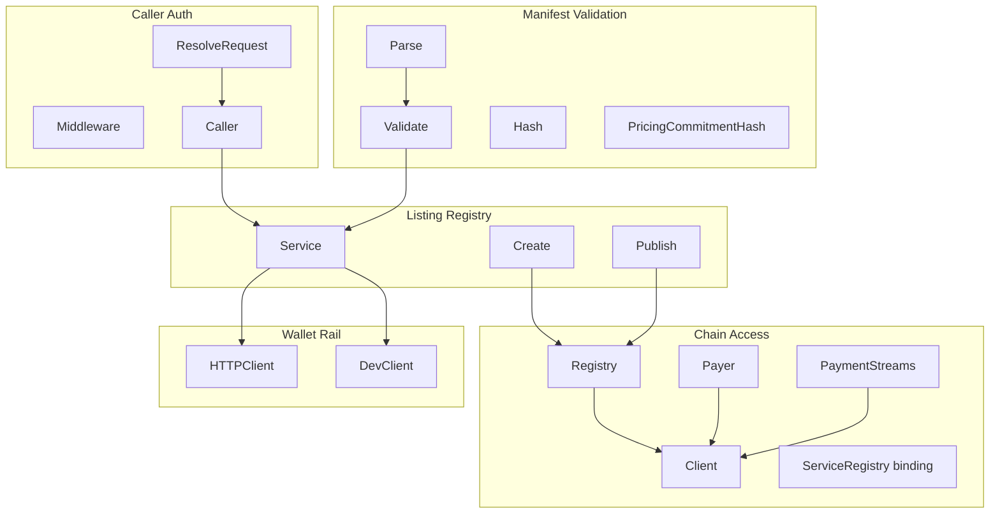
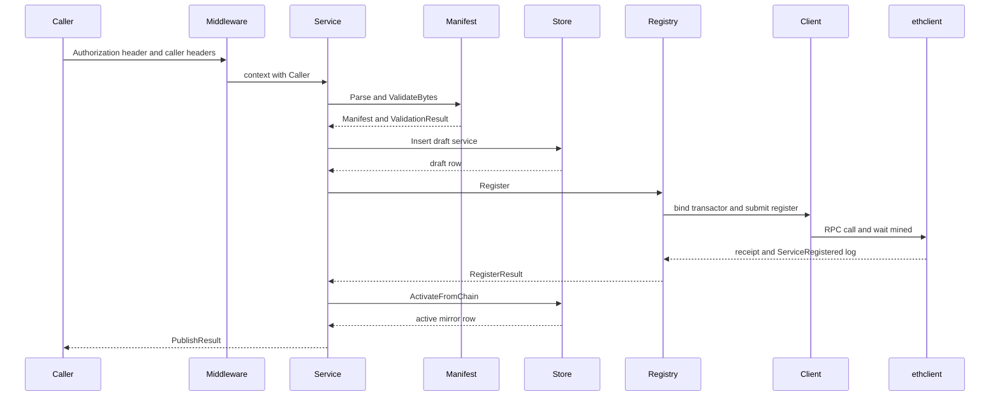
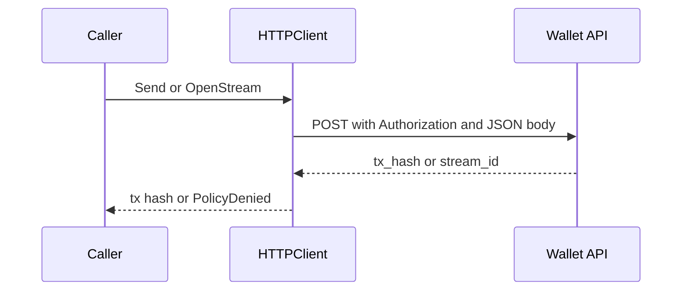

## Overview

This layer connects the authenticated caller identity, the wallet rail, the on-chain service registry, and the manifest schema that describes each listing. It is the part of Deus that turns a signed agent request into a validated service record, an on-chain registration, and a mirrored listing in the local store.

The code here is split across three concerns: request identity and trust boundaries in `deus/internal/auth/auth.go`, EVM and wallet transport in `deus/internal/chain/*.go` and `deus/internal/wallet/client.go`, and listing validation plus manifest hashing in `deus/internal/registry/*.go` and `deus/pkg/manifest/*.go`. The chain binding in `deus/internal/chain/bindings/service_registry.go` is the contract-facing core that the registry service uses to create, update, and observe service state on Paxeer chain 125.

## Architecture Overview

## Caller Authentication

### Caller Identity Resolution

*`deus/internal/auth/auth.go`*

`Caller` is the authenticated agent identity passed through request context. `Middleware` extracts it from HTTP headers and either forwards the request with context attached or returns a JSON 401 response. `ResolveRequest` is the low-level header parser and is the only place that decides whether a request is treated as an agent bearer call or a dev-mode fallback.

#### Data shape

| Property | Type | Description |
| --- | --- | --- |
| `DID` | `string` | Caller DID resolved from the request. |
| `Wallet` | `string` | Caller wallet address forwarded from the request. |
| `Bearer` | `string` | Bearer token preserved for downstream use. |

#### Functions

| Method | Description |
| --- | --- |
| `FromContext` | Reads `Caller` from `context.Context` and reports whether it was present. |
| `Middleware` | Wraps an `http.Handler` and rejects unauthenticated requests with `{"error":"unauthorized","message":"agent bearer required"}`. |
| `ResolveRequest` | Parses `Authorization`, `X-Caller-DID`, and `X-Caller-Wallet` into a `Caller`. |

#### Header behavior

| Header | Behavior |
| --- | --- |
| `Authorization` | Required bearer token in normal mode. |
| `X-Caller-DID` | Optional identity hint in dev mode and a fallback DID source when bearer auth is present. |
| `X-Caller-Wallet` | Optional wallet address copied into `Caller.Wallet`. |

`ResolveRequest` accepts a `Bearer` token only when the `Authorization` header starts with `Bearer `. In dev mode, a missing bearer can still produce a `Caller` if `X-Caller-DID` is present, and a missing DID can fall back to the token itself when the token starts with `did:`. If no DID can be resolved, it fails before the request reaches the handler.

## Chain Access

### Chain Client

*`deus/internal/chain/client.go`*

`Client` wraps `ethclient.Client` and verifies that the connected RPC endpoint is on the expected chain. `DefaultChainID` is `125`, and `New` can reject a connection if the remote chain ID does not match the expected value.

#### Data shape

| Property | Type | Description |
| --- | --- | --- |
| `rpcURL` | `rpcURL` | RPC endpoint used for the `ethclient` dial. |
| `chainID` | `*big.Int` | Cached chain identifier returned by `ChainID`. |
| `eth` | `eth` | Underlying `ethclient.Client`. |

#### Methods

| Method | Description |
| --- | --- |
| `Eth` | Returns the underlying `ethclient.Client`. |
| `ChainID` | Returns a copy of the configured chain ID. |
| `Ping` | Issues a lightweight `BlockNumber` RPC call. |
| `Close` | Closes the underlying RPC client if it exists. |

#### Constructor dependencies

| Type | Description |
| --- | --- |
| `context.Context` | Used for dialing and optional chain ID verification. |
| `expectedChainID int64` | Expected EVM chain ID; verification is skipped when this is not positive. |

`New` fails fast when `rpcURL` is empty, closes the RPC connection if the chain ID check fails, and preserves the configured chain ID even when verification is skipped.

### Chain Client Checks

*`deus/internal/chain/client_test.go`*

| Test | Behavior |
| --- | --- |
| `TestNewRequiresRPCURL` | Verifies that `New` rejects an empty RPC URL. |
| `TestPingOptional` | Uses `PAXEER_RPC_URL` when present, constructs a client, and confirms `Ping` succeeds against a live endpoint. |

### On Chain Payer and Settlement

*`deus/internal/chain/payer.go`*

`Payer` is the chain-backed settlement executor. It holds the settler key, the chain client, the settlement anchor address, and ABI handles for the payment channel and settlement anchor contracts. It is the component that actually submits payout and settlement transactions after off-chain work has been accepted.

#### Data shapes

| Property | Type | Description |
| --- | --- | --- |
| `paymentChannelABI` | `const` | Minimal ABI with `payout`, `fundedWei`, `redeemedWei`, and `availableWei`. |
| `settlementAnchorABI` | `const` | Minimal ABI with `anchor`. |
| `eth` | `*ethclient.Client` | RPC backend used for contract calls and transaction submission. |
| `chainID` | `*big.Int` | Chain ID used to sign transactions. |
| `key` | `*ecdsa.PrivateKey` | Settler private key. |
| `from` | `common.Address` | On-chain settler address derived from the private key. |
| `anchorAddr` | `common.Address` | Settlement anchor contract address. |
| `channelABI` | `abi.ABI` | Parsed payment channel ABI. |
| `anchorABI` | `abi.ABI` | Parsed settlement anchor ABI. |

#### Methods

| Method | Description |
| --- | --- |
| `NewPayer` | Builds a settlement payer from a chain client, settler key, and anchor address. |
| `SettlerAddress` | Returns the derived on-chain settler address. |
| `PayoutDeveloper` | Sends `payout` to the escrowed payment channel and waits for a mined receipt. |
| `AnchorSettlement` | Sends `anchor` to record a settled batch root and waits for a mined receipt. |
| `FundedWei` | Reads `fundedWei` from a payment channel contract and returns it as a decimal string. |

#### Constructor dependencies

| Type | Description |
| --- | --- |
| `*Client` | Supplies the RPC client and chain ID. |
| `settlerKeyHex string` | Hex-encoded private key used to sign settlement transactions. |
| `anchorAddr string` | Settlement anchor contract address. |

`NewPayer` rejects a nil chain client, an empty anchor address, or an invalid private key. `PayoutDeveloper` also rejects the unset placeholder `0xescrow-dev`, validates `amountWei` as base-10, submits `payout`, waits for mining, and confirms that the receipt status is successful. `AnchorSettlement` decodes the Merkle root with `decodeRoot`, verifies that it is exactly 32 bytes, and then submits `anchor` with the developer address, root, total value, and count.

### Payment Streams Precompile

*`deus/internal/chain/precompiles.go`*

`PaymentStreams` is a calldata and read helper for the Paxeer precompile at `0x0000000000000000000000000000000000000906`. It does not own transactions; it builds calldata for stream lifecycle operations and performs the `accrued` read against the precompile.

#### Data shapes

| Property | Type | Description |
| --- | --- | --- |
| `PaymentStreamsAddr` | `var` | Precompile address on chain 125. |
| `paymentStreamsABI` | `const` | ABI for `open`, `settle`, `close`, and `accrued`. |
| `client` | `*Client` | Chain client used for contract calls. |
| `abi` | `abi.ABI` | Parsed precompile ABI. |

#### Methods

| Method | Description |
| --- | --- |
| `NewPaymentStreams` | Builds a precompile helper from a chain client. |
| `EncodeOpen` | Packs calldata for `open`. |
| `EncodeSettle` | Packs calldata for `settle`. |
| `EncodeClose` | Packs calldata for `close`. |
| `Accrued` | Executes `eth_call` against the precompile and decodes the returned amount. |

#### Constructor dependencies

| Type | Description |
| --- | --- |
| `*Client` | Supplies the RPC backend used by `CallContract`. |

`Accrued` packs the `accrued` call, uses `CallContract` against `PaymentStreamsAddr`, and requires exactly one returned `*big.Int`. If decoding fails or the output shape does not match, it returns an explicit error.

### Service Registry Binding

*`deus/internal/chain/bindings/service_registry.go`*

This generated binding is the contract surface used by the registry service to register listings, update them, and listen for contract events. `ServiceRegistryMetaData` carries the generated ABI JSON, and `ServiceRegistryABI` is the deprecated alias to `ServiceRegistryMetaData.ABI`.

#### Contract metadata values

| Value | Role |
| --- | --- |
| `ServiceRegistryMetaData` | Generated metadata wrapper containing ABI and constructor information. |
| `ServiceRegistryABI` | Deprecated alias to the ABI string in `ServiceRegistryMetaData`. |

#### Core wrapper types

| Type | Properties |
| --- | --- |
| `IServiceRegistryService` | `Id *big.Int`, `Owner common.Address`, `Payout common.Address`, `ManifestHash [32]byte`, `PricingHash [32]byte`, `Status uint8`, `Hosted bool`, `Confidential bool`, `RegisteredAt uint64`, `UpdatedAt uint64` |
| `ServiceRegistry` | Embedded `ServiceRegistryCaller`, `ServiceRegistryTransactor`, `ServiceRegistryFilterer` |
| `ServiceRegistryCaller` | `contract *bind.BoundContract` |
| `ServiceRegistryTransactor` | `contract *bind.BoundContract` |
| `ServiceRegistryFilterer` | `contract *bind.BoundContract` |
| `ServiceRegistrySession` | `Contract *ServiceRegistry`, `CallOpts bind.CallOpts`, `TransactOpts bind.TransactOpts` |
| `ServiceRegistryCallerSession` | `Contract *ServiceRegistryCaller`, `CallOpts bind.CallOpts` |
| `ServiceRegistryTransactorSession` | `Contract *ServiceRegistryTransactor`, `TransactOpts bind.TransactOpts` |
| `ServiceRegistryRaw` | `Contract *ServiceRegistry` |
| `ServiceRegistryCallerRaw` | `Contract *ServiceRegistryCaller` |
| `ServiceRegistryTransactorRaw` | `Contract *ServiceRegistryTransactor` |

#### Event payloads

| Type | Properties |
| --- | --- |
| `ServiceRegistryOwnerTransferred` | `Id *big.Int`, `From common.Address`, `To common.Address`, `Raw types.Log` |
| `ServiceRegistryPayoutChanged` | `Id *big.Int`, `Payout common.Address`, `Raw types.Log` |
| `ServiceRegistryServiceRegistered` | `Id *big.Int`, `Owner common.Address`, `ManifestHash [32]byte`, `PricingHash [32]byte`, `Hosted bool`, `Confidential bool`, `Raw types.Log` |
| `ServiceRegistryServiceStatusChanged` | `Id *big.Int`, `Status uint8`, `Raw types.Log` |
| `ServiceRegistryServiceUpdated` | `Id *big.Int`, `ManifestHash [32]byte`, `PricingHash [32]byte`, `Raw types.Log` |

#### Iterator types

| Type | Properties |
| --- | --- |
| `ServiceRegistryOwnerTransferredIterator` | `Event *ServiceRegistryOwnerTransferred`, `contract *bind.BoundContract`, `event string`, `logs chan types.Log`, `sub ethereum.Subscription`, `done bool`, `fail error` |
| `ServiceRegistryPayoutChangedIterator` | `Event *ServiceRegistryPayoutChanged`, `contract *bind.BoundContract`, `event string`, `logs chan types.Log`, `sub ethereum.Subscription`, `done bool`, `fail error` |
| `ServiceRegistryServiceRegisteredIterator` | `Event *ServiceRegistryServiceRegistered`, `contract *bind.BoundContract`, `event string`, `logs chan types.Log`, `sub ethereum.Subscription`, `done bool`, `fail error` |
| `ServiceRegistryServiceStatusChangedIterator` | `Event *ServiceRegistryServiceStatusChanged`, `contract *bind.BoundContract`, `event string`, `logs chan types.Log`, `sub ethereum.Subscription`, `done bool`, `fail error` |
| `ServiceRegistryServiceUpdatedIterator` | `Event *ServiceRegistryServiceUpdated`, `contract *bind.BoundContract`, `event string`, `logs chan types.Log`, `sub ethereum.Subscription`, `done bool`, `fail error` |

#### Methods

| Method | Description |
| --- | --- |
| `NewServiceRegistry` | Builds a full read write filter binding for a deployed contract. |
| `NewServiceRegistryCaller` | Builds a read-only binding. |
| `NewServiceRegistryTransactor` | Builds a write-only binding. |
| `NewServiceRegistryFilterer` | Builds a log filter binding. |
| `STATUSACTIVE` | Reads the `STATUS_ACTIVE` constant. |
| `STATUSDELISTED` | Reads the `STATUS_DELISTED` constant. |
| `STATUSDRAFT` | Reads the `STATUS_DRAFT` constant. |
| `STATUSPAUSED` | Reads the `STATUS_PAUSED` constant. |
| `GetService` | Reads a full service tuple by id. |
| `Governor` | Reads the governor address. |
| `IsActive` | Reads whether a service is active. |
| `NextId` | Reads the next service id. |
| `OwnerOf` | Reads the owner of a service id. |
| `Services` | Reads the service tuple from the public mapping. |
| `ServicesByOwner` | Reads a service id by owner and index. |
| `Register` | Sends the `register` transaction. |
| `SetPayout` | Sends the `setPayout` transaction. |
| `SetStatus` | Sends the `setStatus` transaction. |
| `TransferOwner` | Sends the `transferOwner` transaction. |
| `Update` | Sends the `update` transaction. |
| `FilterOwnerTransferred` | Filters historical `OwnerTransferred` logs. |
| `WatchOwnerTransferred` | Subscribes to live `OwnerTransferred` logs. |
| `ParseOwnerTransferred` | Unpacks a single `OwnerTransferred` log. |
| `FilterPayoutChanged` | Filters historical `PayoutChanged` logs. |
| `WatchPayoutChanged` | Subscribes to live `PayoutChanged` logs. |
| `ParsePayoutChanged` | Unpacks a single `PayoutChanged` log. |
| `FilterServiceRegistered` | Filters historical `ServiceRegistered` logs. |
| `WatchServiceRegistered` | Subscribes to live `ServiceRegistered` logs. |
| `ParseServiceRegistered` | Unpacks a single `ServiceRegistered` log. |
| `FilterServiceStatusChanged` | Filters historical `ServiceStatusChanged` logs. |
| `WatchServiceStatusChanged` | Subscribes to live `ServiceStatusChanged` logs. |
| `ParseServiceStatusChanged` | Unpacks a single `ServiceStatusChanged` log. |
| `FilterServiceUpdated` | Filters historical `ServiceUpdated` logs. |
| `WatchServiceUpdated` | Subscribes to live `ServiceUpdated` logs. |
| `ParseServiceUpdated` | Unpacks a single `ServiceUpdated` log. |
| `Call` | Raw read-only call on `ServiceRegistryRaw`. |
| `Transfer` | Raw transfer on `ServiceRegistryRaw` and `ServiceRegistryTransactorRaw`. |
| `Transact` | Raw write call on `ServiceRegistryRaw` and `ServiceRegistryTransactorRaw`. |

The event watch methods use `WatchLogs`, wrap the stream in `event.NewSubscription`, and forward unpacked events into the sink channel until the sink, the quit channel, or `sub.Err()` ends the subscription. The iterator variants perform the same unpacking work for historical log scans and stop when `Close` unsubscribes the underlying subscription.

The generated ABI exposes the following contract errors: `InvalidStatus`, `NotOwner`, `NotOwnerOrGovernor`, `ServiceNotFound`, and `ZeroAddress`.

The read methods are also mirrored on `ServiceRegistrySession` and `ServiceRegistryCallerSession` with preset `CallOpts`, and the write methods are mirrored on `ServiceRegistrySession` and `ServiceRegistryTransactorSession` with preset `TransactOpts`.

### Service Registry Orchestration

*`deus/internal/chain/registry.go`*

`Registry` is the chain transaction façade used by the higher-level registry service. It binds a deployed `ServiceRegistry` contract, signs transactions with the caller-provided private key, waits for receipts, and extracts the `ServiceRegistered` event that contains the on-chain service id.

#### Data shapes

| Property | Type | Description |
| --- | --- | --- |
| `client` | `*ethclient.Client` | RPC client used for transaction submission and receipt waits. |
| `contract` | `*bindings.ServiceRegistry` | Generated contract binding. |
| `address` | `common.Address` | Deployed contract address. |
| `chainID` | `*big.Int` | Chain ID used to sign `register` transactions. |
| `Payout` | `common.Address` | Payout address sent to the contract from `RegisterRequest`. |

#### Request and result shapes

| Type | Properties |
| --- | --- |
| `RegisterRequest` | `Payout common.Address`, `ManifestHash [32]byte`, `PricingHash [32]byte`, `Hosted bool`, `Confidential bool`, `PrivateKeyHex string` |
| `RegisterResult` | `ChainServiceID uint64`, `TxHash string`, `BlockNumber uint64` |

#### Methods

| Method | Description |
| --- | --- |
| `NewRegistry` | Binds a deployed `ServiceRegistry` at the supplied address. |
| `Address` | Returns the bound registry address. |
| `Register` | Signs, sends, waits for mining, and extracts the new chain service id. |
| `FilterRegistered` | Scans historical `ServiceRegistered` events from a starting block. |

#### Constructor dependencies

| Type | Description |
| --- | --- |
| `*Client` | Supplies the RPC client and chain ID. |
| `addr string` | Deployed registry contract address. |

`Register` trims an optional `0x` prefix from `PrivateKeyHex`, constructs a keyed transactor, submits the transaction, waits for the receipt, and checks for `ReceiptStatusSuccessful`. After a successful receipt, it walks the logs from the registry address, parses the first `ServiceRegistered` event it can decode, and returns the chain service id, tx hash, and block number. If the event is absent, it returns `chain: ServiceRegistered event not found`.

`FilterRegistered` uses a `bind.FilterOpts` starting at `fromBlock`, requests all service and owner matches with nil filters, and collects the unpacked `ServiceRegistryServiceRegistered` values until the iterator finishes.

### Chain Client Checks

*`deus/internal/chain/client_test.go`*

| Test | Behavior |
| --- | --- |
| `TestNewRequiresRPCURL` | Confirms that an empty RPC URL is rejected before dialing. |
| `TestPingOptional` | Reads `PAXEER_RPC_URL`, constructs a client, and exercises `Ping` against the live chain endpoint when configured. |

## Wallet Clients

### Wallet HTTP Client

*`deus/internal/wallet/client.go`*

`HTTPClient` is the remote wallet transport. It forwards the caller bearer token to the wallet API, submits JSON bodies, maps HTTP 403 into `PolicyDenied`, and returns transaction hashes or stream identifiers for the spending rail. `AuthorizeSpend` is a configuration guard in this implementation; the actual policy enforcement happens on the money-moving call path when the wallet responds with 403.

#### Data shapes

| Property | Type | Description |
| --- | --- | --- |
| `BaseURL` | `string` | Wallet API base URL. |
| `HTTP` | `*http.Client` | Optional custom HTTP client. |
| `TxHash` | `string` | Transaction hash returned by the wallet. |
| `StreamID` | `string` | Stream id returned by the wallet. |
| `Error` | `string` | Error code returned by the wallet API. |
| `Message` | `string` | Human-readable error message returned by the wallet API. |
| `CapWei` | `string` | Declared spend cap from a forbidden wallet response. |

#### Request and result shapes

| Type | Properties |
| --- | --- |
| `StreamOpenInput` | `Payee string`, `RatePerSecondWei string`, `CapWei string`, `StopTime uint64`, `Token string` |
| `OpenStreamResult` | `ChainStreamID string`, `TxHash string` |
| `sendResponse` | `TxHash string`, `StreamID string` |
| `walletError` | `Error string`, `Message string`, `CapWei string` |

#### Methods

| Method | Description |
| --- | --- |
| `AuthorizeSpend` | Performs the pre-flight wallet configuration check. |
| `Send` | Sends a direct native PAX transfer through `/v1/agent/send`. |
| `OpenStream` | Opens a PaymentStreams session through `/v1/agent/precompiles/streams/open`. |
| `StreamSettle` | Settles a stream through `/v1/agent/precompiles/streams/settle`. |
| `StreamClose` | Closes a stream through `/v1/agent/precompiles/streams/close`. |
| `Error` | Returns the formatted message for `PolicyDenied`. |

#### Constructor and request dependencies

| Type | Description |
| --- | --- |
| `bearer string` | Caller bearer token forwarded from the gateway. |
| `toAddress string` | Destination address for direct sends. |
| `amountWei string` | Transfer amount in wei. |
| `in StreamOpenInput` | Stream open payload. |

Every request sets `Content-Type: application/json` and `Authorization: Bearer `. `do` also caps the response body read to 1 MiB, maps 403 responses into `PolicyDenied`, and returns the parsed wallet response when the call succeeds. `OpenStream` sends `stop_time` only when it is greater than zero, and `streamToken` maps an empty token to the zero address string so native PAX streams do not require an explicit token address.

#### Dev client stub

| Property | Type | Description |
| --- | --- | --- |
| `MaxPerCallWei` | `string` | Optional per-call allowance enforced by the stub. |
| `Sends` | `[]SendRecord` | Recorded direct transfers. |
| `StreamOpens` | `[]StreamOpenRecord` | Recorded stream opens. |
| `StreamRefunds` | `[]StreamRefundRecord` | Recorded stream close refunds. |
| `streamSeq` | `atomic.Uint64` | Synthetic stream id generator. |
| `streamCaps` | `map[string]string` | Tracks funded cap by `chain_stream_id`. |

| Type | Properties |
| --- | --- |
| `SendRecord` | `To string`, `AmountWei string` |
| `StreamOpenRecord` | `Payee string`, `RatePerSecondWei string`, `CapWei string`, `ChainStreamID string`, `TxHash string` |
| `StreamRefundRecord` | `ChainStreamID string`, `RefundWei string`, `TxHash string` |

#### Methods

| Method | Description |
| --- | --- |
| `AuthorizeSpend` | Allows spends up to `MaxPerCallWei` in dev mode. |
| `Send` | Records a synthetic send and returns a synthetic tx hash. |
| `OpenStream` | Records a synthetic stream open and stores the funded cap. |
| `StreamSettle` | Returns a synthetic stream settle tx hash. |
| `StreamClose` | Records a refund and returns a synthetic stream close tx hash. |

### Wallet Client Checks

*`deus/internal/wallet/client_test.go`*

| Test | Behavior |
| --- | --- |
| `TestHTTPClientSendReturnsTxHash` | Verifies the POST path, bearer header, JSON body, and `tx_hash` decoding for `Send`. |
| `TestHTTPClientSendPolicyDenied` | Verifies that HTTP 403 becomes `PolicyDenied` and preserves `cap_wei`. |
| `TestHTTPClientSendRequiresConfig` | Verifies that `Send` rejects a missing `BaseURL`. |

## Registry Orchestration

### Listing Service

*`deus/internal/registry/registry.go`*

`Service` is the orchestrator that creates draft listings, publishes them on chain, mirrors chain state back into the store, and optionally pushes raw listing payloads into a manifest indexer. It is the highest-level workflow in this section and ties together manifest validation, storage, chain registration, and discovery indexing.

#### Data shapes

| Property | Type | Description |
| --- | --- | --- |
| `store` | `*store.Store` | Backing persistence layer for listings and related records. |
| `registry` | `*chain.Registry` | Chain registration façade used during publish. |
| `indexer` | `*indexer.Indexer` | Index sync handle used after publishing. |
| `embedIdx` | `ManifestIndexer` | Optional async manifest indexer hook. |

#### Interface

| Method | Description |
| --- | --- |
| `IndexService` | Accepts a service id and raw manifest JSON for discovery indexing. |

#### Request and result shapes

| Type | Properties |
| --- | --- |
| `CreateInput` | `Manifest json.RawMessage`, `Owner string` |
| `CreateResult` | `ID string`, `Slug string`, `Status string`, `ManifestHash string`, `Validation ValidationResult` |
| `PublishInput` | `ServiceID string`, `Owner string`, `PrivateKeyHex string` |
| `PublishResult` | `ID string`, `ChainID uint64`, `Status string`, `ManifestHash string`, `TxHash string` |

#### Methods

| Method | Description |
| --- | --- |
| `NewService` | Wires the store, chain registry, and indexer into a listing service. |
| `SetManifestIndexer` | Registers the optional raw manifest indexer hook. |
| `Create` | Validates a manifest, inserts a draft service, and mirrors child rows. |
| `Publish` | Registers the service on chain and marks the mirrored service active. |
| `Get` | Returns a stored service row by id. |

#### Constructor dependencies

| Type | Description |
| --- | --- |
| `*store.Store` | Persists services, endpoints, and pricing plans. |
| `*chain.Registry` | Used to submit the on-chain `register` transaction. |
| `*indexer.Indexer` | Used to synchronize discovery state after publish. |

`Create` validates the raw manifest bytes with `manifest.ValidateBytes`, then runs `ValidateManifest` and rejects manifests that fail schema or business rules. It normalizes the requested owner, verifies that it matches the manifest owner, hashes the manifest with `manifest.Hash`, creates or updates the developer record, inserts the draft service with status `draft`, and then calls `syncChildren` to persist endpoint and pricing rows. When `embedIdx` is present, it indexes the raw manifest after the draft row is inserted.

`Publish` loads the service row, looks up the developer wallet, and rejects the call when the provided owner does not match the stored wallet. It reparses and revalidates the stored manifest, requires an active deployment when `Mode` is `hosted`, computes both the manifest hash and pricing commitment hash, and sends the chain registration through `chain.Registry.Register`. After the transaction succeeds, it mirrors the chain service id and hashes back into the store, pushes the raw manifest into `embedIdx` when configured, and asks `indexer.Sync` to advance discovery from the mined block number.

The helper `hexToBytes32` requires exactly 64 hexadecimal characters after `0x` stripping, and `syncChildren` writes one endpoint row and one pricing row per manifest operation and pricing entry.

### Registry Validation

*`deus/internal/registry/validate.go`*

`ValidationResult` is the structured validation outcome returned by `CreateResult`. It separates schema success from warnings, so a reachable listing can still surface a proxy URL warning without blocking the workflow.

#### Data shape

| Property | Type | Description |
| --- | --- | --- |
| `OK` | `bool` | Overall validation status. |
| `Warnings` | `[]string` | Non-fatal validation warnings. |
| `Errors` | `[]string` | Fatal validation errors. |

#### Functions

| Method | Description |
| --- | --- |
| `ValidateManifest` | Runs schema validation and business rule checks against a manifest. |
| `probeURL` | Sends an HTTP HEAD request and treats 500-level responses as errors. |

`ValidateManifest` always calls `manifest.Validate` first. When a manifest is in `proxy` mode and has a non-empty `endpoint.proxy_url`, it probes the URL with a `HEAD` request that times out after three seconds and appends a warning when the target is unreachable or returns a 500-level status. The warning does not prevent `Create` or `Publish` from continuing if the manifest is otherwise valid.

## Manifest Model and Schema

### Manifest Model

*`deus/pkg/manifest/manifest.go`*

`Manifest` is the machine-readable description of a Deus service. It captures identity, ownership, deployment mode, operations, pricing, routing hints, SLA targets, and optional attestation metadata. `Operation`, `Pricing`, `Endpoint`, and `SLA` are the nested data shapes that carry the per-operation and service-level details.

#### Data shapes

| Property | Type | Description |
| --- | --- | --- |
| `SchemaVersion` | `string` | Manifest schema version. |
| `Slug` | `string` | Service slug. |
| `Kind` | `string` | Service kind. |
| `DisplayName` | `string` | Human-readable name. |
| `Summary` | `string` | Short description. |
| `Description` | `string` | Optional extended description. |
| `Tags` | `[]string` | Optional tag list. |
| `Owner` | `string` | Owner identity. |
| `PayoutAddress` | `string` | Payout wallet address. |
| `Mode` | `string` | Deployment mode. |
| `Confidential` | `bool` | Confidential listing flag. |
| `Operations` | `[]Operation` | Callable operations. |
| `Pricing` | `[]Pricing` | Pricing entries. |
| `Endpoint` | `*Endpoint` | Optional routing hints. |
| `SLA` | `*SLA` | Optional service level targets. |
| `Attestation` | `any` | Optional attestation payload. |

#### Nested shapes

| Type | Properties |
| --- | --- |
| `Operation` | `Name string`, `Method string`, `InputSchema map[string]any`, `OutputSchema map[string]any`, `TimeoutMS int`, `MaxResponseBytes int` |
| `Pricing` | `Operation string`, `Model string`, `Unit string`, `PriceWei string`, `MinChargeWei string` |
| `Endpoint` | `ProxyURL string` |
| `SLA` | `TargetUptimeBPS int`, `P99LatencyMS int` |

### Canonicalization and Hashing

*`deus/pkg/manifest/canonical.go`*

`CanonicalVersion` is `1`. `CanonicalJSON` marshals the manifest, rehydrates it into generic JSON, sorts object keys recursively, and returns stable UTF-8 bytes for hashing. `Hash` returns `keccak256(canonical_json(manifest))` as a hex string, and `PricingCommitmentHash` hashes only `schema_version` and `pricing` after applying the same recursive sort logic.

#### Functions

| Method | Description |
| --- | --- |
| `CanonicalJSON` | Produces stable canonical JSON bytes. |
| `Hash` | Computes the manifest hash from canonical JSON. |
| `PricingCommitmentHash` | Computes the pricing-only commitment hash. |
| `sortValue` | Recursively sorts JSON object keys and arrays. |
| `Parse` | Parses JSON into `Manifest` with unknown fields rejected. |

`Parse` uses `DisallowUnknownFields`, so extra keys are rejected before schema validation runs.

### Schema Validation

*`deus/pkg/manifest/schema.go`*

`compiledSchema` compiles the embedded schema once with `sync.Once`. `Validate` marshals the manifest, validates it against the embedded schema, and then enforces business rules that the schema alone cannot express. `ValidateBytes` is the raw JSON entrypoint used by the listing service.

#### Functions

| Method | Description |
| --- | --- |
| `compiledSchema` | Compiles and caches the embedded schema. |
| `Validate` | Validates a manifest against the schema and business rules. |
| `ValidateBytes` | Parses and validates raw JSON bytes. |
| `validateBusinessRules` | Enforces listing rules that complement the schema. |

#### Business rules

| Rule | Behavior |
| --- | --- |
| Proxy mode requires a proxy URL | `mode == "proxy"` requires `endpoint.proxy_url`. |
| Pricing must map to an operation | Each pricing row must reference an existing operation name. |
| Pricing must be positive | A pricing row cannot have both `price_wei` and `min_charge_wei` equal to `0`. |
| Attestation requires confidentiality | `attestation` is only accepted when `confidential` is `true`. |

### Embedded Schema Contract

*`deus/pkg/manifest/schema.json`*

| Key | Constraint |
| --- | --- |
| `title` | `DeusServiceManifest` |
| `type` | `object` |
| `additionalProperties` | `false` |
| `required` | `schema_version`, `slug`, `kind`, `display_name`, `summary`, `owner`, `payout_address`, `mode`, `operations`, `pricing` |
| `schema_version` | Must equal `1`. |
| `kind` | `data` or `agent`. |
| `mode` | `proxy` or `hosted`. |
| `operations` | Array with at least one item; each item requires `name`, `method`, `input_schema`, `output_schema`. |
| `pricing` | Array with at least one item; each item requires `operation`, `model`, `unit`, `price_wei`, `min_charge_wei`. |
| `endpoint.proxy_url` | Optional URI field, required by business rules when mode is `proxy`. |
| `sla` | Optional object with `target_uptime_bps` and `p99_latency_ms`. |
| `attestation` | `object` or `null`. |

### Manifest Validation Checks

*`deus/pkg/manifest/manifest_test.go`*

| Test | Behavior |
| --- | --- |
| `TestValidateFixture` | Loads a fixture manifest, validates it, hashes it, and verifies canonical JSON stability. |
| `TestValidateRejectsProxyWithoutURL` | Confirms that proxy mode without `endpoint.proxy_url` fails validation. |

## State Management

The workflow moves through a small set of explicit states that are proven in code.

| State or signal | Where it appears | Meaning |
| --- | --- | --- |
| `draft` | `Create` in `deus/internal/registry/registry.go` | Newly inserted listing before chain registration. |
| `active` | `Publish` in `deus/internal/registry/registry.go` | Listing mirrored after successful chain registration. |
| `STATUS_ACTIVE` | `deus/internal/chain/bindings/service_registry.go` | Contract constant returned by the generated binding. |
| `STATUS_DRAFT` | `deus/internal/chain/bindings/service_registry.go` | Contract constant returned by the generated binding. |
| `STATUS_PAUSED` | `deus/internal/chain/bindings/service_registry.go` | Contract constant returned by the generated binding. |
| `STATUS_DELISTED` | `deus/internal/chain/bindings/service_registry.go` | Contract constant returned by the generated binding. |
| `ValidationResult.OK` | `deus/internal/registry/validate.go` | Boolean validation gate for create and publish. |

The local mirror writes draft rows first, then transitions them to active only after the chain receipt is mined and the `ServiceRegistered` event is decoded. The contract binding reflects the same lifecycle via event emissions and status constants.

## Error Handling

Each layer wraps its own failure mode and keeps the context specific:

- `auth.Middleware` returns a fixed 401 JSON body for missing or invalid agent bearer credentials.
- `chain.New` wraps dial failures, chain ID fetch failures, and chain ID mismatches with `chain:` prefixes.
- `Payer` validates the private key, anchor address, payout amount, and Merkle root before broadcasting.
- `chain.Registry.Register` reports private key parsing errors, transactor setup errors, transaction submission errors, receipt wait errors, and missing `ServiceRegistered` events separately.
- `HTTPClient.do` maps wallet 403 responses into `PolicyDenied` so the caller can see `cap_wei`, while other 4xx and 5xx responses become formatted transport errors.
- `ValidateManifest` returns structured `ValidationResult` data, and the listing service decides whether that result is fatal.

## Integration Points

- `deus/internal/auth/auth.go` supplies `Caller` to downstream services through request context.
- `deus/internal/registry/registry.go` consumes `manifest.ValidateBytes`, `manifest.Validate`, `manifest.Hash`, and `manifest.PricingCommitmentHash`.
- `deus/internal/registry/registry.go` depends on `chain.Registry` for on-chain registration and on the store for draft and active mirrors.
- `deus/internal/wallet/client.go` forwards the caller bearer token to the wallet rail and interprets policy denials from the wallet API.
- `deus/internal/chain/registry.go` bridges the higher-level registry service to `deus/internal/chain/bindings/service_registry.go`.
- `deus/internal/chain/precompiles.go` and `deus/internal/chain/payer.go` cover stream and settlement side effects that sit outside the listing mirror.

## Request Flows

### Create and Publish a Listing

### Wallet Spend and Stream Rails

