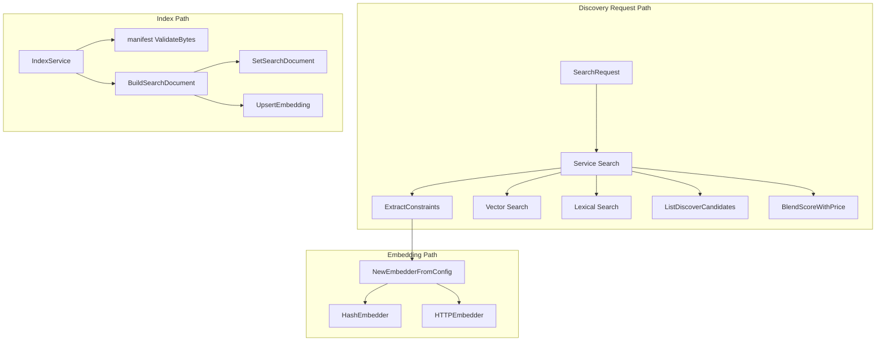

## Overview

This section covers the discovery path that turns a query and a manifest into ranked service results. The pipeline starts by extracting structured constraints from free text, then optionally generates embeddings, then combines vector, lexical, and browse candidates into a scored result set.

It also covers the indexing side of discovery: a manifest is validated, collapsed into a search document, written to the store, and, when an embedder is available, converted into a stored embedding vector. The net effect is a search surface that can keep working when semantic embedding is unavailable, while still enriching results when vector search is enabled.

## Discovery Pipeline Architecture

## Discovery Service

*`deus/internal/discovery/discovery.go`*

The discovery service owns query execution, candidate merging, and ranking. It starts with a store, an embedder, and ranking weights, then uses those inputs to blend semantic and lexical candidates into a final response.

### `Service`

| Property | Type | Description |
| --- | --- | --- |
| `store` | `*store.Store` | Backing store used for candidate lookups, price checks, and search document and embedding writes. |
| `embed` | `Embedder` | Embedding backend used by `Search` and `IndexService`. |
| `weights` | `RankingWeights` | Blend weights used by `BlendScoreWithPrice`. |

#### Constructor dependencies

| Type | Description |
| --- | --- |
| `*store.Store` | Required store handle passed to `New`. |
| `Option` | Optional configuration functions applied after the default embedder and default ranking weights are set. |

#### Package functions

| Method | Description |
| --- | --- |
| `New` | Builds a `Service` with `NewHashEmbedder()` and `DefaultRankingWeights()`, then applies any `Option` values. |
| `WithEmbedder` | Returns an `Option` that replaces the embedding backend. |
| `WithRankingWeights` | Returns an `Option` that replaces the ranking blend weights. |
| `pricingOps` | Reads pricing operations from a manifest JSON blob and converts them into `types.DiscoverOperation` values. |

#### Service methods

| Method | Description |
| --- | --- |
| `Search` | Runs constraint extraction, optional semantic embedding, vector and lexical candidate retrieval, browse fallback, price and uptime filtering, and final ranking. |

### `SearchRequest`

The search request is the structured input consumed by `Search`. The source comment describes it as mirroring the discovery API payload.

| Property | Type | Description |
| --- | --- | --- |
| `Query` | `string` | Free text query string used for constraint extraction and semantic search. |
| `Filters` | `map[string]any` | Explicit filter map merged into extracted constraints. |
| `Limit` | `int` | Maximum number of results requested by the caller. |

### Search behavior

`Search` applies a fixed execution order:

1. It clamps `Limit` to `10` whenever the request value is `<= 0` or `> 100`.
2. It calls `ExtractConstraints` with the request query and filters.
3. It resolves `kind` from the extracted filters, then pulls `max_price_wei` and `min_uptime_bps`.
4. It merges candidate rows by ID from semantic and lexical searches.
5. It falls back to `ListDiscoverCandidates` only when both search paths produce nothing.
6. It filters merged candidates by uptime and then by price.
7. It scores with `BlendScoreWithPrice`, sorts descending, and truncates to the requested limit.

The merge step keeps the highest `SemanticSim` and `LexicalRank` values seen for a given service ID. The final response is built from the store row fields and adds parsed operations from the service manifest.

### Ranking inputs

The ranking blend is configurable in code through `WithRankingWeights`. The repository also ships `deus/configs/ranking.yaml` with these values:

- `semantic`: `0.40`
- `quality`: `0.30`
- `uptime`: `0.15`
- `price`: `0.10`
- `freshness`: `0.05`

### Error handling

`Search` degrades by design:

- embedding failures do not stop lexical search
- vector search failures do not stop lexical search
- lexical search failures do not stop browse fallback
- `MinPriceWeiForService` is called during ranking, but its error is ignored in the current flow
- `priceAbove` returns `false` when either price string cannot be parsed as a base-10 integer

The only hard failure in the fallback chain is `ListDiscoverCandidates`, which returns an error when no candidates were accumulated from the earlier paths.

### Result shaping

The response path populates these fields on each `types.DiscoverResult`:

- `ID`
- `Slug`
- `DisplayName`
- `Summary`
- `Kind`
- `QualityScore`
- `UptimeBPS`
- `Score`
- `Operations`

The `Operations` slice comes from the manifest `pricing` array and is built from operation name, price in wei, and unit.

## Constraint Extraction

*`deus/internal/discovery/extract.go`*

Constraint extraction turns plain-language queries into structured filters and a cleaned semantic query. It favors explicit filters when they already exist, then augments them from text matches.

### `ExtractedQuery`

| Property | Type | Description |
| --- | --- | --- |
| `SemanticQuery` | `string` | Remaining text after recognized constraint phrases are stripped and normalized. |
| `Filters` | `map[string]any` | Structured constraints extracted from query text and explicit filters. |

#### Package functions

| Method | Description |
| --- | --- |
| `ExtractConstraints` | Copies explicit filters, extracts price, uptime, and kind constraints from the query, and returns the semantic remainder. |
| `paxToWei` | Converts a decimal PAX amount into a base-10 wei string by multiplying by `1e18`. |

### Extraction rules

`ExtractConstraints` recognizes these patterns:

- `under <number> PAX` → populates `max_price_wei` through `paxToWei`
- `under <number> wei` → populates `max_price_wei`
- `> <number>% uptime` or `at least <number>% uptime` → populates `min_uptime_bps`
- `agent service` → populates `kind` with `agent`
- `data service` → populates `kind` with `data`

Explicit filters win. If `max_price_wei`, `min_uptime_bps`, or `kind` are already present in the `explicit` map, the corresponding text extraction path leaves them untouched.

The semantic query is normalized by trimming whitespace and collapsing repeated spaces. If the normalized remainder becomes empty, the original query string is reused.

### Error handling

The extraction path is permissive:

- failed numeric parsing leaves the relevant filter unset
- unmatched patterns simply remain in `SemanticQuery`
- explicit filter values are copied as-is into the returned map

This makes the function suitable for mixed free-text and structured discovery requests.

## Embedding Implementations

*`deus/internal/discovery/embed.go`*

This file defines the embedding contract and two concrete backends. The hash-backed implementation is deterministic and non-semantic, while the HTTP-backed implementation calls a remote embedding service and produces vectors suitable for semantic search.

### Shared settings

`defaultEmbedDim` is `768`. Both constructors use it when the requested dimension is not positive, and `NewEmbedderFromConfig` uses it for the HTTP backend when an endpoint is configured.

### `HashEmbedder`

| Property | Type | Description |
| --- | --- | --- |
| `dim` | `int` | Output vector size. |
| `model` | `string` | Model name reported by `Model`. |

#### Package functions and methods

| Method | Description |
| --- | --- |
| `NewHashEmbedder` | Returns a deterministic 768-dimensional embedder with model `hash-stub@v1`. |
| `Dim` | Returns the configured embedding dimension. |
| `Model` | Returns the configured model name. |
| `Semantic` | Returns `false`, which keeps `Search` on the lexical path for the default embedder. |
| `Embed` | Generates a normalized vector from a SHA-256 seed derived from the input text. |

#### Hash embedding behavior

`Embed` hashes the text with `sha256.Sum256`, uses 8-byte windows from the hash to seed vector elements, maps each seed through `math.Sin`, and then normalizes the result to unit length when possible. The same text always produces the same vector, which is why the tests treat this implementation as deterministic.

Because `Semantic()` returns `false`, the service does not use this embedder for semantic vector search. It remains useful as a development and test fallback that preserves the embedding interface without enabling vector search.

### `HTTPEmbedder`

| Property | Type | Description |
| --- | --- | --- |
| `Endpoint` | `string` | Remote embedding URL with trailing slash removed during construction. |
| `modelName` | `string` | Model name sent in the request body and returned by `Model`. |
| `Dimension` | `int` | Expected vector dimension. |
| `client` | `*http.Client` | HTTP client created with a 15 second timeout. |

#### Package functions and methods

| Method | Description |
| --- | --- |
| `NewHTTPEmbedder` | Builds a remote embedder, trims the endpoint, applies the default dimension when needed, and installs a 15 second HTTP client timeout. |
| `Dim` | Returns `Dimension`. |
| `Model` | Returns the configured model name. |
| `Semantic` | Returns `true`, which enables semantic search in `Search`. |
| `Embed` | Sends a JSON POST request to the configured endpoint and parses the first embedding from the response. |
| `NewEmbedderFromConfig` | Returns `NewHTTPEmbedder` when the endpoint string is non-blank, otherwise returns `NewHashEmbedder`. |

#### HTTP embedding lifecycle

The HTTP backend does three things in order:

1. it builds a JSON object with `input` and `model`
2. it sends a POST request with `Content-Type: application/json`
3. it expects a response whose first `data[0].embedding` array contains the vector

Any transport failure is wrapped as `discovery: embed http`. Non-2xx responses are wrapped with the status code and response body. An empty `data` array or empty embedding array also returns an error.

### Embedding path selection

`NewEmbedderFromConfig` is the switchpoint used by callers that want an environment-driven backend choice:

- non-empty endpoint → HTTP embedding
- blank endpoint → hash embedding

That selection directly controls whether `Search` will enter the semantic vector search branch.

## Search Document Construction

*`deus/internal/discovery/index.go`*

This file contains the indexing entrypoint for discovery listings. It converts a validated manifest into a text document, stores that document for lexical search, and optionally stores an embedding vector for semantic retrieval.

### Package functions and methods

| Method | Description |
| --- | --- |
| `BuildSearchDocument` | Concatenates manifest display name, summary, description, tags, and operation names into a single trimmed search document string. |
| `IndexService` | Validates the raw manifest, writes the search document to the store, embeds the document, and upserts the embedding vector. |

### Indexing flow

`BuildSearchDocument` writes fields into a `strings.Builder` in this order:

1. `DisplayName`
2. `Summary`
3. `Description`
4. each tag in `Tags`
5. each operation name in `Operations`

The result is trimmed before return, so trailing spaces are removed.

`IndexService` then uses the resulting document in two stages:

1. `manifest.ValidateBytes(raw)` ensures the raw payload is a valid manifest before indexing starts.
2. `s.store.SetSearchDocument(ctx, serviceID, doc)` persists the lexical document.

If `s.embed` is present, the same document is embedded with `s.embed.Embed(ctx, doc)` and written through `s.store.UpsertEmbedding(ctx, serviceID, s.embed.Model(), vec)`.

### Error handling

The indexing path is strict up front and tolerant afterward:

- manifest validation failures stop the operation immediately
- store failures while writing the search document stop the operation
- embedding failures stop the embedding step and return a wrapped error
- a nil embedder short-circuits after the search document is stored

That means a service can still be indexed for lexical search even if the semantic backend is unavailable.

## Validation and Regression Tests

### Embedder tests

*`deus/internal/discovery/embed_test.go`*

| Test | What it proves |
| --- | --- |
| `TestHashEmbedderDeterministic` | `NewHashEmbedder().Embed` returns the same vector for the same input and the output length matches `Dim()`. |
| `TestHashEmbedderNotSemantic` | `NewHashEmbedder().Semantic()` is `false`, so the default hash embedder does not enable vector search. |

### Constraint extraction tests

*`deus/internal/discovery/extract_test.go`*

| Test | What it proves |
| --- | --- |
| `TestExtractMaxPAXAndUptime` | The query `weather API with >99% uptime under 0.001 PAX per call` produces `max_price_wei`, `min_uptime_bps` equal to `9900`, and a non-empty semantic remainder. |

### Mirror rebuild integration test

*`deus/internal/indexer/rebuild_test.go`*

This test exercises the indexer rebuild path against a real temporary chain and database. It is gated by `DEUS_RUN_ANVIL_TESTS=1`, starts an Anvil node, deploys a registry contract, opens the store, runs migrations, registers a service, and replays indexing from sequence `0`.

#### `anvilProc`

| Property | Type | Description |
| --- | --- | --- |
| `Cmd` | `*exec.Cmd` | Process handle for the spawned Anvil node. |
| `RPC` | `string` | RPC URL used by the test and by contract deployment. |

#### Test helpers

| Method | Description |
| --- | --- |
| `startAnvil` | Launches Anvil on port `8545` and waits until the RPC endpoint accepts connections. |
| `deployRegistry` | Runs a `forge create` deployment and extracts the deployed address from command output. |
| `TestMirrorRebuildDeterministic` | Verifies that replaying the indexer twice does not decrease mirror count. |

### What the rebuild test checks

The test creates a service registration, calls `ReplayFrom(ctx, 0)`, and then calls it again. After each replay it reads the mirror count through `indexer.MirrorCount`. The only assertion about the count is that the second replay does not reduce it, which matches the test’s goal of exercising deterministic rebuild behavior rather than a user-facing discovery query.

## File Responsibility Reference

| File | Responsibility |
| --- | --- |
| `deus/internal/discovery/discovery.go` | Query execution, candidate merging, filtering, and ranking for discovery search. |
| `deus/internal/discovery/extract.go` | Text-to-filter constraint extraction and PAX-to-wei conversion. |
| `deus/internal/discovery/embed.go` | Hash and HTTP embedding implementations plus backend selection. |
| `deus/internal/discovery/index.go` | Search document construction and manifest-to-embedding indexing. |
| `deus/internal/discovery/embed_test.go` | Deterministic hash embedding and semantic flag coverage. |
| `deus/internal/discovery/extract_test.go` | Extraction coverage for price and uptime constraints. |
| `deus/internal/indexer/rebuild_test.go` | End-to-end rebuild determinism check with a live node and registry deployment. |
