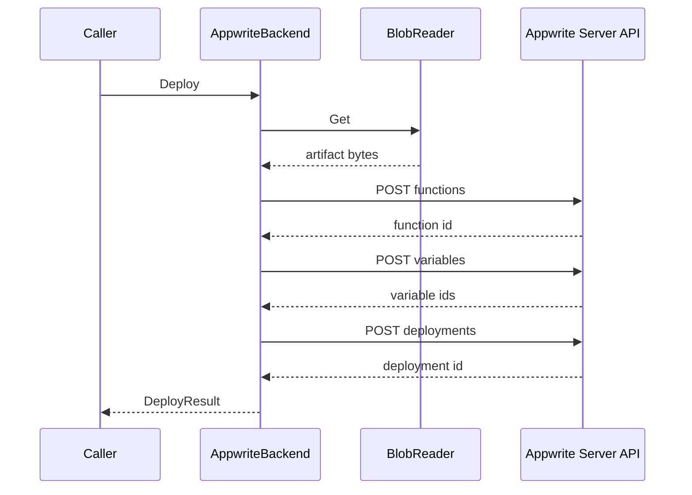
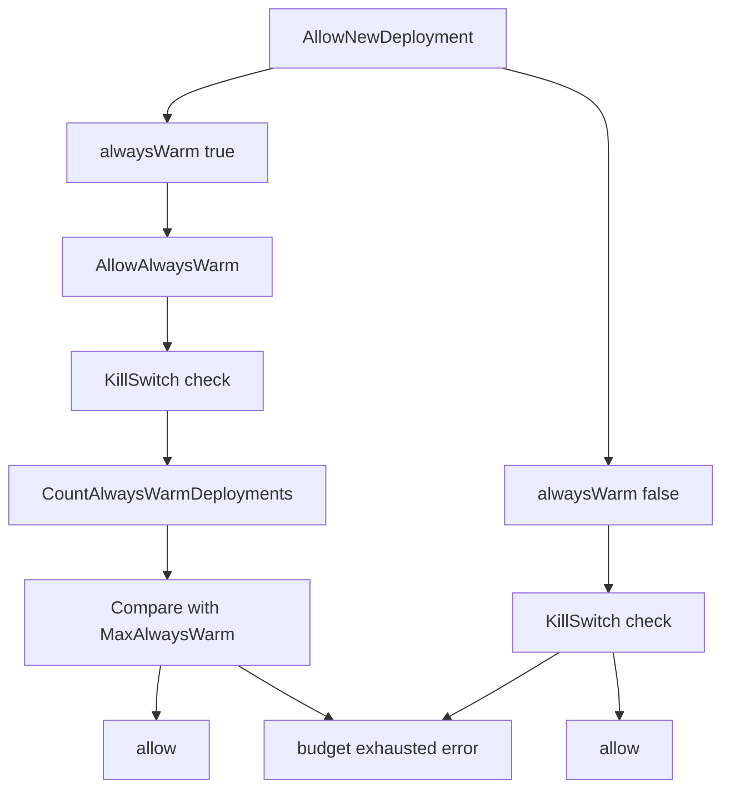

## Overview

This section covers the hosted-execution path used to provision, update, and remove Appwrite-backed function deployments, plus the budget gate that decides whether a new hosted allocation can proceed. The code path is centered on a concrete Appwrite backend implementation and a small budget guard that reads deployment counts from the store and enforces kill-switch and always-warm limits.

The hosted execution flow is opinionated: it only accepts `node20`, packages a developer artifact as `code.tar.gz`, publishes Appwrite function variables in deterministic order, and returns an execution endpoint that can be used for synchronous invocation. The budget layer does not manage deployment state itself; it only decides whether a request is permitted based on current limits and the number of active always-warm deployments.

## Hosted Execution Contract

### `deus/internal/hosting/backend.go`

*File path: `deus/internal/hosting/backend.go`*

This file defines the shared deploy contract used by hosted-execution backends. It carries the inputs needed to provision a deployment, the identifiers returned after provisioning, and the interface that concrete backends must implement.

#### `DeployInput`

| Property | Type | Description |
| --- | --- | --- |
| `ServiceID` | `string` | Service identifier used by the hosting layer, including the default function-name fallback. |
| `ArtifactKey` | `string` | Object storage key for the uploaded deployment artifact. |
| `Runtime` | `string` | Runtime selector passed into the backend. |
| `AlwaysWarm` | `bool` | Requests a provisioned deployment with the always-warm resource profile. |
| `Region` | `string` | Region selector carried through the deploy contract. |
| `FunctionName` | `string` | Optional explicit function name. |
| `Env` | `map[string]string` | Per-service variables forwarded to the backend as function variables. |

#### `DeployResult`

| Property | Type | Description |
| --- | --- | --- |
| `FunctionID` | `string` | Backend function identifier returned after provisioning. |
| `DeploymentID` | `string` | Backend deployment identifier returned after publishing the artifact. |
| `ExecEndpoint` | `string` | Executions endpoint returned for synchronous invocation. |

#### `Backend`

| Method | Description |
| --- | --- |
| `Deploy` | Provisions a hosted deployment from a service artifact. |
| `Delete` | Removes a hosted function by backend function identifier. |

## Appwrite Hosting Backend

### `deus/internal/hosting/appwrite.go`

*File path: `deus/internal/hosting/appwrite.go`*

This file contains the Appwrite Server API implementation of `Backend`. It validates configuration, reads the uploaded artifact from object storage through `BlobReader`, creates a function, pushes variables, uploads the packaged code as a real deployment, and returns the function execution URL.

#### `AppwriteConfig`

| Property | Type | Description |
| --- | --- | --- |
| `Endpoint` | `string` | Appwrite Server API base URL. The code expects this to already include the version segment. |
| `ProjectID` | `string` | Project identifier sent on each Appwrite request. |
| `APIKey` | `string` | Appwrite API key sent on each Appwrite request. |
| `Region` | `string` | Region value carried in the backend configuration. |

#### `AppwriteBackend`

| Property | Type | Description |
| --- | --- | --- |
| `cfg` | `AppwriteConfig` | Appwrite connection settings. |
| `client` | `*http.Client` | HTTP client used for Appwrite requests, created with a 120 second timeout. |
| `blobs` | `BlobReader` | Artifact reader used to load the deploy bundle. |
| `limits` | `Limits` | Hosting limits used for timeout, max response bytes, and warm-spec selection. |

#### Constructor dependencies

| Type | Description |
| --- | --- |
| `AppwriteConfig` | Base endpoint and Appwrite credentials. |
| `BlobReader` | Loads the deployment artifact from storage. |
| `Limits` | Supplies timeout, response size, and warm deployment limits. |

#### `BlobReader`

| Method | Description |
| --- | --- |
| `Get` | Loads an artifact by storage key and returns a readable stream. |

#### Public functions and methods

| Method | Description |
| --- | --- |
| `NewAppwriteBackend` | Builds a production Appwrite hosting backend and installs a 120 second HTTP timeout. |
| `Deploy` | Validates the request, loads the artifact, ensures the Appwrite function exists, pushes variables, uploads the code bundle, and returns deployment identifiers. |
| `Delete` | Deletes the Appwrite function for a deployment. |

### Deployment behavior

`Deploy` enforces three upfront checks before any Appwrite request is sent:

- `cfg.Endpoint`, `cfg.ProjectID`, and `cfg.APIKey` must all be set.

The deploy path is:

1. `fetchArtifact` loads the raw bytes through `BlobReader.Get`.- `functionId: "unique()"`
- `name`
- `runtime: "node-20.0"`
- `execute: []string{"any"}`
- `enabled: true`
- `logging: true`
- `timeout` derived from `limits.DefaultTimeoutMS`
- `scopes: []string{"users.read"}`
- `events: []string{}`
- `schedule: ""`
- `entrypoint: "src/main.js"`
- `commands: "npm install"`
2. If `AlwaysWarm` is true, the backend adds `specification: warmSpecification`.
3. `pushVariables` posts one variable at a time in deterministic key order.
4. `createDeployment` uploads the artifact as multipart form data and activates it.
5. The result returns the Appwrite function ID, deployment ID, and the executions endpoint.

#### Request headers

Every Appwrite request sets:

- `X-Appwrite-Project`
- `X-Appwrite-Key`

The backend also sets `Content-Type` per request type:

- `application/json` for JSON requests
- multipart form data for code uploads
- `application/gzip` on the file part inside the multipart deployment request

### Artifact packaging

`packageArtifact` normalizes the uploaded bundle into `code.tar.gz`:

- If the artifact already begins with gzip magic bytes, the bytes are passed through unchanged.
- Otherwise, the raw bytes are gzip-wrapped before upload.

This keeps the deployment path tolerant of both pre-gzipped project archives and plain tar payloads while always sending Appwrite a gzip stream.

### Runtime and execution endpoint

`executionsURL` constructs the synchronous execution URL by trimming trailing slashes from `cfg.Endpoint` and appending:

- `/functions/`
- the backend function identifier
- `/executions`

The code explicitly avoids adding another `/v1` segment because the configured endpoint already includes it.

### Timeout and size limits

The backend derives two runtime caps from `Limits`:

- `timeoutSeconds()` uses `DefaultTimeoutMS`, falling back to `30000` milliseconds, then clamps the result to at least `1` second.
- `maxResponseBytes()` uses `DefaultMaxResponseBytes`, falling back to `262144`.

`maxResponseBytes()` is pushed into Appwrite as `DEUS_MAX_RESPONSE_BYTES` through `pushVariables`.

### Always-warm function profile

The constant `warmSpecification` is set to `s-1vcpu-512mb`. When `AlwaysWarm` is enabled, `ensureFunction` adds that specification to the create request so the deployment receives the dedicated warm resource profile.

### Error handling

The Appwrite backend uses explicit, source-backed failures for the major bad states:

- incomplete configuration
- unsupported runtime
- missing artifact key
- missing blob reader
- empty artifact bytes
- missing Appwrite function or deployment IDs
- non-2xx HTTP responses from Appwrite
- JSON decoding failures on successful responses

`do` reads the full response body before checking status and includes the raw upstream payload in the error string when the status is 300 or greater.

### Sequence of a hosted deploy

### Source-backed request composition

| Step | Behavior |
| --- | --- |
| Function create | Posts JSON with `functionId`, `name`, `runtime`, `execute`, `enabled`, `logging`, `timeout`, `scopes`, `events`, `schedule`, `entrypoint`, `commands`, and optional `specification`. |
| Variable push | Posts JSON bodies with `key` and `value`. |
| Deployment upload | Posts multipart form data with `activate`, `entrypoint`, `commands`, and a `code` file part named `code.tar.gz`. |
| Delete | Sends an authenticated `DELETE` request to the function URL. |

## Budget Controls

### `deus/internal/hosting/budget.go`

*File path: `deus/internal/hosting/budget.go`*

This file enforces aggregate hosting ceilings. It gates deploy requests with a kill switch, checks how many always-warm deployments are already active, and exposes the configured aggregate budget as a `*big.Int`.

#### `Budget`

| Property | Type | Description |
| --- | --- | --- |
| `limits` | `Limits` | Limit set used for kill-switch, warm capacity, and budget calculations. |
| `store` | `*store.Store` | Store handle used to count active always-warm deployments. |

#### Constructor dependencies

| Type | Description |
| --- | --- |
| `*store.Store` | Reads deployment counts for always-warm capacity checks. |
| `Limits` | Supplies kill-switch, always-warm, and budget values. |

#### Public functions and methods

| Method | Description |
| --- | --- |
| `NewBudget` | Constructs a budget gate from the store and current limits. |
| `AllowAlwaysWarm` | Allows an always-warm allocation only when the kill switch is off and capacity remains. |
| `AllowNewDeployment` | Allows either a scale-to-zero deployment or an always-warm deployment according to the current policy. |
| `BudgetWei` | Returns the aggregate budget as a `*big.Int`. |

### Budget flow

`AllowNewDeployment` is the entrypoint used for deployment admission:

- When `alwaysWarm` is `true`, it delegates to `AllowAlwaysWarm`.
- When `alwaysWarm` is `false`, it only checks the kill switch.

`AllowAlwaysWarm` performs the stricter path:

1. Otherwise it calls the store count for active always-warm deployments.
2. If the count is at or above `limits.MaxAlwaysWarm`, it returns the budget-exhausted error.
3. Otherwise it allows the allocation.

`BudgetWei` parses `limits.BudgetPAXWei` as base-10 text. If parsing fails, it returns zero.

### Budget gate flow

### Error handling

The budget gate returns explicit errors for the main refusal cases:

- kill switch active for all deploys
- kill switch active for always-warm allocations
- always-warm capacity exhausted

The refusal path is short-circuited for the kill switch, so no store lookup happens when `limits.KillSwitch` is already set.

## Test Coverage

### `deus/internal/hosting/appwrite_test.go`

*File path: `deus/internal/hosting/appwrite_test.go`*

This file verifies the Appwrite deployment path end to end against an HTTP test server and an in-memory object store.

#### Test functions

| Test | Verified behavior |
| --- | --- |
| `TestAppwriteDeployUploadsCodeBundle` | Confirms that `Deploy` creates the function, posts variables, uploads a multipart deployment, preserves gzip bytes, names the artifact `code.tar.gz`, and returns the Appwrite IDs and executions endpoint. |
| `TestAppwriteDeployRejectsMissingConfig` | Confirms that incomplete Appwrite configuration fails before deployment work begins. |

#### Helper functions

| Function | Verified behavior |
| --- | --- |
| `makeGzip` | Builds a gzip stream and asserts that the output carries gzip magic bytes. |
| `contains` | Checks whether a slice contains a requested variable name. |

`TestAppwriteDeployUploadsCodeBundle` specifically proves these source-backed behaviors:

- the artifact is read from `objstore.NewMem("test")`
- a valid gzip artifact is passed through unchanged
- `POST /functions` is sent
- variable posts target the `/variables` suffix
- deployment posts use multipart form data
- the code part is named `code.tar.gz`
- the multipart fields include `activate`, `entrypoint`, and `commands`
- `DEUS_MAX_RESPONSE_BYTES` is present among the posted variables

### `deus/internal/hosting/budget_test.go`

*File path: `deus/internal/hosting/budget_test.go`*

This file verifies the budget gate against the kill switch and the non-warm path.

#### Test functions

| Test | Verified behavior |
| --- | --- |
| `TestBudgetKillSwitchBlocksDeploy` | Confirms that a scale-to-zero deployment is rejected when the kill switch is active. |
| `TestBudgetKillSwitchBlocksAlwaysWarm` | Confirms that an always-warm deployment is rejected when the kill switch is active and that the short-circuit happens before any store access is needed. |
| `TestBudgetScaleToZeroAllowedWithoutKillSwitch` | Confirms that a scale-to-zero deployment is allowed when the kill switch is off. |

## File Responsibilities

| File | Responsibility |
| --- | --- |
| `deus/internal/hosting/backend.go` | Defines the shared hosting deploy contract and result shape. |
| `deus/internal/hosting/appwrite.go` | Implements Appwrite-based deployment, variable push, artifact packaging, and deletion. |
| `deus/internal/hosting/appwrite_test.go` | Verifies artifact upload, multipart deployment, variable propagation, and config validation. |
| `deus/internal/hosting/budget.go` | Enforces kill-switch and always-warm capacity checks, and exposes aggregate budget as wei. |
| `deus/internal/hosting/budget_test.go` | Verifies kill-switch behavior and the scale-to-zero allowance path. |
