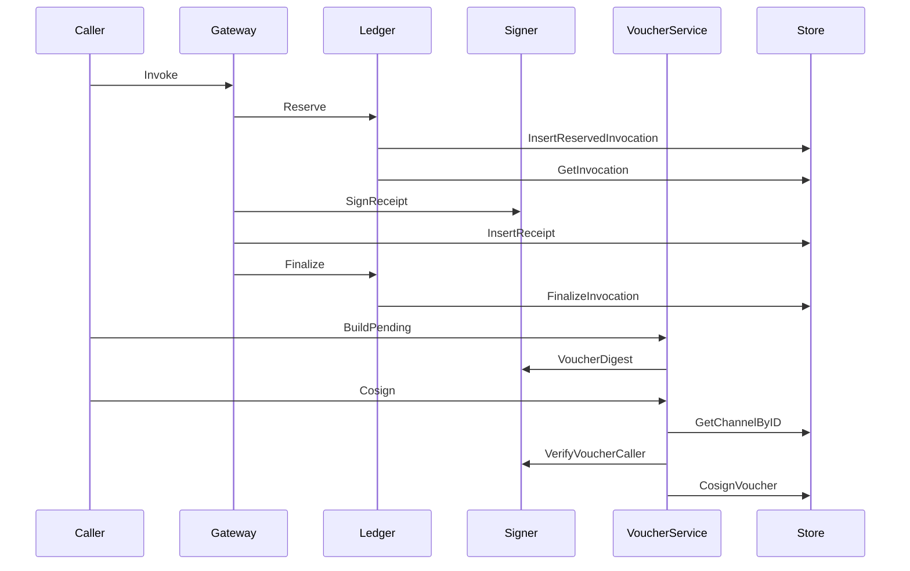

## Overview

This slice of `matrix-core` turns payment and settlement into a set of tightly linked primitives: EIP-712 signing for quotes, receipts, and vouchers; deterministic hashing for receipt batches; channel accounting for reserved and cumulative value; and Postgres-backed persistence for invocations, receipts, vouchers, deployments, and channel mirrors. The result is a workflow that can quote work, reserve spend, finalize delivery, and persist proof material without mixing those responsibilities into one layer.

The code is organized around three moving parts. `deus/internal/receipts/*` defines the hashing and signature material, `deus/internal/channels/*` manages caller-funded channels and co-signed vouchers, and `deus/internal/metering/ledger.go` records invocation lifecycle transitions while `deus/internal/store/*` writes the durable rows. These pieces are designed to be composed by higher-level invoke flows, but the financial correctness rules live here.

## Settlement Flow

This flow shows the two settlement tracks that share the same persisted state. Invocation settlement reserves an entry, records the receipt, and finalizes or voids the row; channel settlement builds a pending voucher, verifies the caller signature, and commits the co-signed voucher with the channel update in one transaction.

## Receipt Signing Primitives

### `deus/internal/receipts/eip712.go`

*deus/internal/receipts/eip712.go*

This file defines the signer that creates and verifies EIP-712 material for quotes and receipts. It also provides the canonical payload hashing helper used by downstream code to derive stable digests from JSON objects.

#### `Signer`

| Property | Type | Description |
| --- | --- | --- |
| `ChainID` | `int64` | Chain id used in the EIP-712 domain. |
| `VerifyingContract` | `common.Address` | Contract address included in the typed-data domain. |
| `PrivateKey` | `*ecdsa.PrivateKey` | Signing key used for quote and receipt signatures. |

**Constructor dependencies**

| Type | Description |
| --- | --- |
| `int64` | Chain id supplied to the signer. |
| `string` | Registry or verifying-contract address parsed into `common.Address`. |
| `string` | Hex-encoded private key parsed into an ECDSA key. |

**Methods**

| Method | Description |
| --- | --- |
| `NewSignerFromHex` | Trims the input key, parses it as hex, and builds a `Signer` with the supplied chain id and verifying-contract address. |
| `GatewayAddress` | Derives the signer address from `PrivateKey`. |
| `SignQuote` | Builds the `DeusQuote` typed data, hashes it, signs it, and returns the digest and signature as `0x`-prefixed hex. |
| `VerifyQuote` | Recovers the signer from the quote digest and signature, then checks that it matches `GatewayAddress`. |
| `SignReceipt` | Builds the `DeusReceipt` typed data, hashes it, signs it, and returns the digest and signature as `0x`-prefixed hex. |
| `VoucherDigest` | Builds the `DeusVoucher` typed data and returns its unsigned digest. |
| `VerifyVoucherCaller` | Recovers the signer from the voucher digest and caller signature, then checks that it matches the caller wallet. |

#### `QuoteFields`

| Property | Type | Description |
| --- | --- | --- |
| `ServiceID` | `string` | Service identifier included in the signed quote. |
| `EndpointID` | `string` | Endpoint identifier included in the signed quote. |
| `PricingVersion` | `int` | Pricing version encoded into the typed data. |
| `UnitPriceWei` | `string` | Unit price represented as a decimal wei string. |
| `MaxUnits` | `string` | Maximum units represented as a decimal string. |
| `Caller` | `string` | Caller identity included in the quote. |
| `ExpiresAt` | `time.Time` | Expiry timestamp converted to Unix seconds in the signed payload. |

#### `ReceiptFields`

| Property | Type | Description |
| --- | --- | --- |
| `InvocationID` | `string` | Invocation identifier bound into the receipt. |
| `ServiceID` | `string` | Service identifier bound into the receipt. |
| `Caller` | `string` | Caller identity bound into the receipt. |
| `ArgsHash` | `string` | Hash of the request arguments. |
| `ResultHash` | `string` | Hash of the returned result object. |
| `PriceWei` | `string` | Final charge encoded as a decimal wei string. |
| `Units` | `string` | Billed units encoded as a decimal string. |
| `Outcome` | `string` | Outcome string encoded into the receipt. |
| `Timestamp` | `time.Time` | Receipt timestamp converted to Unix seconds in the signed payload. |

**Behavior**

- `NewSignerFromHex` strips surrounding whitespace and an optional `0x` prefix before parsing the key.
- `SignQuote` and `SignReceipt` both use the same EIP-712 domain pattern: `EIP712Domain` with `name`, `version`, `chainId`, and `verifyingContract`.
- Both signing methods normalize the signature recovery byte into the `27` or `28` range before hex encoding.
- `VerifyQuote` and `VerifyVoucherCaller` fail closed on signer mismatch.

#### Utility functions

| Function | Description |
| --- | --- |
| `RecoverSigner` | Recovers an Ethereum address from a digest and signature. |
| `HashPayload` | Marshals a value to JSON and returns the Keccak-256 hash as a `0x`-prefixed hex string. |
| `WeiString` | Formats a `*big.Int` as a decimal wei string, returning `"0"` for `nil`. |

### `deus/internal/receipts/voucher.go`

HashPayload is the common digest builder used for arbitrary JSON objects, while SignQuote, SignReceipt, and VoucherDigest each wrap a typed EIP-712 message. That keeps quote, receipt, and voucher signatures structurally separate even though they all use the same signer.

*deus/internal/receipts/voucher.go*

This file defines the EIP-712 voucher shape used for caller co-signing and the caller verification step that checks whether a signature belongs to the expected wallet.

#### `VoucherFields`

| Property | Type | Description |
| --- | --- | --- |
| `ChannelID` | `string` | Channel identifier bound into the voucher. |
| `CumulativeWei` | `string` | Cumulative channel spend encoded as a decimal wei string. |
| `Nonce` | `uint64` | Monotonic voucher nonce. |
| `LastReceiptHash` | `string` | Receipt digest linked to the voucher. |

**Behavior**

- `VoucherDigest` constructs a `DeusVoucher` typed-data payload and returns only the digest.
- `VerifyVoucherCaller` recovers the signer from the voucher digest and caller signature, then compares the recovered address to `callerWallet`.
- The digest includes the channel id, cumulative spend, nonce, and last receipt hash, so a voucher is bound to one channel state and one receipt chain position.

### `deus/internal/receipts/merkle.go`

*deus/internal/receipts/merkle.go*

This file builds deterministic Merkle roots over receipt digests. It uses domain separation on both leaves and internal nodes so a raw receipt digest cannot be confused with a tree node hash.

#### `MerkleRoot`

| Function | Description |
| --- | --- |
| `MerkleRoot` | Decodes each digest, domain-separates leaves, sorts the first layer, duplicates the trailing node on odd layers, and returns a `0x`-prefixed root. |

**Supporting functions**

- `hashLeaf` prefixes each leaf with `0x00` before hashing.
- `hashNode` prefixes each internal node with `0x01` before hashing.
- `decodeHash` strips `0x` or `0X`, requires exactly 32 bytes, and rejects malformed digests.

**Behavior**

- Empty input fails with `receipts: empty merkle input`.
- The first layer is sorted, so the output is order-independent.
- Odd layers are handled by duplicating the final node rather than promoting it.

## Channel Voucher Lifecycle

### `deus/internal/channels/channels.go`

*deus/internal/channels/channels.go*

This file manages caller-funded payment channels. It opens a new channel window, reserves and releases balance, finalizes cumulative charge state, and exposes the current open channel for a caller.

#### `EscrowReader`

| Method | Description |
| --- | --- |
| `FundedWei` | Returns the on-chain funded balance for an escrow address as a decimal wei string. |

#### `Service`

| Property | Type | Description |
| --- | --- | --- |
| `store` | `*store.Store` | Persistence layer used for channel rows and balance updates. |
| `wallet` | `wallet.Client` | Wallet client retained by the service for financial flows. |
| `escrow` | `EscrowReader` | Optional chain-backed balance reader used to bound the channel by funded escrow. |

**Constructor dependencies**

| Type | Description |
| --- | --- |
| `*store.Store` | Postgres store used for channel persistence. |
| `wallet.Client` | Wallet client passed into the service. |
| `EscrowReader` | Optional on-chain funded-balance reader. |

**Methods**

| Method | Description |
| --- | --- |
| `New` | Constructs a `Service` and accepts a nil escrow reader for dev mode. |
| `Open` | Validates the cap, checks on-chain funding when available, opens a new channel row, and returns the active channel for the caller. |
| `Reserve` | Delegates a reserve decrement to the store. |
| `Void` | Releases reserved balance without charging it. |
| `Finalize` | Applies a charge, cumulative spend, voucher nonce, and voucher signature to the channel row. |
| `Active` | Loads the current open channel for a caller. |
| `AddCumulative` | Adds a charge to an existing cumulative total using decimal string arithmetic. |

#### `OpenInput`

| Property | Type | Description |
| --- | --- | --- |
| `CallerDID` | `string` | Caller identity for the new channel. |
| `CallerWallet` | `string` | Caller wallet address stored with the channel. |
| `CapWei` | `string` | Requested channel cap in decimal wei. |
| `EscrowAddr` | `string` | Escrow contract address used for funding checks. |
| `FundTx` | `string` | Funding transaction reference stored with the channel. |
| `Bearer` | `string` | Caller bearer token carried in the request shape. |

**Behavior**

- `Open` requires a positive `CapWei`.
- When `escrow` is non-nil, `Open` requires `EscrowAddr`, queries `FundedWei`, and caps the off-chain balance to the funded amount when the funded amount is smaller than the requested cap.
- When `escrow` is nil and no escrow address is supplied, `Open` assigns the dev sentinel `0xescrow-dev`.
- `defaultWindow` is `10 * time.Minute`, so new channels get a fixed current window.

### `deus/internal/channels/voucher.go`

*deus/internal/channels/voucher.go*

This file coordinates voucher construction and co-signing. It turns a channel row into a pending voucher, verifies the caller signature, and persists the signed voucher together with the channel state transition.

#### `VoucherService`

| Property | Type | Description |
| --- | --- | --- |
| `store` | `*store.Store` | Store used to load and persist channel and voucher rows. |
| `signer` | `*receipts.Signer` | EIP-712 signer used to derive and verify voucher digests. |

**Constructor dependencies**

| Type | Description |
| --- | --- |
| `*store.Store` | Store used for channel and voucher persistence. |
| `*receipts.Signer` | Receipt signer reused for voucher digests and caller verification. |

**Methods**

| Method | Description |
| --- | --- |
| `NewVoucherService` | Wires the voucher helper with store and signer dependencies. |
| `BuildPending` | Computes the next cumulative total, increments the nonce, and returns the unsigned voucher digest for caller signing. |
| `Cosign` | Loads the channel, enforces a monotonic nonce, verifies the caller signature, and commits the co-signed voucher through the store. |

#### `PendingVoucher`

| Property | Type | Description |
| --- | --- | --- |
| `CumulativeWei` | `string` | Next cumulative channel spend. |
| `Nonce` | `int64` | Next voucher nonce. |
| `LastReceiptHash` | `string` | Receipt digest that anchors the voucher. |
| `Digest` | `string` | Unsigned EIP-712 voucher digest returned to the caller. |

#### `CosignInput`

| Property | Type | Description |
| --- | --- | --- |
| `ChannelID` | `string` | Channel identifier for the voucher. |
| `CumulativeWei` | `string` | Cumulative spend to persist. |
| `ChargeWei` | `string` | Incremental charge that is being finalized. |
| `Nonce` | `int64` | Voucher nonce that must advance monotonically. |
| `LastReceiptHash` | `string` | Receipt digest carried into the voucher. |
| `Digest` | `string` | Voucher digest that the caller signs. |
| `CallerSig` | `string` | Caller signature over the voucher digest. |
| `CallerWallet` | `string` | Wallet address expected from the recovered signature. |

**Behavior**

- `BuildPending` uses `AddCumulative` to compute the next cumulative spend and then calls `receipts.Signer.VoucherDigest`.
- `Cosign` rejects any nonce that is less than or equal to the current stored nonce with `channels: voucher nonce not monotonic`.
- `Cosign` verifies the caller signature before persisting anything.
- The final write path is delegated to `store.CosignVoucher`, which atomically updates the channel mirror and inserts the voucher row.

## Metering Ledger

### `deus/internal/metering/ledger.go`

Cosign relies on the store transaction so the channel nonce/cumulative update and the voucher row insert move together. The write path is intentionally coupled so one cannot advance without the other.

*deus/internal/metering/ledger.go*

This file records invocation lifecycle transitions. It creates or reuses reserved invocation rows, loads the row back for outcome checks, and then finalizes or voids it through the store.

#### `Ledger`

| Property | Type | Description |
| --- | --- | --- |
| `store` | `*store.Store` | Store used for invocation reservation and finalization. |

**Constructor dependencies**

| Type | Description |
| --- | --- |
| `*store.Store` | Store used to persist invocation state. |

**Methods**

| Method | Description |
| --- | --- |
| `New` | Constructs a new `Ledger`. |
| `Reserve` | Inserts a reserved invocation row, reloads it, and accepts only `reserved`, `ok`, or `voided` outcomes. |
| `Finalize` | Marks the invocation delivered and charged. |
| `Void` | Releases a reservation without charging it. |

#### `ReserveInput`

| Property | Type | Description |
| --- | --- | --- |
| `IdempotencyKey` | `string` | Idempotency key used to deduplicate reservations. |
| `ServiceID` | `string` | Service identifier for the invocation. |
| `EndpointID` | `string` | Endpoint identifier for the invocation. |
| `CallerDID` | `string` | Caller identity recorded with the invocation. |
| `CallerWallet` | `string` | Caller wallet recorded with the invocation. |
| `QuoteID` | `string` | Quote identifier, optionally forwarded to the store. |
| `Units` | `string` | Billed units as a decimal string. |
| `PriceWei` | `string` | Final price as a decimal wei string. |
| `PricingVersion` | `int` | Pricing version stored with the invocation. |
| `ArgsHash` | `string` | Hash of the invocation arguments. |
| `Rail` | `string` | Payment rail name such as direct, net, or stream. |
| `ChannelID` | `string` | Channel identifier, optionally forwarded to the store. |

**Behavior**

- `Reserve` converts empty `QuoteID` and `ChannelID` values into `nil` pointers before persisting.
- `Reserve` uses `store.InsertReservedInvocation` and then immediately reloads the row with `store.GetInvocation`.
- `Reserve` treats any unexpected outcome as a hard error.

## Storage and Persistence

### `deus/internal/store/store.go`

*deus/internal/store/store.go*

This file owns the Postgres connection pool and the forward-only migration runner. It is the base layer for every financial write path in this section.

#### `Store`

| Property | Type | Description |
| --- | --- | --- |
| `pool` | `*pgxpool.Pool` | Backing Postgres connection pool. |

**Methods**

| Method | Description |
| --- | --- |
| `Close` | Closes the pool when it is non-nil. |
| `Pool` | Exposes the underlying pool for query packages. |
| `Ping` | Probes database connectivity through the pool. |
| `Migrate` | Applies `.sql` files in lexical order and records each applied version. |

**Lifecycle**

- `New` parses the PostgreSQL URI, creates the pool with `pgxpool.NewWithConfig`, and pings the database before returning.
- `Migrate` reads a directory, keeps only `.sql` files, sorts them lexically, ensures `schema_migrations` exists, skips files already recorded in `schema_migrations`, and runs each unapplied file inside its own transaction.
- `ensureMigrationTable` creates `schema_migrations` with `version` and `applied_at`.
- `isApplied` checks whether a version has already been recorded.

### `deus/internal/store/channels.go`

isApplied checks pgx.ErrNoRows, but the SELECT COUNT(1) query always returns one row. The branch does not drive behavior in the shown code; the real decision is based on whether the count is greater than zero.

*deus/internal/store/channels.go*

This file mirrors channel state in Postgres. It stores the channel balance, reservation state, cumulative spend, voucher nonce, and settlement metadata.

#### `ChannelRow`

| Property | Type | Description |
| --- | --- | --- |
| `ID` | `string` | Channel row identifier. |
| `CallerDID` | `string` | Caller identity linked to the channel. |
| `CallerWallet` | `string` | Caller wallet linked to the channel. |
| `EscrowAddr` | `string` | Escrow contract address mirrored on the row. |
| `BalanceWei` | `string` | Funded channel balance as a decimal wei string. |
| `ReservedWei` | `string` | Reserved amount as a decimal wei string. |
| `CumulativeWei` | `string` | Cumulative charged amount as a decimal wei string. |
| `RedeemedWei` | `string` | Redeemed amount mirrored for settlement accounting. |
| `Nonce` | `int64` | Latest voucher nonce. |
| `LastVoucherSig` | `*string` | Last persisted voucher signature. |
| `WindowStart` | `time.Time` | Channel window start timestamp. |
| `WindowEnd` | `time.Time` | Channel window end timestamp. |
| `Status` | `string` | Channel status. |
| `FundTx` | `*string` | Funding transaction reference. |
| `SettleTx` | `*string` | Settlement transaction reference. |

**Methods**

| Method | Description |
| --- | --- |
| `OpenChannel` | Inserts a new open channel row with zero reserved and cumulative balances. |
| `ActiveChannelForCaller` | Loads the newest open channel for a caller whose window has not expired. |
| `ReserveChannelBalance` | Atomically increments reserved balance when enough unreserved balance remains. |
| `ReleaseChannelReserve` | Releases reserved wei without charging the channel. |
| `FinalizeChannelCharge` | Decrements reserved wei and stores cumulative spend, nonce, and voucher signature. |
| `CosignVoucher` | Finalizes the channel charge and inserts the voucher in a single transaction. |
| `AdvanceChannelRedeemed` | Adds settled wei to the redeemed mirror. |
| `ReleaseExpiredChannelReserves` | Zeroes dangling reservations on expired open channels. |
| `GetChannelByID` | Loads a channel by id. |
| `CloseChannel` | Marks a channel closed and stores the settlement transaction reference. |

**Behavior**

- `OpenChannel` writes `status = 'open'`, `reserved_wei = '0'`, and `cumulative_wei = '0'`.
- `ActiveChannelForCaller` filters on `status = 'open'` and `window_end > now()`.
- `ReserveChannelBalance` uses a numeric comparison so it only succeeds when the remaining available balance can cover the requested amount.
- `CosignVoucher` starts a transaction, updates the channel row, inserts the voucher row, and commits only when both writes succeed.
- `ReleaseExpiredChannelReserves` is the cleanup path for stale reservations after the channel window ends.

### `deus/internal/store/invocations.go`

*deus/internal/store/invocations.go*

This file persists the invocation ledger that `metering.Ledger` works against. It stores the reservation, final outcome, timing, and payment rail.

#### `InvocationRow`

| Property | Type | Description |
| --- | --- | --- |
| `ID` | `string` | Invocation identifier. |
| `IdempotencyKey` | `string` | Idempotency key used for reservation deduplication. |
| `ServiceID` | `string` | Service identifier. |
| `EndpointID` | `string` | Endpoint identifier. |
| `CallerDID` | `string` | Caller identity. |
| `CallerWallet` | `string` | Caller wallet. |
| `QuoteID` | `*string` | Optional quote identifier. |
| `Units` | `string` | Billed units. |
| `PriceWei` | `string` | Final price in wei. |
| `PricingVersion` | `int` | Pricing version stored with the invocation. |
| `ArgsHash` | `string` | Invocation argument hash. |
| `ResultHash` | `string` | Result hash stored after finalization. |
| `Outcome` | `string` | Invocation outcome. |
| `LatencyMS` | `*int` | Optional latency in milliseconds. |
| `Rail` | `string` | Payment rail used for the invocation. |
| `ChannelID` | `*string` | Optional payment-channel id. |
| `CreatedAt` | `time.Time` | Row creation timestamp. |

**Methods**

| Method | Description |
| --- | --- |
| `InsertReservedInvocation` | Inserts a reserved invocation row and falls back to the existing row when the idempotency key already exists. |
| `GetInvocationByIdempotency` | Loads an invocation by idempotency key. |
| `GetInvocation` | Loads an invocation by id. |
| `FinalizeInvocation` | Updates a reserved invocation to its final outcome, result hash, units, price, and latency. |
| `VoidInvocation` | Marks a reserved invocation voided and zeroes price. |

**Behavior**

- `InsertReservedInvocation` uses `ON CONFLICT (idempotency_key) DO NOTHING`.
- If `InsertReservedInvocation` sees the existing key, it reloads the row by idempotency key and returns the existing id.
- `FinalizeInvocation` only succeeds when the row is still `reserved`.
- `VoidInvocation` only affects `reserved` rows.

### `deus/internal/store/receipts.go`

*deus/internal/store/receipts.go*

This file stores the durable receipt envelope for each finalized invocation.

#### `ReceiptRow`

| Property | Type | Description |
| --- | --- | --- |
| `Digest` | `string` | EIP-712 receipt digest. |
| `GatewaySig` | `string` | Gateway signature over the receipt digest. |
| `RunnerSig` | `*string` | Optional runner signature returned by hosted execution. |

**Methods**

| Method | Description |
| --- | --- |
| `InsertReceipt` | Inserts a receipt row and ignores duplicate invocation ids. |
| `GetReceipt` | Loads a receipt by invocation id. |

**Behavior**

- `InsertReceipt` uses `ON CONFLICT (invocation_id) DO NOTHING`.
- `GetReceipt` returns `store: receipt not found` when the invocation has no stored receipt.

### `deus/internal/store/vouchers.go`

*deus/internal/store/vouchers.go*

This file persists the voucher rows used for caller-co-signed cumulative settlement.

#### `VoucherRow`

| Property | Type | Description |
| --- | --- | --- |
| `ID` | `string` | Voucher row identifier. |
| `ChannelID` | `string` | Channel identifier. |
| `CumulativeWei` | `string` | Cumulative spend for the voucher. |
| `Nonce` | `int64` | Voucher nonce. |
| `LastReceiptHash` | `string` | Last receipt digest bound into the voucher. |
| `Digest` | `string` | EIP-712 voucher digest. |
| `CallerSig` | `string` | Caller signature over the digest. |
| `RedeemedIn` | `*string` | Optional settlement reference. |
| `CreatedAt` | `time.Time` | Voucher creation timestamp. |

**Methods**

| Method | Description |
| --- | --- |
| `InsertVoucher` | Inserts a co-signed voucher row. |
| `HighestVoucherForChannel` | Returns the highest-nonce voucher for settlement. |

**Behavior**

- `HighestVoucherForChannel` orders by `nonce DESC` and returns the first row.
- The table is used as the durable record of a channel’s latest cumulative voucher state.

### `deus/internal/store/deployments.go`

*deus/internal/store/deployments.go*

This file mirrors deployment records for hosted execution routing and lifecycle tracking.

#### `DeploymentRow`

| Property | Type | Description |
| --- | --- | --- |
| `ID` | `string` | Deployment identifier. |
| `ServiceID` | `string` | Service identifier. |
| `AppwriteFunctionID` | `*string` | Optional Appwrite function id. |
| `SiteID` | `*string` | Optional site id. |
| `Runtime` | `string` | Runtime name. |
| `DeploymentID` | `*string` | Optional backend deployment id. |
| `ExecEndpoint` | `*string` | Optional execution endpoint. |
| `Status` | `string` | Deployment status. |
| `Region` | `*string` | Optional region. |
| `LastInvokedAt` | `*time.Time` | Optional timestamp of the last invocation. |
| `AlwaysWarm` | `bool` | Whether the deployment is always warm. |
| `ArtifactKey` | `*string` | Optional artifact key. |
| `CreatedAt` | `time.Time` | Row creation timestamp. |

**Methods**

| Method | Description |
| --- | --- |
| `InsertDeployment` | Creates a deployment row. |
| `ActiveDeploymentForService` | Returns the newest active deployment for a service. |
| `ListDeploymentsForService` | Returns deployments for a service in reverse chronological order. |
| `GetDeployment` | Loads a deployment by id. |
| `UpdateDeploymentStatus` | Updates deployment status and optionally the execution endpoint. |
| `CountAlwaysWarmDeployments` | Counts active always-warm deployments. |
| `TouchDeploymentInvoked` | Updates `last_invoked_at`. |
| `SetDeploymentBackendIDs` | Stores backend function and deployment ids after provisioning. |
| `DeactivateDeploymentsForService` | Marks prior active deployments as superseded. |

**Behavior**

- `ActiveDeploymentForService` filters on `status = 'active'` and sorts by `created_at DESC`.
- `CountAlwaysWarmDeployments` counts only active rows with `always_warm = true`.
- `DeactivateDeploymentsForService` updates active rows to `superseded` before a new deploy becomes active.

## Settlement States and Invariants

| Entity | Stored states or values | Rules enforced in code |
| --- | --- | --- |
| Channel | `open`, `closed` | `OpenChannel` writes `open`; `CloseChannel` writes `closed`; `ActiveChannelForCaller` only returns `open` and unexpired rows. |
| Invocation | `reserved`, `ok`, `voided` | `InsertReservedInvocation` writes `reserved`; `FinalizeInvocation` only updates rows still `reserved`; `VoidInvocation` only updates rows still `reserved`. |
| Deployment | `active`, `superseded` | `ActiveDeploymentForService` only reads `active`; `DeactivateDeploymentsForService` marks old active rows `superseded`. |
| Voucher nonce | Monotonic integer | `BuildPending` increments the stored nonce; `Cosign` rejects non-monotonic input. |
| Channel reserve | Decimal wei string | `ReserveChannelBalance` only succeeds when available balance covers the requested amount. |

## Error Handling

The financial workflow code uses explicit, package-prefixed errors so each layer can tell reservation failures from signature failures or persistence failures.

| Layer | Example error text | Trigger |
| --- | --- | --- |
| Receipts | `receipts: invalid signing key` | Hex key parsing fails in `NewSignerFromHex`. |
| Receipts | `receipts: quote signer mismatch` | `VerifyQuote` recovers a different address than the signer address. |
| Receipts | `receipts: voucher caller mismatch` | `VerifyVoucherCaller` recovers a different address than `callerWallet`. |
| Receipts | `receipts: empty merkle input` | `MerkleRoot` receives no digests. |
| Receipts | `receipts: invalid digest` | `decodeHash` cannot parse a digest as a 32-byte hex string. |
| Receipts | `receipts: invalid signature length` | `RecoverSigner` receives a signature that is not 65 bytes. |
| Channels | `channels: cap required` | `Open` receives an empty channel cap. |
| Channels | `channels: invalid cap` | `Open` cannot parse or validate `CapWei` as a positive integer. |
| Channels | `channels: escrow_addr required` | `Open` has an escrow reader but no escrow address. |
| Channels | `channels: escrow not funded` | The escrow reader returns a non-positive funded balance. |
| Channels | `channels: voucher nonce not monotonic` | `Cosign` receives a nonce that does not advance. |
| Metering | `metering: unexpected outcome` | `Reserve` reloads a row whose outcome is not one of the accepted values. |
| Store | `store: no migrations in ` | `Migrate` finds no `.sql` files. |
| Store | `store: deployment not found` | Deployment lookups return no rows. |
| Store | `store: channel not found` | Channel lookups return no rows. |
| Store | `store: invocation not found` | Invocation lookups return no rows. |
| Store | `store: receipt not found` | Receipt lookups return no rows. |
| Store | `store: insufficient channel balance` | Channel reservation cannot satisfy the requested amount. |
| Store | `store: invocation not in reserved state` | Finalization or voiding is attempted on a non-reserved row. |

## Verification

### `deus/internal/receipts/eip712_test.go`

*deus/internal/receipts/eip712_test.go*

| Test | What it proves |
| --- | --- |
| `TestSignAndVerifyQuote` | A quote can be signed and verified with the same signer, chain id, and registry address. |

The test uses a fixed private-key fixture, a fixed service id, a fixed endpoint id, and a fixed pricing version so the quote digest and signature round-trip deterministically.

### `deus/internal/receipts/merkle_test.go`

*deus/internal/receipts/merkle_test.go*

| Test | What it proves |
| --- | --- |
| `TestMerkleRootDeterministic` | Reordering the same digests does not change the Merkle root. |
| `TestMerkleRootOddLeaves` | Odd layers duplicate the trailing node, and a single leaf is not passed through as the root. |

### `deus/internal/receipts/voucher_test.go`

*deus/internal/receipts/voucher_test.go*

| Test | What it proves |
| --- | --- |
| `TestVoucherCallerVerify` | A voucher digest signed by the caller wallet passes `VerifyVoucherCaller`. |

The test signs the digest with a fixed caller-key fixture and checks that the recovered wallet matches the expected caller wallet fixture.

### `deus/internal/store/store_test.go`

*deus/internal/store/store_test.go*

| Test | What it proves |
| --- | --- |
| `TestMigrateCreatesSchema` | `Migrate` creates the schema, can be run twice without failing, and leaves the `services` table present. |

The test reads `DEUS_POSTGRES_URI` and `DEUS_MIGRATIONS_DIR` when present and otherwise falls back to a local Postgres URI with embedded credentials and a migrations directory relative to the store package.

## External Financial Dependencies

### `wallet.Client`

`wallet.Client` is injected into `deus/internal/channels/channels.go` `Service` and into the `Gateway` configuration in `deus/internal/gateway/gateway.go`. In the visible financial invoke path, it is used for spend authorization and payout transfer calls through `AuthorizeSpend` and `Send`.

### `quality.Service`

`quality.Service` is injected into `Gateway` and sampled after payment rails complete. The visible call sites record outcomes and latency with `Sample`.

### `streams.Service`

`streams.Service` is injected into `Gateway` and is used by the stream rail flow to load ownership, meter deltas, and persist meter progress with `GetOwned`, `MeterDelta`, and `RecordMeter`.

### `HostingRouter`

`HostingRouter` is injected into `Gateway` and resolves the active hosted execution endpoint with `ActiveEndpoint`. That endpoint selection feeds the hosted invocation path that eventually settles through the same store and receipt primitives documented above.

## Key Files Reference

| File | Responsibility |
| --- | --- |
| `deus/internal/receipts/eip712.go` | Builds and verifies EIP-712 quotes and receipts, recovers signers, and hashes JSON payloads. |
| `deus/internal/receipts/eip712_test.go` | Verifies quote signing and signature recovery. |
| `deus/internal/receipts/merkle.go` | Produces deterministic, domain-separated Merkle roots over receipt digests. |
| `deus/internal/receipts/merkle_test.go` | Verifies deterministic ordering and odd-leaf handling for Merkle roots. |
| `deus/internal/receipts/voucher.go` | Builds voucher digests and verifies caller signatures. |
| `deus/internal/receipts/voucher_test.go` | Verifies voucher caller recovery against a fixed wallet fixture. |
| `deus/internal/channels/channels.go` | Opens channels, reserves and releases balance, finalizes cumulative spend, and exposes active channels. |
| `deus/internal/channels/voucher.go` | Builds pending vouchers and co-signs them with monotonic nonce enforcement. |
| `deus/internal/metering/ledger.go` | Reserves, finalizes, and voids invocation ledger rows. |
| `deus/internal/store/store.go` | Creates the Postgres pool and applies forward-only SQL migrations. |
| `deus/internal/store/channels.go` | Persists channel mirrors and channel settlement transitions. |
| `deus/internal/store/invocations.go` | Persists invocation reservations and final outcomes. |
| `deus/internal/store/receipts.go` | Persists signed receipts keyed by invocation id. |
| `deus/internal/store/vouchers.go` | Persists voucher rows and loads the highest nonce for a channel. |
| `deus/internal/store/deployments.go` | Persists deployment mirrors, active deployment lookup, and warm deployment tracking. |
| `deus/internal/store/store_test.go` | Verifies migration application and schema creation. |
