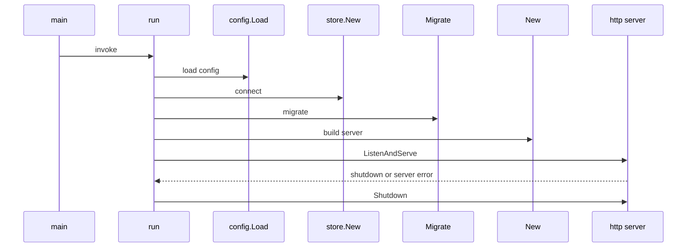
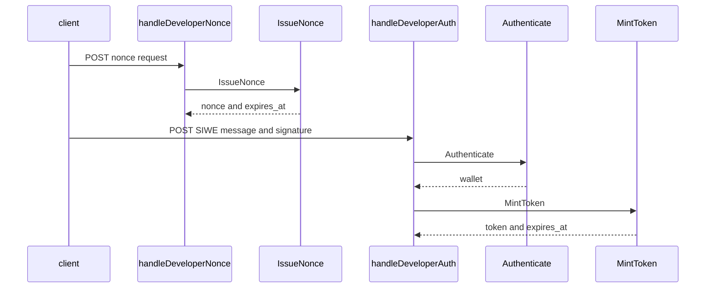
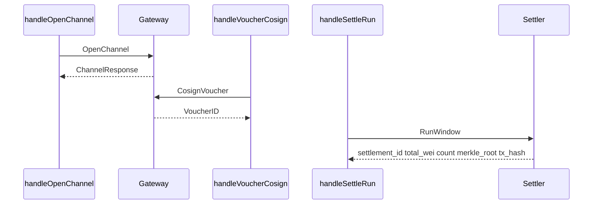

## Overview

This section covers the Deus service shell: the daemon entrypoint, operator CLI, HTTP server assembly, developer sign-in flow, channel and settlement handlers, the repository docs that describe the service contract, and the SQL migrations that create the control-plane schema. The code here is the glue that turns the broader marketplace design into a runnable control plane.

From a workflow perspective, `deusd` is responsible for bootstrapping storage, applying migrations, wiring service facades, and starting the HTTP server. The server then exposes health and metrics endpoints, mounts developer-auth routes, and delegates financial actions to the gateway and settler services. The docs files define the intended product, architecture, data model, and deployment shape that these entrypoints implement.

## Source Files in Scope

| Path | Role in this section | Concrete behavior |
| --- | --- | --- |
| `deus/README.md` | Top-level product and runbook summary | Frames Deus as a marketplace and registry, points readers to the docs set, shows quick-start commands, and notes the Postgres extension requirement. |
| `deus/cmd/deusd/main.go` | Daemon entrypoint | Loads config, connects to Postgres, runs migrations, optionally connects to chain and object storage, constructs service facades, starts `http.Server`, and runs the expired-channel reserve reaper. |
| `deus/cmd/deusctl/main.go` | Operator CLI entrypoint | Builds the `deusctl` root command, wires `migrate` and `manifest` subcommands, prints execution errors to stderr, and exits non-zero on failure. |
| `deus/internal/server/server.go` | HTTP server assembly | Defines shared server dependencies, installs middleware, mounts health and metrics routes, mounts auth and service route groups, and provides graceful-shutdown plumbing. |
| `deus/internal/server/errors.go` | JSON error envelope | Defines the standard API error shape and a helper that writes JSON errors with the correct content type and status code. |
| `deus/internal/server/devauth.go` | Developer SIWE auth | Implements nonce issuance, SIWE parsing, message verification, token minting, token verification, and the `/v1/developers/nonce` and `/v1/developers/auth` handlers. |
| `deus/internal/server/devauth_test.go` | Developer auth tests | Exercises nonce/auth/token round-trips, tamper rejection, nonce expiry, domain pinning, bare-header rejection, and token-authenticated owner routes. |
| `deus/internal/server/handlers_channels.go` | Channel and settlement handlers | Handles channel open, voucher co-sign, and settlement-run requests by calling gateway and settler services. |
| `deus/docs/00-index.md` | Master spec index | Acts as the canonical spec landing page, glossary, decision log, and doc navigation hub. |
| `deus/docs/01-overview.md` | Product overview | Describes the marketplace/registry problem statement, personas, value proposition, scope, and success criteria. |
| `deus/docs/02-architecture.md` | Architecture spec | Defines the control plane, execution layer, on-chain layer, data stores, request flows, and failure behavior. |
| `deus/docs/03-data-model.md` | Data model spec | Defines the authoritative stores, schema direction, service manifest shape, and rebuild/replay rules. |
| `deus/docs/13-deployment.md` | Deployment and ops spec | Describes control-plane placement, hosted execution placement, required environment variables, rollout order, observability, backups, and invariants. |
| `deus/migrations/001_init.sql` | Initial schema | Creates extensions, the migration table, all core control-plane tables, indexes, and the initial `index_cursor` row. |
| `deus/migrations/002_draft_chain_id.sql` | Draft-chain migration | Makes `services.chain_id` nullable so services can exist off-chain before on-chain registration. |
| `deus/migrations/003_discovery_search.sql` | Discovery search migration | Adds a searchable document column and search indexes for active services and vector similarity. |

## Service Entrypoints

### `deus/cmd/deusctl/main.go`

deus/docs/00-index.md still describes the repository as a specification with a scaffold-only status, while this section of the repository already contains implemented entrypoints, HTTP handlers, tests, and migrations. Use the index as the design baseline, not as a live inventory.

`deusctl` is the operator-facing CLI shell. Its `main` function calls `newRoot().Execute()`, writes any error to stderr, and exits with status `1` on failure. The root command is labeled `deusctl` and described as `Deus operator CLI`.

| Function | Description |
| --- | --- |
| `main` | Executes the root command and terminates the process on error. |
| `newRoot` | Builds the root `cobra.Command` and attaches the `migrate` and `manifest` subcommands. |

### `deus/cmd/deusd/main.go`

`deusd` is the long-running Go control-plane process. The `run` function loads configuration, establishes storage, applies migrations, wires service facades, starts the HTTP server, and launches the reserve-reaper goroutine that frees expired channel reservations once per minute.

Key startup behavior:

- `telemetry.NewLogger()` creates the process logger.
- `signal.NotifyContext` handles `SIGINT` and `SIGTERM`.
- `config.Load()` reads runtime configuration.
- `store.New(ctx, cfg.PostgresURI)` opens Postgres.
- `db.Migrate(ctx, migDir)` runs the SQL migrations from `cfg.MigrationsDir`, resolving relative paths through `moduleRoot()`.
- `chain.New(ctx, cfg.RPCURL, cfg.ChainID)` is optional and can fail open in dev mode.
- `objstore.New` is optional and can fall back to `objstore.NewMem(cfg.ObjStoreBucket)` in dev mode.
- `indexer.New(chainRegistry, db)` is created only when the chain registry is available.
- `discovery.New` is initialized with the embedder and ranking weights.
- `registry.NewService(db, chainRegistry, ix)` is created and then given the discovery service via `SetManifestIndexer`.
- `pricing.New(db)`, `metering.New(db)`, `channels.New`, `streams.New`, `gateway.New`, and `settlement.NewSettler` are wired into the server.
- `server.New(server.Deps{})` assembles the HTTP stack.
- `http.Server` is created with `ReadHeaderTimeout: 10 * time.Second`.
- The process shuts down by waiting on the signal-derived context, then calling both server shutdown paths with a `15*time.Second` timeout.

Dev-mode fallbacks are explicit in the code:

- If chain, object store, or registry wiring fails and `cfg.Dev` is set, the process logs a warning and continues.
- If the object store never materializes in dev mode, an in-memory store is used.
- If the gateway signing key is absent in dev mode, `cfg.PublishPrivateKey` is reused.
- If no chain payer is available in dev mode, settlement uses `&settlement.DevPayer{}`.

| Function | Description |
| --- | --- |
| `main` | Calls `run` and exits with the returned code. |
| `run` | Performs the full boot sequence, starts the HTTP server, and manages shutdown. |
| `moduleRoot` | Resolves the repository root from `DEUS_ROOT`, then the current working directory, then `.`. |

### Operational commands referenced by the repository docs

`deus/README.md` exposes the local quick-start and operator commands that support the shell:

| Command | Purpose |
| --- | --- |
| `make deus-build deus-test deus-lint` | Build, test, and lint the Deus service tree. |
| `make deus-migrate` | Apply the forward-only SQL migrations. |
| `go run ./cmd/deusctl manifest validate test/fixtures/proxy-weather.json` | Validate a manifest with the operator CLI. |
| `go run ./cmd/deusd` | Start the daemon locally. |

The README also states that Postgres must have `pgcrypto` and `pgvector` installed, and it shows a local `DEUS_POSTGRES_URI` example together with `DEUS_DEV=1` for relaxed local boot.

## HTTP Server and Error Envelope

### `deus/internal/server/server.go`

`Server` is the HTTP composition root. `New` creates the router, installs middleware, mounts route groups, and stores the resulting router for `Handler` to return.

#### `Deps`

| Property | Type | Purpose |
| --- | --- | --- |
| `Log` | `zerolog.Logger` | Shared logger injected from the daemon entrypoint. |
| `Store` | `*store.Store` | Postgres-backed persistence and health checks. |
| `Chain` | `*chain.Client` | Chain RPC client used for health checks and chain-aware services. |
| `Registry` | `*registry.Service` | Registry service facade. |
| `Discovery` | `*discovery.Service` | Discovery service facade. |
| `Gateway` | `*gateway.Gateway` | Invocation and financial request gateway. |
| `Settler` | `*settlement.Settler` | Settlement runner. |
| `Streams` | `*streams.Service` | Stream service facade. |
| `Hosting` | `*hosting.Orchestrator` | Hosting orchestration facade. |
| `BlobURL` | `func(string) string` | Object-store URL resolver. |
| `DevMode` | `bool` | Toggles dev-only fallbacks. |
| `PublishPrivateKey` | `string` | Dev-mode fallback for signing. |
| `DeveloperAuthSecret` | `string` | Secret used to mint and verify SIWE nonces and tokens. |
| `SIWEDomain` | `string` | Optional domain pin for SIWE messages. |

#### `Server`

| Property | Type | Purpose |
| --- | --- | --- |
| `deps` | `Deps` | Shared runtime dependencies. |
| `devAuth` | `*DeveloperAuth` | SIWE auth engine created from `DeveloperAuthSecret` and `SIWEDomain`. |
| `mux` | `chi.Router` | Composed router returned by `Handler`. |

#### Methods

| Method | Description |
| --- | --- |
| `New` | Creates the router, installs request ID, real IP, recovery, and timeout middleware, mounts health and metrics routes, and wires all route groups. |
| `Handler` | Returns the root `http.Handler`. |
| `handleHealthz` | Pings Postgres and the chain client, builds the health response, and returns HTTP `200` or `503`. |
| `Shutdown` | Present as a graceful-drain hook and currently returns `nil`. |
| `writeJSON` | Writes JSON responses with `Content-Type: application/json`. |
| `promStub` | Returns a plaintext Prometheus-style stub body for `/internal/metrics`. |

handleHealthz reports resp.Chain from Chain.Ping(ctx), but only Store.Ping(ctx) affects resp.OK. A chain outage can still return HTTP 200 as long as Postgres is healthy.

The server installs `middleware.RequestID`, `middleware.RealIP`, `middleware.Recoverer`, and `middleware.Timeout(60 * time.Second)`. It mounts `/internal/healthz` directly, mounts `/internal/metrics` via the stub handler, then calls the route-group mount functions for developer auth, registry, discovery, invoke, stream, and dashboard flows.

### `deus/internal/server/errors.go`

`APIError` is the uniform JSON error envelope.

#### `APIError`

| Property | Type | Purpose |
| --- | --- | --- |
| `Error` | `string` | Machine-readable error code. |
| `Message` | `string` | Human-readable error message. |
| `Detail` | `map[string]any` | Optional structured detail payload. |

#### Helper

| Function | Description |
| --- | --- |
| `writeAPIError` | Sets the response content type to JSON, writes the status code, and encodes `APIError`. |

## Developer Authentication

### `deus/internal/server/devauth.go`

This file implements the developer sign-in flow based on SIWE. `NewDeveloperAuth` returns `nil` when the secret is empty, which makes the SIWE endpoints unavailable and leaves the dev-mode header fallback as the only path. Nonces are stateless and HMAC-bound, and tokens are short-lived HMAC-bound wallet tokens.

#### `DeveloperAuth`

| Property | Type | Purpose |
| --- | --- | --- |
| `secret` | `[]byte` | HMAC key used for nonce and token signatures. |
| `siweDomain` | `string` | Optional domain pin for SIWE verification. |
| `now` | `func() time.Time` | Clock source used for expiry checks and test control. |

#### Methods

| Method | Description |
| --- | --- |
| `NewDeveloperAuth` | Trims the inputs and returns `nil` when the secret is empty. |
| `sign` | Computes the HMAC signature for a payload string. |
| `verifySigned` | Verifies an HMAC signature using constant-time comparison. |
| `IssueNonce` | Creates a random, stateless nonce with a 5-minute expiry. |
| `verifyNonce` | Validates a nonce signature and expiry. |
| `MintToken` | [REDACTED] |
| `VerifyToken` | [REDACTED] |
| `Authenticate` | Parses the SIWE message, verifies domain, nonce, optional expiration, and signature recovery, then returns the recovered wallet. |

#### Helper functions

| Function | Description |
| --- | --- |
| `parseSIWE` | Extracts the SIWE domain, address, nonce, and optional expiration from a message. |
| `personalSignDigest` | Computes the EIP-191 digest used for `personal_sign` verification. |

#### HTTP DTOs

| Type | Property | Type | Purpose |
| --- | --- | --- | --- |
| `developerNonceResponse` | `Nonce` | `string` | HMAC-bound nonce value returned by `/v1/developers/nonce`. |
| `ExpiresAt` | `time.Time` | Expiry time for the nonce. |
| `developerAuthRequest` | `Message` | `string` | SIWE message body posted to `/v1/developers/auth`. |
| `Signature` | `string` | Hex-encoded signature for the message. |
| `developerAuthResponse` | `Wallet` | `string` | Recovered wallet address. |
| `Token` | `string` | Short-lived developer token. |
| `ExpiresAt` | `time.Time` | Expiry time for the token. |

#### Route handlers

| Method | Description |
| --- | --- |
| `mountDeveloperAuthRoutes` | Registers `/v1/developers/nonce` and `/v1/developers/auth`. |
| `handleDeveloperNonce` | Returns a nonce and expiry, or `503` when auth is not configured and `500` on nonce-generation failure. |
| `handleDeveloperAuth` | Reads the JSON body, authenticates the SIWE message, and returns wallet, token, and expiry. |

Behavioral details visible in source:

- Request bodies are capped with `io.LimitReader` at `16 * 1024` bytes.
- SIWE messages are capped at `4096` bytes.
- The code accepts MetaMask-style `v` values in `{27,28}` and normalizes them before recovery.
- Domain pinning is optional and enforced only when `SIWEDomain` is set.
- Token and nonce expiry checks use the injected clock function, which makes the tests deterministic.

### `deus/internal/server/devauth_test.go`

The test file proves the auth behavior end to end.

| Test | What it proves |
| --- | --- |
| `TestDeveloperAuthRoundTrip` | A nonce can be issued, the SIWE message can be signed, and the recovered wallet matches the signing key. |
| `TestDeveloperAuthRejectsTamperedSignature` | Tampered signatures and wrong-signing keys are rejected. |
| `TestDeveloperAuthRejectsForeignAndExpiredNonce` | Nonces minted under a different secret and expired nonces are rejected. |
| `TestDeveloperAuthRejectsExpiredMessageAndToken` | [REDACTED] |
| `TestDeveloperAuthDomainPinning` | Pinned domains pass when they match and fail when they do not. |
| `TestDeveloperHeaderRejectedOutsideDevMode` | Bare `X-Developer-Wallet` does not authenticate in production mode. |
| `TestDeveloperAuthHTTPFlow` | The `/v1/developers/nonce` and `/v1/developers/auth` HTTP flow returns a wallet-bound token. |
| `TestTokenAuthedOwnerRoute` | [REDACTED] |

The helper `siweMessage` builds a message with the `URI`, `Version: 1`, `Chain ID: 125`, `Nonce`, `Issued At`, and optional `Expiration Time` fields. The tests use `httptest.NewServer(s.Handler())` to exercise the real router.

## Channel and Settlement Handlers

### `deus/internal/server/handlers_channels.go`

This file contains the request handlers that connect the HTTP layer to the financial gateway and settlement services. The handlers are thin: they decode JSON, verify that the needed service dependency exists, and delegate the work.

| Method | Description |
| --- | --- |
| `handleOpenChannel` | Requires a caller from `auth.FromContext`, decodes `types.OpenChannelRequest`, calls `Gateway.OpenChannel`, and returns `types.ChannelResponse` with `ID`, `CallerDID`, `BalanceWei`, `ReservedWei`, `CumulativeWei`, `WindowEnd`, and `Status`. |
| `handleVoucherCosign` | Requires a caller from `auth.FromContext`, decodes `types.VoucherCosignRequest`, calls `Gateway.CosignVoucher` with `channels.CosignInput`, and returns `types.VoucherCosignResponse{VoucherID: id}`. |
| `handleSettleRun` | Decodes `developer_id` and `payout_address`, calls `Settler.RunWindow`, and returns `settlement_id`, `total_wei`, `count`, `merkle_root`, and `tx_hash`. |

Runtime guard behavior:

- `handleOpenChannel` returns `503` if the gateway is unavailable, `401` if the caller is missing from context, and `400` for invalid JSON.
- `handleVoucherCosign` uses the same gateway and caller checks.
- `handleSettleRun` returns `503` if the settler is unavailable, `400` for invalid JSON, and `500` if the settlement run fails.

The open-channel and voucher paths are caller-scoped: both explicitly read the caller from the request context before touching the gateway. The settlement-run path is operator-style in the handler body itself; it only requires the settler dependency and a valid JSON body.

## Documentation and Operations

### `deus/docs/00-index.md`

The index file is the root of the spec set. It introduces Deus as the marketplace and registry for the agent economy, defines the glossary, and lays out the decision log and cross-cutting conventions. It also shows how the rest of the docs are meant to be read in order.

### `deus/docs/01-overview.md`

This document frames the user problem and solution:

- onboarding friction for machines
- subscriptions that do not fit bursty usage
- anecdotal reputation
- split registry and marketplace products
- custody risk for autonomous spend

It then maps those problems to Deus mechanisms such as pay-per-call usage, PoFQ quality scoring, a single registry-marketplace entity, embedded-wallet spend limits, semantic discovery, free hosting, and zero platform rake. It also defines the personas and success criteria that the runtime shell supports.

### `deus/docs/02-architecture.md`

The architecture spec explains the runtime split:

- Go control plane
- Node execution layer on Paxeer Cloud
- on-chain `ServiceRegistry` plus Paxeer precompiles
- Postgres and pgvector as the derived mirror
- Next.js console
- Matrix MCP proxy bridge

It also spells out the major flows: service listing, hosted listings, discovery plus invocation, streaming use, confidential calls, and failure behavior such as search fallback, runner failures, settlement retries, policy denials, and chain-RPC failures.

### `deus/docs/03-data-model.md`

The data-model spec establishes authority boundaries between chain, Postgres, and object storage, then defines the service manifest shape and the rebuild invariant. The migration files in this section implement the schema direction described there, including the financial tables for invocations, receipts, channels, vouchers, settlements, spend grants, and deployment state.

### `deus/docs/13-deployment.md`

The deployment doc ties the runtime shell to actual ops:

- placement options for `deusd`
- hosted execution on Paxeer Cloud
- env vars for Postgres, chain RPC, registry address, settlement anchor, object store, wallet API, embeddings provider, Appwrite, hosting budget, and port
- on-chain deploy order
- daemon-baked MCP proxy rollout
- observability and runbooks
- backups and disaster recovery
- operational invariants

It also states that hosted execution is always Paxeer Cloud, regardless of where the control plane runs, and that the box install path runs `deusctl migrate`.

### Operational references from the docs

| File | Operational content |
| --- | --- |
| `deus/README.md` | Quick start, extension prerequisites, and local run commands. |
| `deus/docs/13-deployment.md` | Environment variables, deployment order, health and metrics, runbooks, backups, and invariants. |

### Deployment environment variables referenced in `deus/docs/13-deployment.md`

| Variable | Purpose |
| --- | --- |
| `DEUS_POSTGRES_URI` | Postgres connection string for the `deus` database. |
| `PAXEER_RPC_URL` | Chain 125 RPC endpoint. |
| `DEUS_SERVICE_REGISTRY_ADDR` | On-chain registry address. |
| `DEUS_SETTLEMENT_ANCHOR_ADDR` | Settlement anchor address. |
| `DEUS_OBJSTORE_ENDPOINT` | Object-store endpoint. |
| `DEUS_OBJSTORE_KEY` / `DEUS_OBJSTORE_SECRET` | [REDACTED] |
| `DEUS_GATEWAY_SIGNING_KEY_REF` | Quote and receipt signing key reference. |
| `DEUS_SETTLER_KEY_REF` | Settlement signing key reference. |
| `MATRIX_WALLET_API_URL` | Embedded wallet API endpoint. |
| `DEUS_EMBED_PROVIDER` / `DEUS_EMBED_API_KEY` | [REDACTED] |
| `DEUS_APPWRITE_ENDPOINT` / `DEUS_APPWRITE_PROJECT` / `DEUS_APPWRITE_API_KEY` | [REDACTED] |
| `DEUS_HOSTING_BUDGET_PAX` | Free-hosting budget ceiling. |
| `DEUS_PORT` | Listen port for `deusd`. |

## Schema Migrations

### `deus/migrations/001_init.sql`

This migration creates the initial control-plane schema and is explicitly forward-only and idempotent. It installs `pgcrypto` and `vector`, creates the `schema_migrations` table, and creates the primary control-plane tables:

- `developers`
- `services`
- `endpoints`
- `pricing_plans`
- `embeddings`
- `quotes`
- `settlements`
- `invocations`
- `receipts`
- `channels`
- `vouchers`
- `spend_grants`
- `deployments`
- `index_cursor`

It also creates the relevant indexes, including:

- GIN index on `services.manifest`
- B-tree indexes on service kind/mode/status and quality
- invocation indexes on service, settlement, and caller
- the initial `index_cursor` row with `id = 1`

### `deus/migrations/002_draft_chain_id.sql`

This migration drops the `NOT NULL` constraint from `services.chain_id`. The result is that a service draft can exist before it has an on-chain identifier.

### `deus/migrations/003_discovery_search.sql`

This migration adds the search fields and indexes used by discovery:

- `services.search_document` as `tsvector`
- GIN index on `services.search_document`
- HNSW index on `embeddings.vec`
- partial index on active services by `kind` and `status`

The file is the schema-side counterpart to the discovery search behavior described in the docs.

## Financial Workflow Summary

The source-backed flow across this section is:

1. `deusd` starts, loads config, and runs migrations.
2. The HTTP server is created with shared dependencies and middleware.
3. Developer auth issues a nonce, verifies SIWE, and mints a short-lived token.
4. Channel handlers call the gateway to open a channel or co-sign a voucher.
5. The settlement handler delegates a window run to the settler.
6. The reserve reaper clears expired channel reservations once per minute.

The code in this section is the control-plane shell around the broader Deus financial and service workflows: it does not implement discovery, wallet policy, hosting execution, or chain contracts itself, but it wires the services that do.
