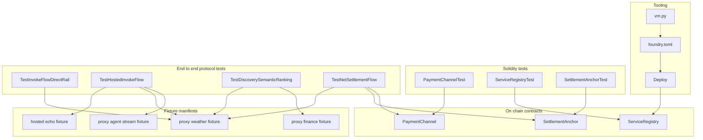
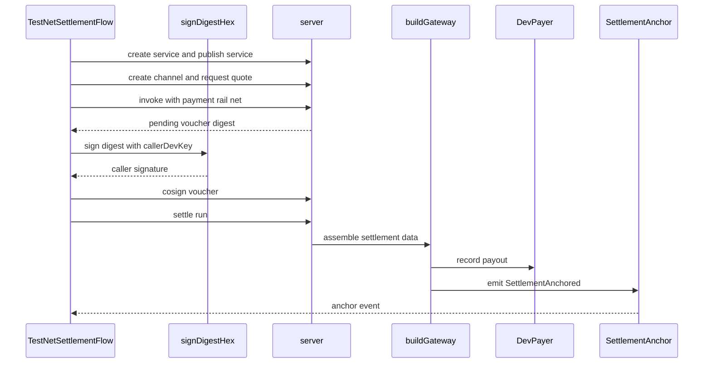

## Overview

This section covers the on-chain pieces that govern Deus service listings, per-caller escrow windows, and settlement anchoring, together with the Foundry deployment path and the protocol-level tests that exercise those flows end to end. The contracts establish the durable source of truth for listings and settlement signals, while the test suite proves how service publication, direct-rail invocation, hosted execution, semantic discovery, and net settlement behave under Anvil-driven integration runs.

The workflow is split across three layers. `ServiceRegistry` records service metadata and ownership on-chain, `PaymentChannel` handles per-caller escrow for net-settlement windows, and `SettlementAnchor` emits settlement roots for later verification. The Solidity tests validate the contract state transitions directly, and the Go integration tests drive the HTTP-backed protocol from manifest publication through quote, invoke, voucher cosign, and settlement.

## Source Files and Roles

| File | Role in this section | Concrete behavior |
| --- | --- | --- |
| `deus/contracts/foundry.toml` | Foundry build profile | Sets the Solidity source root, output directory, library path, compiler version, EVM target, optimizer settings, and the `paxeer` RPC alias. |
| `deus/contracts/script/Deploy.s.sol` | Deployment script | Broadcasts a `ServiceRegistry` deployment after reading `DEUS_REGISTRY_GOVERNOR` from the environment. |
| `deus/contracts/src/PaymentChannel.sol` | Escrow contract | Tracks funded and redeemed wei, allows the caller to fund, the settler to pay out, and either party to close the channel and refund leftovers. |
| `deus/contracts/src/ServiceRegistry.sol` | Listing registry | Stores service records, ownership, payout addresses, hashes, status, timestamps, and owner history. |
| `deus/contracts/src/SettlementAnchor.sol` | Settlement anchor | Emits settlement anchors for developer batches and allows the governor to replace the settler. |
| `deus/contracts/src/interfaces/IServiceRegistry.sol` | Listing interface | Defines the `Service` struct plus registry events and external function signatures. |
| `deus/contracts/src/interfaces/ISettlementAnchor.sol` | Settlement interface | Defines the settlement anchoring event and anchor entrypoint. |
| `deus/contracts/test/PaymentChannel.t.sol` | Channel unit tests | Verifies funding, payout, refund, and available balance accounting. |
| `deus/contracts/test/ServiceRegistry.t.sol` | Registry unit tests | Verifies registration, updates, status changes, owner transfer, and access control. |
| `deus/contracts/test/SettlementAnchor.t.sol` | Anchor unit tests | Verifies successful anchoring and rejection of unauthorized callers. |
| `deus/test/e2e/flow_test.go` | Direct-rail end-to-end flow | Exercises service creation, publication, quote, invoke, receipt retrieval, and charge accounting for a proxy service. |
| `deus/test/e2e/helpers_test.go` | E2E harness helpers | Builds the gateway stack used by the integration tests and signs voucher digests. |
| `deus/test/e2e/hosted_flow_test.go` | Hosted-flow end-to-end test | Exercises artifact upload, hosted deployment, publication, quote, and invoke against a local runner. |
| `deus/test/e2e/discovery_semantic_test.go` | Discovery ranking end-to-end test | Publishes weather and finance services and checks semantic ranking for the weather query. |
| `deus/test/e2e/net_settlement_flow_test.go` | Net-settlement end-to-end test | Exercises channel creation, pending voucher generation, cosign, settlement execution, and anchor recording. |
| `deus/test/fixtures/hosted-echo.json` | Hosted manifest fixture | Seeds a hosted echo service with per-call pricing and a single `echo` operation. |
| `deus/test/fixtures/proxy-agent-stream.json` | Streaming proxy fixture | Seeds a proxy agent service with per-second pricing and a streaming-oriented operation. |
| `deus/test/fixtures/proxy-finance.json` | Finance proxy fixture | Seeds a proxy FX service with a `convert` operation and per-call pricing. |
| `deus/test/fixtures/proxy-weather.json` | Weather proxy fixture | Seeds a proxy weather service with a `forecast` operation, per-call pricing, and SLA metadata. |
| `layerx/contracts/lib/forge-std/scripts/vm.py` | Forge support generator | Generates `Vm.sol` from Foundry cheatcode metadata, sorts entries, writes the output file, and formats it with `forge fmt`. |

## Contract and Test Flow

The flowchart reflects the section’s split between deployable on-chain contracts, direct Solidity verification, and protocol-level Go integration tests. The Go tests reuse fixture manifests and local helper functions to drive the same service lifecycle from publication to settlement.

## Foundry Build and Deployment

### `deus/contracts/foundry.toml`

The Foundry profile pins the contract toolchain used by the rest of this section.

| Key | Value | Effect |
| --- | --- | --- |
| `profile.default.src` | `src` | Solidity sources are loaded from the `src` directory. |
| `profile.default.out` | `out` | Build artifacts are written to `out`. |
| `profile.default.libs` | `["lib"]` | Foundry libraries are resolved from `lib`. |
| `profile.default.solc` | `0.8.27` | Contracts compile with Solidity 0.8.27. |
| `profile.default.evm_version` | `shanghai` | The build targets the Shanghai EVM. |
| `profile.default.optimizer` | `true` | The optimizer is enabled. |
| `profile.default.optimizer_runs` | `200` | The optimizer is tuned for 200 runs. |
| `[rpc_endpoints].paxeer` | `${PAXEER_RPC_URL}` | The `paxeer` RPC alias reads its endpoint from the environment. |

### `deus/contracts/script/Deploy.s.sol`

The deployment script uses `layerx/contracts/lib/forge-std/src/Script.sol` and imports `ServiceRegistry`. Its `run` function reads `DEUS_REGISTRY_GOVERNOR`, starts a broadcast, deploys `new ServiceRegistry(governor)`, stops the broadcast, and returns the deployed registry address.

| Item | Behavior |
| --- | --- |
| Contract | `Deploy` extends `Script`. |
| Function | `run` returns the deployed registry address. |
| Input | `vm.envAddress("DEUS_REGISTRY_GOVERNOR")`. |
| Broadcast lifecycle | `vm.startBroadcast()` then `vm.stopBroadcast()`. |
| Deployment target | `ServiceRegistry(governor)`. |

The file comment states that the broadcast deploy is intended for chain 125 and requires explicit operator approval.

## On-chain Contract Suite

### `deus/contracts/src/interfaces/IServiceRegistry.sol`

#### Service Listing Interface

*`deus/contracts/src/interfaces/IServiceRegistry.sol`*

This interface defines the canonical service listing shape and the external registry operations that `ServiceRegistry` implements.

| Property | Type | Meaning |
| --- | --- | --- |
| `id` | `uint256` | Numeric service identifier. |
| `owner` | `address` | Current service owner. |
| `payout` | `address` | Address that receives payouts. |
| `manifestHash` | `bytes32` | Hash of the manifest content. |
| `pricingHash` | `bytes32` | Hash of the pricing content. |
| `status` | `uint8` | Listing status code. |
| `hosted` | `bool` | Whether the service is hosted. |
| `confidential` | `bool` | Whether the service is confidential. |
| `registeredAt` | `uint64` | Timestamp when the service was first registered. |
| `updatedAt` | `uint64` | Timestamp of the last update. |

| Method | Description |
| --- | --- |
| `register` | Creates a new service listing and returns its id. |
| `update` | Updates the manifest and pricing hashes for an existing service. |
| `setStatus` | Changes the listing status. |
| `setPayout` | Updates the payout address. |
| `transferOwner` | Transfers ownership to a new address. |
| `getService` | Returns the full `Service` record. |
| `ownerOf` | Returns the current owner address for a service id. |
| `isActive` | Returns whether the service is currently active. |
| `nextId` | Returns the next service id counter value. |

### `deus/contracts/src/ServiceRegistry.sol`

#### Service Registry

*`deus/contracts/src/ServiceRegistry.sol`*

`ServiceRegistry` is the on-chain listing registry for Deus services. It keeps hashes and ownership on-chain, stores owner-indexed ids, and exposes status and payout updates under owner or governor control.

#### Constructor Inputs

| Type | Description |
| --- | --- |
| `address` | `governor_` becomes the registry governor and must be nonzero. |

#### Properties

| Property | Type | Meaning |
| --- | --- | --- |
| `STATUS_DRAFT` | `uint8` | Draft status code `0`. |
| `STATUS_ACTIVE` | `uint8` | Active status code `1`. |
| `STATUS_PAUSED` | `uint8` | Paused status code `2`. |
| `STATUS_DELISTED` | `uint8` | Delisted status code `3`. |
| `services` | `mapping(uint256 => Service)` | Primary service record store. |
| `servicesByOwner` | `mapping(address => uint256[])` | Owner-indexed service ids. |
| `nextId` | `uint256` | Counter used to assign the next service id. |
| `governor` | `address` | Address allowed to co-govern status changes. |

#### Methods

| Method | Description |
| --- | --- |
| `register` | Creates a new active `Service`, rejects zero payout addresses, increments `nextId`, stores timestamps, appends the id to the sender’s owner list, and emits `ServiceRegistered`. |
| `update` | Replaces `manifestHash` and `pricingHash` for an owned service and refreshes `updatedAt`. |
| `setStatus` | Updates the status when the caller is the owner or the governor and the status code is within `0` through `3`. |
| `setPayout` | Changes the payout address for the owner’s service and updates `updatedAt`. |
| `transferOwner` | Moves ownership to `newOwner`, appends the id to the new owner list, and emits `OwnerTransferred`. |
| `getService` | Returns the stored `Service` or reverts with `ServiceNotFound`. |
| `ownerOf` | Returns the service owner or reverts with `ServiceNotFound`. |
| `isActive` | Returns `false` for unknown ids and otherwise checks whether the status is `STATUS_ACTIVE`. |
| `nextId` | Public getter for the current counter value. |

#### Events and Errors

- Events: `ServiceRegistered`, `ServiceUpdated`, `ServiceStatusChanged`, `PayoutChanged`, `OwnerTransferred`.
- Errors: `NotOwner`, `NotOwnerOrGovernor`, `InvalidStatus`, `ServiceNotFound`, `ZeroAddress`.

#### Behavior Notes

- `register` sets `status` to `STATUS_ACTIVE` immediately.
- `register` and the mutating methods stamp `registeredAt` and `updatedAt` with `block.timestamp` as `uint64`.
- `transferOwner` only appends the new owner entry; it does not rewrite historical owner-indexed entries.

### `deus/contracts/src/interfaces/ISettlementAnchor.sol`

#### Settlement Anchor Interface

*`deus/contracts/src/interfaces/ISettlementAnchor.sol`*

This interface defines the event and entrypoint used to record settlement roots.

| Event | Meaning |
| --- | --- |
| `SettlementAnchored` | Emits the developer address, receipts root, total wei, count, and settlement window end. |

| Method | Description |
| --- | --- |
| `anchor` | Records a settlement anchor for a developer batch. |

### `deus/contracts/src/SettlementAnchor.sol`

#### Settlement Anchor

*`deus/contracts/src/SettlementAnchor.sol`*

`SettlementAnchor` records settlement batches by emitting `SettlementAnchored` events. It keeps only the settler and governor addresses in storage, and the `anchor` call is gated by the current settler.

#### Constructor Inputs

| Type | Description |
| --- | --- |
| `address` | `settler_` becomes the initial settler and must be nonzero. |
| `address` | `governor_` becomes the governor and must be nonzero. |

#### Properties

| Property | Type | Meaning |
| --- | --- | --- |
| `settler` | `address` | Address allowed to call `anchor`. |
| `governor` | `address` | Address allowed to replace the settler. |

#### Methods

| Method | Description |
| --- | --- |
| `setSettler` | Replaces `settler` when called by the governor and rejects zero addresses. |
| `anchor` | Emits `SettlementAnchored` with the developer, receipts root, total wei, count, and the current block timestamp as `windowEnd`. |

#### Events and Errors

- Event: `SettlementAnchored`.
- Errors: `NotSettler`, `ZeroAddress`.

## Solidity Test Coverage

### `deus/contracts/test/PaymentChannel.t.sol`

setSettler checks msg.sender != governor but reverts with NotSettler(). The failure label names the settler role even though the authorization check is against the governor, so callers see a settler-flavored revert on a governor-gated path.

*`deus/contracts/test/PaymentChannel.t.sol`*

`PaymentChannelTest` covers the escrow lifecycle under direct contract calls.

| Method | Description |
| --- | --- |
| `setUp` | Deploys a fresh `PaymentChannel` with fixed caller and settler addresses. |
| `testFundAndPayout` | Funds the channel from the caller, pays a developer from the settler account, and verifies `availableWei` plus recipient balance changes. |
| `testCloseRefunds` | Funds and partially pays out, then closes the channel and checks that the caller receives the remaining balance. |

The test explicitly uses `vm.deal` and `vm.prank` to control the caller and settler roles. It verifies `availableWei()` at `1 ether` after funding and `0.8 ether` after payout, and it checks that the developer receives `0.2 ether`.

### `deus/contracts/test/ServiceRegistry.t.sol`

*`deus/contracts/test/ServiceRegistry.t.sol`*

`ServiceRegistryTest` validates registry state, event emission, and access control.

| Method | Description |
| --- | --- |
| `setUp` | Creates a registry with a governor address plus separate developer and payout addresses. |
| `testRegisterEmitsEventAndStores` | Registers a service, expects `ServiceRegistered`, checks the assigned id, stored owner, payout, manifest hash, active status, and `isActive`. |
| `testUpdateOwnerOnly` | Verifies that the owner can update hashes and that a non-owner revert uses `NotOwner`. |
| `testSetStatusOwnerAndGovernor` | Verifies that both the owner and the stored governor can change status. |
| `testTransferOwner` | Transfers ownership and checks that `ownerOf` returns the new owner. |

The tests confirm that the first service id is `1`, that the stored `Service` matches the sender and payout address, and that the active status code is the contract’s `STATUS_ACTIVE()` value.

### `deus/contracts/test/SettlementAnchor.t.sol`

*`deus/contracts/test/SettlementAnchor.t.sol`*

`SettlementAnchorTest` verifies the event-only anchoring path and the access control failure case.

| Method | Description |
| --- | --- |
| `setUp` | Deploys a `SettlementAnchor` with fixed settler and governor addresses. |
| `testAnchorEmits` | Calls `anchor` from the settler role to exercise the success path. |
| `testRejectNonSettler` | Calls `anchor` from a non-settler and expects `SettlementAnchor.NotSettler.selector`. |

## End-to-End Protocol Tests

### Shared Test Harness

#### `deus/test/e2e/helpers_test.go`

*`deus/test/e2e/helpers_test.go`*

This helper file assembles the gateway stack used by the integration tests and provides digest-signing utilities.

| Function | Description |
| --- | --- |
| `mustBigInt` | Parses a base-10 string into `*big.Int` and panics on invalid input. |
| `callerDevKey` | Returns the test-only Anvil private key used for caller signatures. |
| `buildGateway` | Builds the gateway, settler, and dev payer stack from the store, signer, wallet client, pricing, metering, quality, channels, and vouchers. |
| `signDigestHex` | Signs a digest with the supplied private key and returns a hex-encoded signature. |

`buildGateway` wires `channels.New`, `channels.NewVoucherService`, `gateway.New`, `pricing.New`, `metering.New`, `quality.New`, and `settlement.NewSettler` into one test harness. The returned `DevPayer` is used later in net-settlement assertions to verify payout records and settlement anchors.

`signDigestHex` strips the `0x` prefix, signs the digest, and normalizes the `v` byte when it is below `27`.

### Direct Rail Invocation

#### `deus/test/e2e/flow_test.go`

*`deus/test/e2e/flow_test.go`*

`TestInvokeFlowDirectRail` drives the direct-payment path against a local HTTP server and a local proxy service.

| Step | Behavior |
| --- | --- |
| Bootstrapping | Starts Anvil, deploys the registry, creates an in-memory proxy server that returns `tempC` and `summary`, and loads `proxy-weather.json`. |
| Service creation | Fills the manifest with the test owner, payout address, slug, and proxy URL, then posts it to the service creation handler. |
| Publication | Publishes the created service with the developer wallet header. |
| Quotation | Requests a quote for the `forecast` operation with caller identity headers and verifies the quote response contains a quote id and EIP-712 digest. |
| Invocation | Sends the invoke request with `operation`, `args`, `quote_id`, `idempotency_key`, and `payment.rail = direct`. |
| Assertions | Verifies `outcome`, `chargedWei`, `receipt.digest`, `receipt.gateway_sig`, the returned `tempC`, wallet send count, and the updated service quality score. |
| Receipt lookup | Fetches the invocation receipt by id and expects `200 OK`. |

The flow proves that a direct-rail invocation produces a signed receipt, charges the expected wei amount, and persists the resulting quality score in the store.

### Hosted Execution Flow

#### `deus/test/e2e/hosted_flow_test.go`

*`deus/test/e2e/hosted_flow_test.go`*

`TestHostedInvokeFlow` exercises the hosted runner path end to end.

| Step | Behavior |
| --- | --- |
| Runner setup | Starts a local runner server that accepts `POST /invoke` and returns `gateway.HostedInvokeResponse` with `Outcome`, `Result`, and `Units`. |
| Service seed | Loads `hosted-echo.json`, sets owner and payout address, and assigns a timestamped slug. |
| Artifact upload | Posts a multipart artifact to `/v1/services/{id}/artifacts` through `uploadArtifact` and expects `201 Created`. |
| Deployment | Posts `artifact_key` and `runtime: node20` to `/v1/services/{id}/deploy`. |
| Publication | Publishes the service with the developer wallet header. |
| Quotation and invoke | Requests a quote for the `echo` operation, then invokes it with `args.message = phase3` and `payment.rail = direct`. |
| Assertions | Verifies the echo result, charged wei, and receipt digest. |

`uploadArtifact` returns the `artifact_key` that the deploy step consumes. The runner response uses `Outcome: ok`, `Result: {"echo": }`, and `Units: "1"`.

### Discovery Ranking

#### `deus/test/e2e/discovery_semantic_test.go`

*`deus/test/e2e/discovery_semantic_test.go`*

`TestDiscoverySemanticRanking` checks that semantic search prefers the weather service over the finance service for a weather-oriented query.

| Step | Behavior |
| --- | --- |
| Manifest preparation | Reads `proxy-weather.json` and `proxy-finance.json`, mutates the owner, payout address, and slug fields, and publishes both services. |
| Query | Posts `query: weather forecast current conditions` with `limit: 5` to the discovery handler. |
| Assertions | Requires at least one result, requires the first slug to contain `weather`, rejects finance appearing for the weather query, and checks that the top score is greater than `0.35`. |

The helper `createAndPublish` is the shared publication path used here. It posts the manifest, decodes the created service id, and issues the publish request for that id.

### Net Settlement Flow

#### `deus/test/e2e/net_settlement_flow.go`

*`deus/test/e2e/net_settlement_flow.go`*

`TestNetSettlementFlow` is the longest protocol test in this section. It proves the complete sequence from service publication through pending voucher generation, caller cosign, settlement execution, and anchor recording.

| Step | Behavior |
| --- | --- |
| Bootstrapping | Starts Anvil, deploys the registry, loads `proxy-weather.json`, and publishes the service. |
| Pre-settlement snapshot | Reads `db.UnsettledInvocations` and sums the existing `PriceWei` values into `beforeTotal`. |
| Channel creation | Creates a channel with `cap_wei` and `fund_tx`, then checks for `201 Created`. |
| Quote | Requests a quote for `forecast` with the caller identity headers. |
| First invoke | Posts the invoke request for `payment.rail = net` and captures the pending voucher payload from the response. |
| Caller signature | Uses `signDigestHex(callerDevKey())` to sign the voucher digest. |
| Cosign | Posts the signature, cumulative amount, charge amount, nonce, last receipt hash, and digest to `/v1/vouchers/cosign`. |
| Settlement run | Posts the `developer_id` and `payout_address` to the settlement runner endpoint. |
| Assertions | Verifies `total_wei`, `count`, the final payout amount recorded by `payer.Payouts`, and that exactly one anchor record exists. |

The test confirms that settlement accumulates the earlier unsettled total plus the current charge, and that the final payout and anchor records agree with that aggregate.

This flow ties the network-facing protocol steps to the final settlement record and the settlement anchor emitted by the on-chain settlement contract.

## Fixture Manifests

### `deus/test/fixtures/hosted-echo.json`

*`deus/test/fixtures/hosted-echo.json`*

This fixture seeds a hosted service listing.

| Field | Value |
| --- | --- |
| `schema_version` | `1` |
| `slug` | `echo.hosted` |
| `kind` | `data` |
| `display_name` | `Hosted Echo` |
| `summary` | `Echoes input via Paxeer Cloud hosted runner.` |
| `mode` | `hosted` |
| `confidential` | `false` |
| Operation | `echo` with `POST` and `message` input |
| Pricing | `per_call`, `200000000000000` wei minimum charge |
| SLA | `target_uptime_bps: 9900`, `p99_latency_ms: 1200` |

### `deus/test/fixtures/proxy-agent-stream.json`

*`deus/test/fixtures/proxy-agent-stream.json`*

This fixture seeds a proxy agent service for streaming-style execution.

| Field | Value |
| --- | --- |
| `schema_version` | `1` |
| `slug` | `agent.tick` |
| `kind` | `agent` |
| `display_name` | `Agent Tick` |
| `summary` | `Long-running agent tick billed per second via PaymentStreams.` |
| `description` | `Phase 6 streaming rail fixture.` |
| `mode` | `proxy` |
| `confidential` | `false` |
| Operation | `run` with `POST` and `step` input |
| Pricing | `per_second`, `1000000000000` wei minimum charge |
| Endpoint | `https://api.example.com/agent/run` |
| Attestation | `null` |

### `deus/test/fixtures/proxy-finance.json`

*`deus/test/fixtures/proxy-finance.json`*

This fixture seeds the finance service used by the discovery ranking test.

| Field | Value |
| --- | --- |
| `schema_version` | `1` |
| `slug` | `finance.rates` |
| `kind` | `data` |
| `display_name` | `FX Rates` |
| `summary` | `Foreign exchange spot rates and currency conversion.` |
| `mode` | `proxy` |
| `confidential` | `false` |
| Operation | `convert` with `POST` and `from`, `to`, `amount` input |
| Pricing | `per_call`, `200000000000000` wei minimum charge |
| Endpoint | `https://api.example.com/fx` |

### `deus/test/fixtures/proxy-weather.json`

*`deus/test/fixtures/proxy-weather.json`*

This fixture seeds the weather service used by the direct-rail, hosted, discovery, and net-settlement tests.

| Field | Value |
| --- | --- |
| `schema_version` | `1` |
| `slug` | `weather.now` |
| `kind` | `data` |
| `display_name` | `Weather Now` |
| `summary` | `Current conditions and short-range forecast by lat/lng.` |
| `description` | `Longer markdown description used in console and search.` |
| `mode` | `proxy` |
| `confidential` | `false` |
| Operation | `forecast` with `POST` and `lat`, `lng` input |
| Pricing | `per_call`, `200000000000000` wei minimum charge |
| Endpoint | `https://api.example.com/forecast` |
| SLA | `target_uptime_bps: 9900`, `p99_latency_ms: 800` |
| Attestation | `null` |

The e2e helpers mutate the manifest in memory before publishing, replacing the owner and payout address and assigning a timestamped slug. Some tests also replace the `endpoint.proxy_url` field with a local test server URL.

## Forge Std Generator Support

### `layerx/contracts/lib/forge-std/scripts/vm.py`

*`layerx/contracts/lib/forge-std/scripts/vm.py`*

This support script keeps the Forge cheatcode interface generation pipeline in sync with the contract toolchain used by this section. `main()` loads the cheatcodes JSON from `CHEATCODES_JSON_URL` or from `--from PATH`, filters out `experimental` and `internal` entries, sorts the remaining cheatcodes with `CmpCheatcode`, prefixes group headers, emits `VmSafe` and `Vm`, rewrites older `memory` returns to `calldata` for compatibility, writes `OUT_PATH`, and runs `forge fmt`.

`CheatcodesPrinter` is the renderer that writes Solidity interfaces for errors, events, enums, structs, and functions. `Cheatcodes`, `Cheatcode`, `Function`, `Enum`, `Struct`, and the related helper classes provide the typed structure that `main()` consumes while building the generated output.
