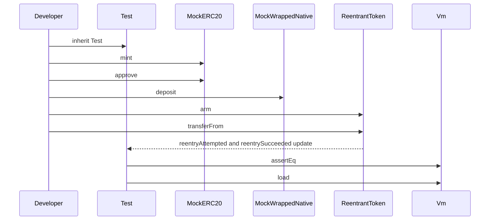

## Overview

This section captures the vendored Forge Standard Library surface that LayerX uses to write Solidity tests, plus the local test doubles and fixture files that exercise token behavior, wrapped native flows, router quoting, and reentrancy handling. The most important integration point is the root `layerx/contracts/foundry.toml`, which explicitly vendors `forge-std` under `lib/` for tests only and keeps production `src/` free of external imports.

The vendored copy under `layerx/contracts/lib/forge-std/` provides the default `Test` harness, the standard `IERC20` and `IERC165` interfaces, helper documentation for storage inspection and cheatcodes, and the configuration files that support Forge’s own validation. The `layerx/contracts/test/mocks/` directory then supplies the concrete mock contracts LayerX uses to simulate standard ERC-20 behavior, USDT-style approval rules, wrapped native token minting and withdrawal, router execution, and deliberate reentrancy attempts.

## Forge Std Package and Repository Configuration

| Path | Role | Concrete behavior |
| --- | --- | --- |
| `layerx/contracts/foundry.toml` | LayerX contracts Forge config | Sets `src = "src"`, `test = "test"`, `script = "script"`, `solc = "0.8.27"`, `evm_version = "shanghai"`, optimizer runs at `200`, and `fs_permissions` to read `./out`. It also reads the `paxeer` RPC endpoint from `${PAXEER_RPC_URL}`. A source comment states that `forge-std` is vendored under `lib/` for tests only and is never imported by `src/`. |
| `layerx/contracts/lib/forge-std/foundry.toml` | Vendored Forge Std config | Enables `fs_permissions` with read-write access to `./`, turns the optimizer on with `optimizer_runs = 200`, ignores error code `3860`, and defines test RPC endpoints for `mainnet`, `optimism_sepolia`, `arbitrum_one_sepolia`, and `needs_undefined_env_var`. `lint_on_build = false`. |
| `layerx/contracts/lib/forge-std/package.json` | Package metadata | Declares the package name `forge-std`, version `1.16.1`, description, homepage, bug tracker, license, author, publish surface `src/**/*`, and git repository metadata. |
| `layerx/contracts/lib/forge-std/README.md` | Usage guide | Documents install, helper contracts and libraries, storage slot discovery, cheatcode wrappers, TOML config loading, and logging guidance. |
| `layerx/contracts/lib/forge-std/CONTRIBUTING.md` | Contributor guide | Documents code-of-conduct expectations, support channels, bug-report fields, PR workflow, build and test commands, cheatcode regeneration, review guidance, and release steps. |


### Package Metadata

The root layerx/contracts/foundry.toml explicitly treats forge-std as a vendored test-only dependency, which is the integration contract that keeps the test harness separate from production imports.

`layerx/contracts/lib/forge-std/package.json` identifies the vendored library as `forge-std` version `1.16.1` and publishes only `src/**/*`. The metadata points to the Forge Std guide for documentation, the Foundry issue tracker for bugs, and the upstream git repository for source history.

### Contributor Workflow

`layerx/contracts/lib/forge-std/CONTRIBUTING.md` is a support file rather than runtime code, but it is part of the test-support surface because it explains how the vendored library is maintained.

| Topic | Source-backed guidance |
| --- | --- |
| Code of conduct | The project follows the Rust Code of Conduct. |
| Help channels | Foundry Support Telegram, GitHub Discussions, and the Foundry Book. |
| Bug reports | Include the Foundry version, platform, code snippets, and concrete reproduction steps. |
| Feature requests | Provide a detailed explanation and examples from other tools when relevant. |
| Pull requests | Keep commits logically grouped, fill out the PR template, and discuss updates constructively. |
| Validation | Run `forge fmt --check` and `forge test -vvv`. |
| Compiler compatibility | Run `forge build --skip test --use solc:0.6.2`, `forge build --skip test --use solc:0.6.12`, `forge build --skip test --use solc:0.7.0`, `forge build --skip test --use solc:0.7.6`, and `forge build --skip test --use solc:0.8.0`. |
| Cheatcode updates | Run `./scripts/vm.py` to refresh `src/Vm.sol` after native cheatcode changes. |
| Releases | Update relevant `Cargo.toml` versions, refresh documentation links, and perform a final breaking-change audit. |


```steps
1. Format check | Run `forge fmt --check`.
2. Test suite | Run `forge test -vvv`.
3. Compiler matrix | Run `forge build --skip test --use solc:0.6.2`, `forge build --skip test --use solc:0.6.12`, `forge build --skip test --use solc:0.7.0`, `forge build --skip test --use solc:0.7.6`, and `forge build --skip test --use solc:0.8.0`.
4. Cheatcode regeneration | Run `./scripts/vm.py` when the native cheatcode surface changes.
```

## Forge Std Helper Surfaces Documented in the README

`layerx/contracts/lib/forge-std/README.md` is the main usage guide for the vendored library. It describes the helper surfaces LayerX relies on in tests and scripts:

- `stdError` supplies compiler built-in error selectors for `expectRevert`.
- `stdStorage` wraps the `record` and `accesses` cheatcodes, can locate storage slots without knowing the full layout, supports mapping keys and struct field depth, and can write back through `find()` and `checked_write()`.
- `stdCheats` wraps prank, deal, hoax, startHoax, time manipulation, deployment helpers, and fuzzing helpers.
- `StdAssertions` provides equality, inequality, comparison, approximate equality, and boolean assertions across primitive values and arrays.
- `StdConfig` loads TOML data by chain identifier or alias and casts values into typed subtables.
- `console2.sol` is the recommended logging surface because Forge traces decode it cleanly.
- `console.sol` remains available for Hardhat compatibility, with a README note that `uint256` and `int256` logs are not decoded correctly in Forge traces.

### `UnpackedStruct`

The README recommends console2.sol for decoded Forge traces and reserves console.sol for Hardhat compatibility.

*`layerx/contracts/lib/forge-std/README.md`*

This example struct appears in the storage walkthrough used to explain `stdStorage`. It is paired with the `testFindStruct` example, which resolves `a` and `b` by field depth and then validates the stored values with `vm.load`.

| Property | Type | Description |
| --- | --- | --- |
| `a` | `uint256` | First field in the example unpacked struct. |
| `b` | `uint256` | Second field in the example unpacked struct. |


| Method | Description | Returns |
| --- | --- | --- |
| `hidden` | Loads a value from the hashed slot `keccak256("my.random.var")` using inline assembly. | `bytes32` |


## Test Harness Contract

### `Test`

*`layerx/contracts/lib/forge-std/src/Test.sol`*

`Test` is the default Forge Std testing base. It is declared as an abstract contract and combines `TestBase`, `StdAssertions`, `StdChains`, `StdCheats`, `StdInvariant`, and `StdUtils` into a single test harness. The contract also imports logging, storage, JSON, math, TOML, and cheatcode modules so test files can use the standard Forge tooling surface from one import.

| Property | Type | Description |
| --- | --- | --- |
| `IS_TEST` | `bool` | Public flag set to `true` for Forge’s test detection. |


The contract declares no public methods of its own. Its role is to expose the inherited assertion, cheatcode, chain, invariant, and utility behavior through a single test entrypoint.

## Helper Interfaces

### `IERC20`

*`layerx/contracts/lib/forge-std/src/interfaces/IERC20.sol`*

`IERC20` is the standard ERC-20 interface used by the test mocks and router adapter. The interface includes the standard token metadata, transfer, allowance, and approval methods, plus the standard `Transfer` and `Approval` events.

| Property | Type | Description |
| --- | --- | --- |
| none declared | Interface-only declaration. |


| Event | Description |
| --- | --- |
| `Transfer` | Emitted when tokens move from one account to another. |
| `Approval` | Emitted when a spender allowance changes. |


| Method | Description |
| --- | --- |
| `totalSupply` | Returns the number of tokens in existence. |
| `balanceOf` | Returns the token balance for an account. |
| `transfer` | Moves tokens from the caller to a recipient. |
| `allowance` | Returns the remaining allowance for a spender. |
| `approve` | Sets the spender allowance for the caller’s tokens. |
| `transferFrom` | Moves tokens using allowance. |
| `name` | Returns the token name. |
| `symbol` | Returns the token symbol. |
| `decimals` | Returns the token decimals. |


### `IERC165`

*`layerx/contracts/lib/forge-std/src/interfaces/IERC165.sol`*

`IERC165` is the minimal ERC-165 surface used to query interface support.

| Property | Type | Description |
| --- | --- | --- |
| none declared | Interface-only declaration. |


| Method | Description |
| --- | --- |
| `supportsInterface` | Queries whether a contract supports a given interface identifier. |


## Test Mocks

`layerx/contracts/test/mocks/` contains the Solidity doubles that the LayerX contract tests use to exercise token transfers, wrapped native value movement, router behavior, and reentrancy protection.

### `MockERC20`

*`layerx/contracts/test/mocks/MockERC20.sol`*

`MockERC20` is the standard, well-behaved ERC-20 test token. It implements `IERC20`, tracks balances and allowances in storage, emits the standard token events, and returns `true` from token-moving methods.

| Constructor parameter | Type | Description |
| --- | --- | --- |
| `n` | `string memory` | Token name used to initialize `name`. |
| `s` | `string memory` | Token symbol used to initialize `symbol`. |
| `d` | `uint8` | Token decimals stored in `_decimals`. |


| Property | Type | Description |
| --- | --- | --- |
| `name` | `string` | Public token name. |
| `symbol` | `string` | Public token symbol. |
| `_decimals` | `uint8` | Immutable decimals value returned by `decimals`. |
| `totalSupply` | `uint256` | Total minted supply. |
| `balanceOf` | `mapping(address => uint256)` | Per-account token balance. |
| `allowance` | `mapping(address => mapping(address => uint256))` | Per-owner, per-spender allowance table. |


| Method | Description | Returns |
| --- | --- | --- |
| `decimals` | Returns `_decimals`. | `uint8` |
| `mint` | Mints tokens to `to`, updates `totalSupply`, and emits `Transfer` from the zero address. | none |
| `transfer` | Debits the caller, credits `to`, and emits `Transfer`. | `bool` |
| `approve` | Sets the caller’s allowance for `spender` and emits `Approval`. | `bool` |
| `transferFrom` | Uses allowance unless it is `type(uint256).max`, then transfers tokens and emits `Transfer`. | `bool` |


| Event | Description |
| --- | --- |
| `Transfer` | Emitted on minting and token transfers. |
| `Approval` | Emitted when an allowance is set. |


### `Mock PECOR Router`

*`layerx/contracts/test/mocks/MockPECORRouter.sol`*

`MockPECORRouter` is a test DEX router. It pulls `tokenIn` from the caller, pays out USDL at a configured rate, and requires USDL liquidity to be pre-funded. It uses `IPECORRouter` and `IERC20`, with `usdl` stored as an immutable ERC-20 reference and `rateE18` holding the per-token conversion rate.

| Constructor parameter | Type | Description |
| --- | --- | --- |
| `usdl_` | `address` | Address wrapped into the immutable `usdl` token reference. |


| Property | Type | Description |
| --- | --- | --- |
| `usdl` | `IERC20` | Immutable USDL token used as the router payout asset. |
| `rateE18` | `mapping(address => uint256)` | Conversion rate table where output is scaled by `1e18`. |


| Method | Description | Returns |
| --- | --- | --- |
| `setRate` | Stores the output rate for a given input token. | none |
| `swapBestRoute` | Requires USDL as `tokenOut`, checks the deadline, pulls input tokens, calculates output via `_out`, enforces `amountOutMin`, and pays USDL to the caller. | `uint256 amountOut` |
| `getBestQuote` | Requires USDL as `tokenOut`, computes the quote through `_out`, and sets `best.amountOut` and `best.found`. | `BestQuote memory best` |


The internal `_out` helper implements the conversion formula:

- `out(USDL base) = amountIn * rateE18[tokenIn] / 1e18`

### `MockUSDT`

*`layerx/contracts/test/mocks/MockUSDT.sol`*

`MockUSDT` models the non-standard USDT approval and transfer behavior used by the test suite to exercise SafeERC20 and force-approval paths. It intentionally does not implement `IERC20` because the signatures differ from the standard interface.

| Property | Type | Description |
| --- | --- | --- |
| `name` | `string` | Token name fixed to `Tether USD`. |
| `symbol` | `string` | Token symbol fixed to `USDT`. |
| `decimals` | `uint8` | Constant decimal count set to `6`. |
| `totalSupply` | `uint256` | Total minted supply. |
| `balanceOf` | `mapping(address => uint256)` | Per-account balance. |
| `allowance` | `mapping(address => mapping(address => uint256))` | Per-owner, per-spender allowance table. |


| Method | Description | Returns |
| --- | --- | --- |
| `mint` | Mints tokens to `to`, updates `totalSupply`, and emits `Transfer` from the zero address. | none |
| `transfer` | Moves tokens without returning a boolean value. | none |
| `approve` | Requires allowance to be reset to zero before a new non-zero approval and emits `Approval`. | none |
| `transferFrom` | Deducts allowance unless it is `type(uint256).max`, then moves tokens without returning a boolean value. | none |


| Event | Description |
| --- | --- |
| `Transfer` | Emitted on minting and token transfers. |
| `Approval` | Emitted when allowance changes. |


### `Mock Wrapped Native`

*`layerx/contracts/test/mocks/MockWrappedNative.sol`*

`MockWrappedNative` is a minimal WETH-style wrapper used in tests. It inherits `MockERC20` with the name `Wrapped PAX`, symbol `WPAX9`, and `18` decimals, and then adds native-value deposit and withdrawal behavior.

| Constructor dependency | Type | Description |
| --- | --- | --- |
| `MockERC20("Wrapped PAX", "WPAX9", 18)` | `MockERC20` | Initializes the inherited ERC-20 state with wrapped-native token metadata. |


The contract reuses the `MockERC20` storage layout and adds no new storage variables.

| Method | Description | Returns |
| --- | --- | --- |
| `deposit` | Accepts native value, credits the caller’s wrapped balance, increases `totalSupply`, and emits `Transfer` from the zero address. | none |
| `withdraw` | Debits wrapped balance and `totalSupply`, sends native value back to the caller, requires the transfer to succeed, and emits `Transfer` to the zero address. | none |


### `Reentrant Token`

*`layerx/contracts/test/mocks/ReentrantToken.sol`*

`ReentrantToken` is the malicious token used to prove that value-moving entrypoints are protected by `nonReentrant`. It inherits `MockERC20`, stores a target payload, and attempts to call back into the target during `transferFrom` when armed.

| Constructor dependency | Type | Description |
| --- | --- | --- |
| `MockERC20("Reentrant", "RE", 6)` | `MockERC20` | Initializes the inherited ERC-20 metadata for the malicious token. |


| Property | Type | Description |
| --- | --- | --- |
| `target` | `address` | Call target used for the reentry attempt. |
| `payload` | `bytes` | Calldata sent to the target during the reentry attempt. |
| `armed` | `bool` | Single-shot guard that enables the callback attempt. |
| `reentryAttempted` | `bool` | Records whether a callback was attempted. |
| `reentrySucceeded` | `bool` | Records whether the callback returned success. |


| Method | Description | Returns |
| --- | --- | --- |
| `arm` | Stores `target_` and `payload_`, then enables the one-shot reentry attempt. | none |
| `transferFrom` | When armed, clears the arm flag, records the attempt, calls `target.call(payload)`, stores the success flag, and then continues with `super.transferFrom`. | `bool` |


## Fixture Files

The fixture set under `layerx/contracts/lib/forge-std/test/fixtures/` provides the sample inputs and outputs used by the vendored Forge Std tests.

| Path | Shape | Purpose |
| --- | --- | --- |
| `layerx/contracts/lib/forge-std/test/fixtures/test.json` | `a`, `b`, and nested object `c` with matching `a` and `b` fields | Demonstrates JSON fixture parsing with scalar and nested data. |
| `layerx/contracts/lib/forge-std/test/fixtures/test.toml` | `a`, `b`, and nested table `[c]` with matching `a` and `b` fields | Mirrors the JSON fixture in TOML form for parser parity. |
| `layerx/contracts/lib/forge-std/test/fixtures/config.toml` | Chain-scoped config with `mainnet` and `optimism` sections, typed subtables, arrays, and env-var-backed RPC URLs | Exercises `StdConfig` style loading across `bool`, `address`, `uint`, `int`, `bytes32`, `bytes`, and `string` fields. |
| `layerx/contracts/lib/forge-std/test/fixtures/broadcast.log.json` | Forge broadcast log with `transactions`, `receipts`, `libraries`, `pending`, `path`, `returns`, and `timestamp` | Captures a full broadcast record for transaction and receipt parsing. |


### `config.toml`

The fixture config uses two example environments, `mainnet` and `optimism`, and assigns values by type-specific subtables. It includes boolean arrays, address arrays, signed and unsigned integers, `bytes32` arrays, raw bytes arrays, string arrays, and RPC URL placeholders driven by environment variables.

### `broadcast.log.json`

The broadcast log fixture stores a complete run record with call transactions, deployment receipts, linked library addresses, a pending list, the broadcast path, return values, and a timestamp. The transaction samples include calls against `Test` contract functions such as `multiple_arguments`, `inc`, and `t`, which makes the file useful for broadcast parsing and trace validation.

## Test Execution Flow



This flow mirrors the way the README examples and the mock contracts are meant to be used together: a Solidity test inherits `Test`, sets up token state with mocks, and then verifies results with Forge cheatcode-backed assertions and storage reads.
