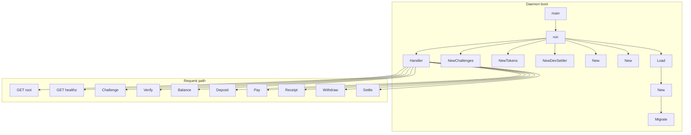

## Overview

LayerX is the always-on settlement fabric for Matrix agents. The daemon gives each agent a DID-scoped account, mints and tracks a USD-denominated balance called USDX, produces a Merkle-provable receipt for every accepted transfer, and batches settlement to Paxeer mainnet chain 125.

## Runtime wiring and file map

| File | Responsibility | Source-backed behavior |
| --- | --- | --- |
| `layerx/README.md` | Product-level contract | Describes LayerX as an always-on sequencer, states that DID is the account, and lists the settlement and receipt invariants plus the documented HTTP surface. |
| `layerx/cmd/layerxd/main.go` | Daemon entrypoint | Loads config, opens Postgres, applies migrations, initializes the receipt signer, auth primitives, settlement worker, ledger, and HTTP server, then shuts down gracefully on `SIGINT` or `SIGTERM`. |
| `layerx/internal/server/server.go` | HTTP routing and auth gates | Registers the HTTP routes, enforces transport bearer auth, resolves the principal token, and implements the balance, deposit, pay, receipt, withdraw, settle, root, and health handlers. |
| `layerx/internal/server/server_test.go` | HTTP and auth-lane verification | Verifies public root access, transport auth enforcement, the challenge/verify round-trip, and signature rejection. |
| `layerx/internal/auth/identity.go` | DID parsing, challenge issuance, signature verification | Parses `did:matrix` identities, creates single-use challenges, and verifies ed25519 signatures against the challenge message and DID fingerprint. |
| `layerx/internal/auth/token.go` | [REDACTED] | Mints and verifies short-lived HMAC principal tokens bound to a DID. |
| `layerx/internal/auth/auth_test.go` | Auth primitive verification | Covers DID parsing, signature verification, single-use challenges, and token round-trips. |
| `layerx/internal/chain/chain.go` | Chain settlement abstraction | Defines settlement deltas, the anchor interface, and the offline `DevSettler`. |
| `layerx/internal/chain/chain_test.go` | Chain adapter verification | Confirms that `DevSettler` is deterministic and idempotent for the same root. |
| `layerx/internal/accumulator/accumulator.go` | Receipt hashing and proof construction | Builds canonical transfer leaves, Merkle roots, inclusion proofs, and proof encodings. |
| `layerx/internal/accumulator/accumulator_test.go` | Accumulator verification | Checks deterministic leaf hashing, proof verification, path round-tripping, and tamper rejection. |
| `layerx/internal/store/store.go` | Postgres pool and migration runner | Opens the database pool, pings it, closes it, and applies forward-only SQL migrations in lexical order. |
| `layerx/internal/store/accounts.go` | Account, transfer, deposit, and withdrawal persistence | Reads accounts, stores deposit credits, performs atomic pay transactions, and queues withdrawals. |
| `layerx/internal/store/store_test.go` | Store and ledger integration | Exercises deposit idempotency, pay flows, overspend rejection, batch sealing, anchoring, and withdrawal accounting. |
| `layerx/internal/ledger/ledger.go` | Value-movement orchestration | Classifies settlement tiers, computes receipt signatures, issues transfer receipts, and reconstructs inclusion paths. |
| `layerx/internal/ledger/ledger_test.go` | Ledger invariants | Verifies tier boundaries, signing domain separation, and sequencer signature validity. |
| `layerx/internal/config/kvx.go` | KVX config parser | Parses sectioned key-value documents with comments, quoted strings, lists, and environment interpolation. |
| `layerx/pkg/types/types.go` | Shared envelope, error, auth, and value models | Defines the wire envelope, error codes, USDX helpers, tiers, and request/response shapes. |
| `layerx/pkg/types/types_test.go` | Shared type validation | Covers USDX parsing/formatting and envelope helpers. |

## Architecture and startup flow

## Logging and telemetry

`layerx/cmd/layerxd/main.go` creates the process logger with `telemetry.NewLogger()` and stores it in `log`. That logger is passed into `server.New`, used for startup diagnostics, and shared with the settlement worker.

### Injection and lifecycle

| Class or function | Role |
| --- | --- |
| `run` | Creates the logger, emits config and startup diagnostics, and logs shutdown completion. |
| `server.New` | Accepts `Log *slog.Logger` in `Deps` and falls back to `slog.Default()` when nil. |
| `handleBalance`, `handlePay`, `handleReceipt`, `handleWithdraw`, `handleSettle` | Use the injected logger for internal server failures. |
| background worker goroutines | Log settlement and shutdown errors without interrupting the request path. |

### Logged events

| Event | Trigger | Fields visible in source |
| --- | --- | --- |
| `layerxd config` | After config load | `port`, `dev`, `window`, `micro_threshold_micro_usdx`, `reserve_asset`, `transport_auth`, `chain_rpc`, `vault` |
| `postgres connect failed` | Store initialization failure | `error` |
| `migrate failed` | Migration failure | `dir`, `error` |
| `migrations applied` | Successful migration run | `dir` |
| `sequencer key init failed` | Receipt signer initialization failure | `error` |
| `LAYERX_SEQUENCER_KEY unset` | Ephemeral signer fallback | warning text only |
| `no chain configured` | Missing chain configuration | warning text only |
| `LAYERX_TOKEN unset` | Transport auth disabled | warning text only |
| `layerxd listening` | HTTP server start | `addr` |
| `http server failed` | ListenAndServe failure | `error` |
| `layerxd shutdown complete` | Graceful shutdown end | no extra fields shown |
| `get balance failed` | Balance lookup error | `error` |
| `pay failed` | Payment error | `error` |
| `transfer accepted` | Successful pay | `seq`, `from`, `to`, `tier` |
| `get receipt failed` | Receipt lookup error | `error` |
| `withdraw failed` | Withdrawal queue failure | `error` |
| `force settle failed` | Settlement worker failure | `error` |
| `auto force-settle failed` | Background material-transfer settlement | `seq`, `error` |

## HTTP surface and auth gates

`layerx/internal/server/server.go` wires the routes into a `http.ServeMux` and wraps it with `transportMiddleware`. Public paths are limited to `GET /` and `GET /healthz`; every other route requires the transport bearer when `TransportToken` is configured.

### Route behavior

| Route | Handler | Auth gate | Input | Output |
| --- | --- | --- | --- | --- |
| `GET /` | `handleRoot` | Public | none | JSON envelope with `service`, `version`, and `health` |
| `GET /healthz` | `handleHealthz` | Public | none | JSON envelope with `status`, `version`, and `db` |
| `POST /v1/agent/auth/challenge` | `handleChallenge` | Transport bearer if configured | `types.ChallengeRequest` | `types.ChallengeResponse` |
| `POST /v1/agent/auth/verify` | `handleVerify` | Transport bearer if configured | `types.VerifyRequest` | `types.VerifyResponse` |
| `GET /v1/balance` | `handleBalance` | Transport bearer plus `X-LayerX-Agent` token | none | `types.BalanceResponse` or zero balance for unfunded accounts |
| `GET /v1/deposit` | `handleDeposit` | Transport bearer plus `X-LayerX-Agent` token | none | `types.DepositResponse` |
| `POST /v1/pay` | `handlePay` | Transport bearer plus `X-LayerX-Agent` token | `types.PayRequest` | signed receipt envelope |
| receipt by sequence | `handleReceipt` | Transport bearer plus `X-LayerX-Agent` token | `seq` path value | `types.Receipt` |
| `POST /v1/withdraw` | `handleWithdraw` | Transport bearer plus `X-LayerX-Agent` token | `types.WithdrawRequest` | `types.WithdrawResponse` |
| `POST /v1/settle` | `handleSettle` | Transport bearer plus `X-LayerX-Agent` token | none | `types.SettleResponse` |

### Auth path details

- `transportMiddleware` extracts `Authorization` with the `Bearer ` prefix and compares it to the configured transport token with `subtle.ConstantTimeCompare`.
- `principal` extracts `X-LayerX-Agent`, verifies it with `Tokens.Verify`, and returns `auth.Claims`.
- `handleVerify` calls `Challenges.Consume` before `auth.VerifySignature`, so each challenge is single-use even if the signature check fails.
- `handleBalance`, `handleDeposit`, `handlePay`, `handleReceipt`, `handleWithdraw`, and `handleSettle` all require the principal token.

### HTTP error mapping

| Condition | Status | Error code |
| --- | --- | --- |
| Missing or invalid transport bearer | 401 | `types.CodeUnauthorized` |
| Missing or invalid `X-LayerX-Agent` token | 401 | `types.CodeUnauthorized` |
| Invalid DID, amount, JSON body, or withdrawal ticker | 400 | `types.CodeInvalidRequest` |
| Missing account or unauthorized receipt ownership | 404 or zero-balance response | `types.CodeNotFound` for receipt lookup failures |
| Insufficient spendable balance | 402 | `types.CodeInsufficientFunds` |
| Store, signer, or settlement failure | 500 | `types.CodeInternal` |

## Auth

### DID

handleBalance treats store.ErrNotFound as a zero-balance account instead of a 404, so an unfunded DID still gets a successful balance response with 0.000000 values.

*`layerx/internal/auth/identity.go`*

`DID` is the parsed `did:matrix` identity used by both challenge verification and token minting.

| Property | Type | Description |
| --- | --- | --- |
| `Raw` | `string` | Original trimmed DID string |
| `Label` | `string` | The DID label segment between `did:matrix:` and the fingerprint |
| `KeyFP` | `string` | Lowercased 16-hex fingerprint derived from the public key |

#### Functions

| Function | Description |
| --- | --- |
| `ParseDID` | Parses `did:matrix:<label>:<16-hex-fingerprint>` and lowercases the fingerprint. |
| `ChallengeMessage` | Builds the exact UTF-8 message the agent must sign: `matrix-layerx-auth:<did>:<nonce>`. |
| `VerifySignature` | Verifies the ed25519 signature and checks that the supplied public key matches the DID fingerprint. |

`VerifySignature` accepts a hex public key and signature with optional `0x` prefixes, rejects malformed encodings, and compares the fingerprint embedded in the DID against the first 16 hex characters of the supplied public key.

### Challenge store

*`layerx/internal/auth/identity.go`*

`Challenges` is an in-memory, mutex-protected, single-use nonce store with TTL. It is the stateful side of the agent-auth lane.

| Property | Type | Description |
| --- | --- | --- |
| `mu` | `sync.Mutex` | Serializes access to the nonce map |
| `ttl` | `time.Duration` | Lifetime of each challenge |
| `m` | `map[string]entry` | Maps nonce values to the internal nonce record |

The internal `entry` record stores:

| Property | Type | Description |
| --- | --- | --- |
| `did` | `string` | DID bound to the nonce |
| `exp` | `time.Time` | Expiration time for the nonce |

#### Methods

| Method | Description |
| --- | --- |
| `NewChallenges` | Constructs the nonce store with the given TTL. |
| `TTL` | Returns the configured nonce lifetime. |
| `Create` | Creates a fresh nonce, binds it to a DID, and returns the nonce plus the message to sign. |
| `Consume` | Atomically validates and deletes a nonce. |
| `Purge` | Removes expired entries during opportunistic garbage collection. |

`Create` uses `crypto/rand`, base64url encodes a 24-byte nonce, stores it with an expiration, and returns the nonce plus the exact `ChallengeMessage`. `Consume` is single-use by design: it deletes the nonce as part of the lookup path.

### Principal tokens

*`layerx/internal/auth/token.go`*

`Tokens` is the stateless HMAC token issuer used after a successful DID verify.

| Property | Type | Description |
| --- | --- | --- |
| `key` | `[]byte` | SHA-256 derived HMAC key |
| `ttl` | `time.Duration` | Token lifetime |
| `now` | `func() time.Time` | Time source used for mint and verify |

`Claims` is the verified principal returned by token verification.

| Property | Type | Description |
| --- | --- | --- |
| `DID` | `string` | Verified DID carried by the token |

#### Methods

| Method | Description |
| --- | --- |
| `NewTokens` | [REDACTED] |
| `Mint` | Signs `<did> | <expUnix>` and returns the token plus its lifetime in seconds. |
| `Verify` | Validates the token signature and expiry, then returns `Claims`. |

The token format is `base64url(payload).base64url(mac)`, where the payload contains the DID and Unix expiration. Verification rejects malformed base64, bad signatures, malformed claims, and expired tokens.

### Auth test coverage

*`layerx/internal/auth/auth_test.go`*

| Test | What it proves |
| --- | --- |
| `TestParseDID` | Valid `did:matrix` parsing and malformed rejection |
| `TestVerifySignatureRoundTrip` | ed25519 signing and DID fingerprint matching |
| `TestChallengesSingleUse` | Nonces can be consumed only once |
| `TestTokenRoundTrip` | [REDACTED] |

## Chain settlement

*`layerx/internal/chain/chain.go`*

`NetDelta` represents one net settlement amount for a DID.

| Property | Type | Description |
| --- | --- | --- |
| `DID` | `string` | DID that participates in settlement |
| `EVMAddress` | `string` | Destination address for the chain payout |
| `AmountMicro` | `int64` | Net amount in micro-USDX |

`Settler` is the settlement interface used by the daemon.

| Method | Description |
| --- | --- |
| `AnchorBatch` | Anchors a sealed batch root and returns the anchor transaction hash. |

`DevSettler` is the offline implementation currently wired by the daemon.

| Method | Description |
| --- | --- |
| `NewDevSettler` | Creates the offline settler. |
| `AnchorBatch` | Returns a deterministic pseudo transaction hash derived from the batch root. |

`AnchorBatch` computes `sha256("dev-anchor:" + rootHex)`, hex-encodes it, prefixes it with `0x`, and returns that value. The same root always produces the same result, which keeps dev settlement idempotent without a live chain.

### Chain test coverage

layerx/cmd/layerxd/main.go wires chain.NewDevSettler() directly, so the current daemon run uses the deterministic offline anchor path unless a different settler is injected.

*`layerx/internal/chain/chain_test.go`*

| Test | What it proves |
| --- | --- |
| `TestDevSettlerDeterministicAndIdempotent` | Same roots produce the same hash, different roots produce different hashes, and the output is `0x`-prefixed |

## Accumulator

*`layerx/internal/accumulator/accumulator.go`*

`LeafDomain` is the versioned domain separator for receipt leaves, and `nodePrefix` separates interior nodes from leaves.

#### Constants

- `LeafDomain`: `layerx.settlement.receipt.v1`
- `nodePrefix`: `0x01`

### Receipt leaf and proof primitives

`ProofStep` records one sibling in a Merkle proof path.

| Property | Type | Description |
| --- | --- | --- |
| `Sibling` | `[32]byte` | Sibling hash on the path from leaf to root |
| `SiblingIsLeft` | `bool` | True when the sibling is the left input to the parent hash |

#### Functions

| Function | Description |
| --- | --- |
| `CanonicalLeaf` | Builds the deterministic preimage for a transfer leaf. |
| `LeafHash` | Computes `sha256(LeafDomain | canonical)`. |
| `LeafHashHex` | Returns the hex string form of the leaf hash. |
| `Root` | Computes the Merkle root over ordered leaves using duplicate-last promotion. |
| `Proof` | Builds the inclusion path for a specific leaf index. |
| `Verify` | Recomputes the root from a leaf and a proof path. |
| `EncodePath` | Renders proof steps as `l:` and `r:` hex strings. |
| `DecodePath` | Parses the encoded proof path back into `ProofStep` values. |

`CanonicalLeaf` encodes `seq`, `amount`, `ts_unixnano`, `len(from)`, `from`, `len(to)`, and `to` in fixed-width big-endian order. The encoding is intentionally byte-stable so the same transfer always hashes to the same leaf across runtimes.

### Accumulator test coverage

*`layerx/internal/accumulator/accumulator_test.go`*

| Test | What it proves |
| --- | --- |
| `TestLeafDeterministic` | The same transfer preimage produces the same leaf hash |
| `TestProofVerifies` | Proofs verify for multiple tree sizes and path encoding round-trips |
| `TestTamperFails` | A different leaf does not verify against another leaf’s proof |

## Store

*`layerx/internal/store/store.go`*

`Store` wraps a `pgxpool.Pool` and owns the database connection lifecycle.

| Property | Type | Description |
| --- | --- | --- |
| `pool` | `*pgxpool.Pool` | Postgres connection pool |

#### Methods

| Method | Description |
| --- | --- |
| `New` | Opens the pool, parses the URI, and pings the database. |
| `Close` | Closes the pool when present. |
| `Ping` | Checks database connectivity. |
| `Migrate` | Applies forward-only SQL files in lexical order and records them in `layerx_schema_migrations`. |

`ErrNotFound` is returned when an account, transfer, or batch is missing. `ErrInsufficientFunds` is returned when the requested pay or withdraw exceeds the spendable balance.

`Migrate` creates `layerx_schema_migrations` if needed, skips already applied versions, and wraps each migration file in a transaction. The migration file list is filtered to `.sql`, sorted lexicographically, and recorded after a successful apply.

### Account and transfer persistence

*`layerx/internal/store/accounts.go`*

#### `types.Account`

| Property | Type | Description |
| --- | --- | --- |
| `DID` | `string` | DID key of the account |
| `EVMAddress` | `string` | Cached chain payout address |
| `BalanceUSDX` | `int64` | Micro-USDX balance |
| `EscrowUSDX` | `int64` | Micro-USDX escrow counter |
| `CreatedAt` | `time.Time` | Creation timestamp |
| `UpdatedAt` | `time.Time` | Last update timestamp |

#### `PayResult`

| Property | Type | Description |
| --- | --- | --- |
| `Seq` | `int64` | Monotonic transfer sequence |
| `TS` | `time.Time` | Database timestamp assigned to the transfer |
| `LeafHex` | `string` | Receipt leaf hash written by the transaction |
| `SigHex` | `string` | Sequencer signature written by the transaction |
| `Tier` | `string` | Settlement tier chosen for the transfer |

#### Store methods in `accounts.go`

| Method | Description |
| --- | --- |
| `GetAccount` | Loads one account or returns `ErrNotFound`. |
| `SetEVMAddress` | Inserts or updates the DID’s mapped payout address. |
| `CreditDeposit` | Credits a confirmed deposit and records idempotency by `deposit_tx`. |
| `Pay` | Atomically debits the sender, credits the recipient, inserts the transfer, and writes the leaf and signature. |
| `QueueWithdrawal` | Debits balance and escrow and records a queued withdrawal row. |

`CreditDeposit` is idempotent on `deposit_tx`: if the same deposit transaction is replayed, it returns without double-crediting. `Pay` rejects non-positive amounts, self-pay, missing senders, and insufficient funds, and it ensures the recipient account exists before writing the transfer. `QueueWithdrawal` rejects non-positive amounts, clamps `escrow_usdx` at zero, and always writes the withdrawal with the provided tier.

The ledger and store tests also call `GetTransfer`, `ListUnsettled`, `SealBatch`, `MarkAnchored`, and `ListBatchLeaves` to reconstruct receipt proofs and settlement batches.

### Store integration test coverage

*`layerx/internal/store/store_test.go`*

| Test | What it proves |
| --- | --- |
| `TestStoreLedgerFlow` | Deposit idempotency, pay debit and credit, overspend rejection, self-pay rejection, receipt scoping, batch sealing, anchoring, and withdrawal balance effects |

## Ledger

*`layerx/internal/ledger/ledger.go`*

`receiptSigDomain` separates the sequencer receipt signature from any other signing context.

`Ledger` ties together the store, sequencer signer, and tier policy.

| Property | Type | Description |
| --- | --- | --- |
| `st` | `*store.Store` | Database-backed ledger state |
| `signer` | `*sig.Signer` | Receipt signer |
| `microThreshold` | `int64` | Boundary between micropayment and material tiers |

#### Methods

| Method | Description |
| --- | --- |
| `New` | Constructs a ledger with the store, signer, and threshold. |
| `tierFor` | Classifies an amount as `micropayment` or `material`. |
| `receiptSigningBytes` | Builds the deterministic receipt signing preimage. |
| `Pay` | Persists a transfer atomically and returns a signed receipt. |
| `Receipt` | Returns the signed receipt for a transfer the caller is allowed to read. |
| `inclusionPath` | Recomputes the Merkle proof for a sealed batch. |

`tierFor` maps amounts below the threshold to `types.TierMicropayment` and amounts at or above the threshold to `types.TierMaterial`. `Pay` uses a `finalize` callback to compute the leaf hash and signature inside the same database transaction that inserts the transfer, so the receipt commitment and the transfer row stay atomic.

`Receipt` returns a populated `types.Receipt` with batch metadata when available. If the transfer belongs to a sealed batch, it reconstructs the inclusion path from `ListBatchLeaves` and encodes it with `EncodePath`.

### Ledger test coverage

*`layerx/internal/ledger/ledger_test.go`*

| Test | What it proves |
| --- | --- |
| `TestTierForBoundary` | The tier threshold is exclusive below and inclusive at the threshold |
| `TestReceiptSigningBytesDeterministicAndDomainSeparated` | Receipt signing bytes are deterministic and domain separated |
| `TestReceiptSignatureVerifies` | A signature produced by the sequencer key verifies under the sequencer public key |

## KVX config parser

*`layerx/internal/config/kvx.go`*

`kvxDoc` is the in-memory representation of a sectioned key-value document.

| Property | Type | Description |
| --- | --- | --- |
| `sections` | `map[string]map[string]string` | Raw key-value storage by section |
| `order` | `[]string` | Section order as parsed |

#### Functions

| Function | Description |
| --- | --- |
| `parseKVXFile` | Opens and parses a file, returning an empty document with `ok=false` when the file does not exist. |
| `newKVXDoc` | Creates an empty document. |
| `parseKVX` | Parses the stream format with sections and `key = value` lines. |
| `stripComment` | Removes trailing `#` comments outside quoted strings. |
| `str` | Returns the interpolated string value for a key. |
| `uint64Or` | Parses a numeric value or falls back. |
| `unquote` | Removes surrounding double quotes. |
| `interpolate` | Replaces `${ENV_VAR}` with the current process environment value. |

The parser accepts quoted strings, bare integers and booleans, bracketed string lists, and environment interpolation. Later duplicate keys overwrite earlier values, and the scanner buffer is sized to 1 MiB.

## Shared types

*`layerx/pkg/types/types.go`*

### Envelope and error model

#### `Envelope`

| Property | Type | Description |
| --- | --- | --- |
| `Ok` | `bool` | Success flag |
| `Data` | `any` | Success payload |
| `Error` | `*Error` | Structured error payload |

#### `Error`

| Property | Type | Description |
| --- | --- | --- |
| `Code` | `string` | Stable machine-readable error code |
| `Message` | `string` | Human-readable message |
| `Retryable` | `bool` | Whether the client should retry |

#### Helpers

| Function | Description |
| --- | --- |
| `OK` | Wraps a success payload in an envelope. |
| `Fail` | Wraps an `*Error` in an envelope. |
| `NewError` | Constructs an `*Error`. |

`Error.Error()` formats the code and message as `code: message`.

#### Stable error codes

`CodeInvalidRequest`, `CodeUnauthorized`, `CodeNotFound`, `CodeInsufficientFunds`, `CodeConflict`, `CodeInternal`

### USDX helpers and settlement tiers

#### Constants

- `MicroPerUSDX`: `1_000_000`
- `TierMicropayment`: `micropayment`
- `TierMaterial`: `material`

#### Functions

| Function | Description |
| --- | --- |
| `FormatUSDX` | Renders a micro-USDX amount as a fixed six-decimal decimal string. |
| `ParseUSDX` | Parses a decimal USDX string into micro-USDX with strict validation. |

`ParseUSDX` accepts optional sign, optional integer part, optional fractional part up to six digits, and rejects trailing garbage, scientific notation, embedded signs, malformed numbers, and overflow. `FormatUSDX` always emits exactly six decimal places.

### Ledger records

#### `Account`

| Property | Type | Description |
| --- | --- | --- |
| `DID` | `string` | DID key of the account |
| `EVMAddress` | `string` | Optional chain payout address |
| `BalanceUSDX` | `int64` | Micro-USDX balance, omitted from JSON |
| `EscrowUSDX` | `int64` | Micro-USDX escrow counter, omitted from JSON |
| `CreatedAt` | `time.Time` | Creation timestamp |
| `UpdatedAt` | `time.Time` | Last update timestamp |

#### `Transfer`

| Property | Type | Description |
| --- | --- | --- |
| `Seq` | `int64` | Monotonic sequencer ordering key |
| `BatchID` | `string` | Batch identifier once sealed |
| `FromDID` | `string` | Sender DID |
| `ToDID` | `string` | Recipient DID |
| `AmountUSDX` | `int64` | Micro-USDX amount, omitted from JSON |
| `Tier` | `string` | Settlement tier |
| `LeafHashHex` | `string` | Receipt leaf hash |
| `SigHex` | `string` | Sequencer signature |
| `TS` | `time.Time` | Transfer timestamp |

#### `Receipt`

| Property | Type | Description |
| --- | --- | --- |
| `Seq` | `int64` | Transfer sequence |
| `BatchID` | `string` | Batch identifier once sealed |
| `FromDID` | `string` | Sender DID |
| `ToDID` | `string` | Recipient DID |
| `AmountUSDX` | `string` | Decimal USDX amount |
| `Tier` | `string` | Settlement tier |
| `TS` | `time.Time` | Transfer timestamp |
| `LeafHashHex` | `string` | Receipt leaf hash |
| `SequencerSig` | `string` | Sequencer signature |
| `SequencerKey` | `string` | Sequencer public key |
| `BatchRootHex` | `string` | Merkle root once sealed |
| `InclusionPath` | `[]string` | Encoded proof path once sealed |
| `AnchorTxHash` | `string` | Anchor transaction hash once settled |
| `Settled` | `bool` | Whether the batch has been settled |

### Auth request and response shapes

#### `ChallengeRequest`

| Property | Type | Description |
| --- | --- | --- |
| `DID` | `string` | DID that wants a challenge |

#### `ChallengeResponse`

| Property | Type | Description |
| --- | --- | --- |
| `DID` | `string` | DID being challenged |
| `Nonce` | `string` | Single-use nonce |
| `Message` | `string` | Exact message the agent must sign |
| `ExpiresIn` | `int` | Challenge lifetime in seconds |

#### `VerifyRequest`

| Property | Type | Description |
| --- | --- | --- |
| `DID` | `string` | DID being verified |
| `PublicKey` | `string` | Hex ed25519 public key |
| `Nonce` | `string` | Challenge nonce |
| `Signature` | `string` | Hex ed25519 signature |

#### `VerifyResponse`

| Property | Type | Description |
| --- | --- | --- |
| `Token` | `string` | Principal token bound to the DID |
| `DID` | `string` | Verified DID |
| `ExpiresIn` | `int` | Token lifetime in seconds |

### Value API request and response shapes

#### `BalanceResponse`

| Property | Type | Description |
| --- | --- | --- |
| `DID` | `string` | DID whose balance was read |
| `EVMAddress` | `string` | Optional payout address |
| `BalanceUSDX` | `string` | Decimal balance |
| `EscrowUSDX` | `string` | Decimal escrow balance |

#### `PayRequest`

| Property | Type | Description |
| --- | --- | --- |
| `ToDID` | `string` | Recipient DID |
| `AmountUSDX` | `string` | Decimal amount |
| `Nonce` | `string` | Present in the DTO, not used by the current pay handler |
| `Signature` | `string` | Present in the DTO, not used by the current pay handler |

#### `WithdrawRequest`

| Property | Type | Description |
| --- | --- | --- |
| `AmountUSDX` | `string` | Decimal amount |
| `SwapOut` | `string` | Optional uppercase asset ticker |
| `Nonce` | `string` | Present in the DTO, not used by the current withdraw handler |
| `Signature` | `string` | Present in the DTO, not used by the current withdraw handler |

#### `WithdrawResponse`

| Property | Type | Description |
| --- | --- | --- |
| `WithdrawalID` | `string` | Queued withdrawal identifier |
| `AmountUSDX` | `string` | Decimal amount |
| `Tier` | `string` | Settlement tier |
| `Status` | `string` | Queue status |

#### `DepositResponse`

| Property | Type | Description |
| --- | --- | --- |
| `VaultAddress` | `string` | Vault address to fund |
| `ReserveAsset` | `string` | Reserve asset symbol |
| `DIDClaim` | `string` | Claim payload to include in the on-chain deposit |
| `Note` | `string` | Human-readable deposit guidance |

#### `SettleResponse`

| Property | Type | Description |
| --- | --- | --- |
| `BatchID` | `string` | Anchored batch identifier |
| `Status` | `string` | Settlement result |
| `Note` | `string` | Human-readable status note |

### Type test coverage

*`layerx/pkg/types/types_test.go`*

| Test | What it proves |
| --- | --- |
| `TestParseUSDXValid` | Valid decimal formats and micro-USDX conversions |
| `TestParseUSDXInvalid` | Invalid format rejection |
| `TestParseUSDXOverflowBoundary` | Overflow safety around the `int64` ceiling |
| `TestFormatParseRoundTrip` | Format and parse are inverses for representative values |
| `TestFormatUSDX` | Fixed six-decimal rendering |
| `TestEnvelopeHelpers` | Envelope construction and error formatting |

## Validation covered by tests

| File | Coverage focus |
| --- | --- |
| `layerx/internal/server/server_test.go` | Root path public access, transport bearer enforcement, challenge and verify flow, forged signature rejection |
| `layerx/internal/auth/auth_test.go` | DID parsing, signature round-trip, single-use challenges, token mint and verify |
| `layerx/internal/chain/chain_test.go` | Deterministic offline anchoring |
| `layerx/internal/accumulator/accumulator_test.go` | Hash determinism, proof verification, tamper resistance |
| `layerx/internal/store/store_test.go` | Deposit idempotency, pay atomicity, batch settlement, anchoring, withdrawal accounting |
| `layerx/internal/ledger/ledger_test.go` | Tier threshold, receipt signing domain, public-key verification |
| `layerx/pkg/types/types_test.go` | USDX parsing and formatting, envelope helpers |

## Key Classes Reference

| Class | Location | Responsibility |
| --- | --- | --- |
| `Server` | `layerx/internal/server/server.go` | Owns the HTTP mux, transport auth, principal auth, and route handlers. |
| `Deps` | `layerx/internal/server/server.go` | Collects the server’s injected dependencies and runtime settings. |
| `Ledger` | `layerx/internal/ledger/ledger.go` | Orchestrates payment, receipt creation, and inclusion proof reconstruction. |
| `Store` | `layerx/internal/store/store.go` | Manages Postgres connectivity and migrations. |
| `Tokens` | [REDACTED] | Mints and verifies short-lived principal tokens. |
| `Challenges` | `layerx/internal/auth/identity.go` | Issues and consumes single-use DID challenges. |
| `DevSettler` | `layerx/internal/chain/chain.go` | Produces deterministic offline settlement anchors. |
| `ProofStep` | `layerx/internal/accumulator/accumulator.go` | Represents one Merkle proof sibling step. |
| `kvxDoc` | `layerx/internal/config/kvx.go` | Holds parsed KVX configuration state. |
| `Envelope` | `layerx/pkg/types/types.go` | Provides the shared `{ok,data,error}` response envelope. |
| `Receipt` | `layerx/pkg/types/types.go` | Carries the signed, Merkle-anchored proof for a transfer. |
