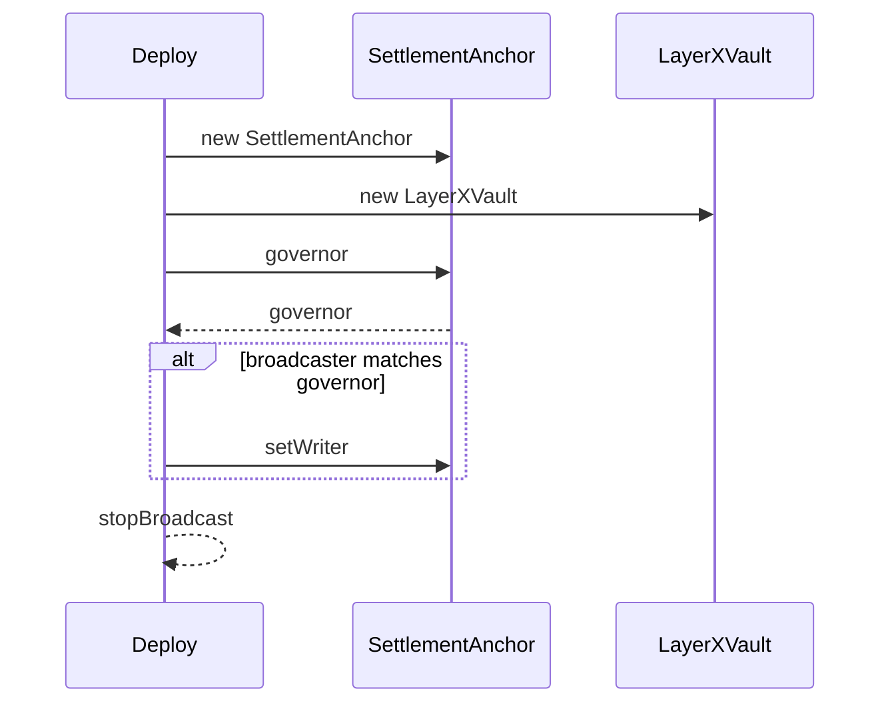
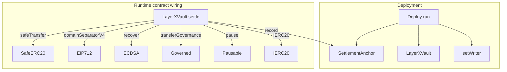

## Overview

The repository documentation states that production `src/` has zero external imports, and that safety primitives are reimplemented in-house under `src/lib`. That makes this section unusually self-contained: deployment, settlement anchoring, typed-data verification, token safety, and governance all live in the same audited surface.

## Repository and Build Notes

| File | What it establishes |
| --- | --- |
| `layerx/contracts/README.md` | Defines the contract suite’s purpose, the trust model, build and test commands, mainnet wiring notes, and frozen-spec open decisions. |
| `layerx/contracts/foundry.toml` | Sets the Foundry layout and compiler profile for `src`, `test`, and `script`, including Solidity `0.8.27`, Shanghai EVM settings, optimizer settings, and the `paxeer` RPC endpoint key. |


The README also records the suite’s two primary contracts: `LayerXVault` for reserve custody and settlement, and `SettlementAnchor` for the immutable root log. It further states that `forge-std` is vendored under `lib/` for tests only and is never imported by production `src/`.

```steps
1. Build contracts | Run `forge build`.
2. Run the test suite | Run `forge test`.
```

## Deployment Flow

### Deploy Script

*`layerx/contracts/script/Deploy.s.sol`*

`Deploy.run` is the deployment entrypoint for the Paxeer contract pair. It reads the required environment variables, starts a broadcast, deploys `SettlementAnchor` first, deploys `LayerXVault` second, and then conditionally wires the anchor writer to the vault when the broadcasting key matches the anchor governor.

| Environment variable | Role in `run` |
| --- | --- |
| `LAYERX_GOVERNOR` | Protocol root authority used for both deployments. |
| `LAYERX_OPERATOR_ADDR` | Sequencer EVM key that submits settlement batches and signs balance proofs. |
| `LAYERX_GUARDIAN` | Emergency pause authority. |
| `LAYERX_USDL_ADDR` | USDL reserve token address. |
| `LAYERX_DEX_ROUTER` | Paxeer DEX router used by the vault’s swap path. |
| `LAYERX_WRAPPED_NATIVE` | Wrapped native asset used for native deposit handling. |
| `LAYERX_EXIT_DELAY` | Force-exit challenge window in seconds. |




## Contract Wiring Overview



## Contract and Library Reference

### SettlementAnchor

Deploy.run creates SettlementAnchor with writer_ set to address(0). It only calls setWriter when anchorC.governor() == msg.sender, so a deployment broadcast from a non-governor key leaves the anchor unwired until the governor performs the follow-up transaction.

*`layerx/contracts/src/SettlementAnchor.sol`*

`SettlementAnchor` is the minimal, append-only registry for settled batch Merkle roots. It stores only anchoring metadata and never holds funds. The contract is deliberately small so the historical root log survives a future vault migration, while the governor can rotate the authorized writer.

#### Constructor dependencies

| Type | Description |
| --- | --- |
| `address governor_` | Protocol root authority that can rotate the writer. |
| `address writer_` | Initial writer address allowed to anchor roots. |


#### Properties

| Property | Type | Description |
| --- | --- | --- |
| `writer` | `address` | Authorized writer allowed to call `record`. |
| `rootOf` | `mapping(bytes32 => bytes32)` | Anchored Merkle root for each batch id. |
| `anchored` | `mapping(bytes32 => bool)` | Idempotency flag keyed by batch id. |


#### Methods

| Method | Description |
| --- | --- |
| `setWriter` | Updates the authorized writer after a governor check. |
| `record` | Anchors one batch root, rejects duplicates, and emits the anchoring event. |


#### Error surface

- `NotWriter` when a non-writer calls `record`.
- `AlreadyAnchored` when the same batch id is anchored again.
- `ZeroRoot` when a batch root is empty.

The `record` call writes `anchored[batchId] = true`, stores `rootOf[batchId] = root`, and emits `SettlementAnchored` with the batch metadata plus `block.timestamp`.

### ISettlementAnchor

*`layerx/contracts/src/interfaces/ISettlementAnchor.sol`*

`ISettlementAnchor` is the on-chain contract boundary for the anchor log. It exposes the batch-root getter and the anchoring event used by the vault and by off-chain receipt verification.

#### Event

| Event | Fields |
| --- | --- |
| `SettlementAnchored` | `batchId`, `root`, `totalSettled`, `count`, `windowEnd`, `anchoredAt` |


#### Methods

| Method | Description |
| --- | --- |
| `record` | Records a settled batch root, callable only by the authorized writer. |
| `rootOf` | Returns the anchored root for a batch id, or zero if no root exists. |


### IERC20

*`layerx/contracts/src/interfaces/IERC20.sol`*

`IERC20` is the in-house ERC-20 interface used by the vault and the token safety helpers. It includes `decimals` because LayerX accounting is denominated in reserve-token native units.

#### Events

| Event | Fields |
| --- | --- |
| `Transfer` | `from`, `to`, `value` |
| `Approval` | `owner`, `spender`, `value` |


#### Methods

| Method | Description |
| --- | --- |
| `totalSupply` | Returns token supply. |
| `balanceOf` | Returns the balance for one account. |
| `transfer` | Transfers tokens to one recipient. |
| `allowance` | Returns the remaining allowance. |
| `approve` | Sets allowance for a spender. |
| `transferFrom` | Transfers tokens using allowance. |
| `decimals` | Returns the token decimal precision. |


### EIP712

*`layerx/contracts/src/lib/EIP712.sol`*

`EIP712` implements the typed-data domain hashing used by the vault’s balance-proof flow. The domain separator is cached at construction and re-derived if the chain id changes, which keeps signatures fork-safe.

#### Constructor dependencies

| Type | Description |
| --- | --- |
| `string memory name` | Typed-data domain name. |
| `string memory version` | Typed-data domain version. |


#### Properties

| Property | Type | Description |
| --- | --- | --- |
| `_TYPE_HASH` | `bytes32` | EIP-712 domain type hash. |
| `_hashedName` | `bytes32` | Keccak256 hash of the configured name. |
| `_hashedVersion` | `bytes32` | Keccak256 hash of the configured version. |
| `_cachedDomainSeparator` | `bytes32` | Cached domain separator built at construction. |
| `_cachedChainId` | `uint256` | Chain id captured at construction. |
| `_cachedThis` | `address` | Contract address captured at construction. |


#### Methods

| Method | Description |
| --- | --- |
| `domainSeparatorV4` | Returns the current domain separator, cached when safe and rebuilt after a fork. |
| `_buildDomainSeparator` | Builds the typed-data domain separator from the cached name, version, chain id, and contract address. |
| `_hashTypedDataV4` | Produces the typed-data digest for one struct hash. |


### ECDSA

*`layerx/contracts/src/lib/ECDSA.sol`*

`ECDSA` performs secp256k1 signer recovery for the vault’s operator co-signed balance proofs. It explicitly rejects high-`s` signatures, invalid `v` values, and zero-address recovery.

#### Properties

| Property | Type | Description |
| --- | --- | --- |
| `_HALF_N` | `bytes32` | Upper-half secp256k1 bound used to reject malleable signatures. |


#### Methods

| Method | Description |
| --- | --- |
| `recover` | Recovers a signer from a packed 65-byte signature. |
| `recover` | Recovers a signer from split `v`, `r`, and `s` values. |


#### Error surface

- `InvalidSignature` for invalid `v` values or zero-address recovery.
- `InvalidSignatureLength` for signatures that are not 65 bytes.
- `InvalidSignatureS` for malleable high-`s` signatures.

### Governed

*`layerx/contracts/src/lib/Governed.sol`*

`Governed` implements the two-step governance handoff used by `SettlementAnchor` and `LayerXVault`. The current governor can start a transfer, but the new governor must accept it explicitly.

#### Constructor dependencies

| Type | Description |
| --- | --- |
| `address governor_` | Initial protocol root authority. |


#### Properties

| Property | Type | Description |
| --- | --- | --- |
| `governor` | `address` | Current governor. |
| `pendingGovernor` | `address` | Governor address waiting to accept control. |


#### Methods

| Method | Description |
| --- | --- |
| `transferGovernance` | Starts a governance transfer to a new governor. |
| `acceptGovernance` | Completes the transfer when called by the pending governor. |


#### Error surface

- `NotGovernor` when a non-governor calls a governor-gated path.
- `NotPendingGovernor` when a non-pending governor attempts acceptance.
- `ZeroAddress` when a zero address is provided where a real address is required.

### Pausable

*`layerx/contracts/src/lib/Pausable.sol`*

`Pausable` is the emergency-stop primitive used by the vault. It exposes the pause state and the internal toggles that the vault’s governor or guardian-controlled wrappers call.

#### Properties

| Property | Type | Description |
| --- | --- | --- |
| `_paused` | `bool` | Internal paused flag. |


#### Methods

| Method | Description |
| --- | --- |
| `paused` | Returns the current paused state. |
| `_pause` | Sets the paused flag and emits `Paused`. |
| `_unpause` | Clears the paused flag and emits `Unpaused`. |


#### Error surface

- `EnforcedPause` when a `whenNotPaused` path is called while paused.
- `ExpectedPause` when a `whenPaused` path is called while not paused.

### SafeERC20

*`layerx/contracts/src/lib/SafeERC20.sol`*

`SafeERC20` is the token-call wrapper used everywhere value moves. It tolerates ERC-20 variants that return no boolean, rejects failures and false returns, and handles the allowance reset-to-zero path required by USDT-style tokens.

#### Methods

| Method | Description |
| --- | --- |
| `safeTransfer` | Transfers tokens and reverts on any failure shape. |
| `safeTransferFrom` | Transfers tokens from one account to another with failure checking. |
| `forceApprove` | Sets an allowance, retrying through zero when the token requires a reset. |
| `_callOptionalReturn` | Performs the low-level call and validates the optional boolean return. |
| `_callOptionalReturnBool` | Performs the same call pattern but returns a success flag for `forceApprove`. |


#### Error surface

- `SafeERC20FailedOperation` when the ERC-20 call reverts, returns false, or targets a non-contract.

### LayerXVault

*`layerx/contracts/src/LayerXVault.sol`*

`LayerXVault` is the on-chain custody and settlement contract that the deployment script wires behind `SettlementAnchor`. It holds the USDL reserve, mints USDX accounting against deposits, executes settlement payouts, and provides the unilateral force-exit escape hatch bounded by the operator’s last co-signed balance proof.

#### Constructor dependencies

| Type | Description |
| --- | --- |
| `address usdl_` | Canonical reserve asset. |
| `address governor_` | Protocol root authority. |
| `address operator_` | Sequencer key that submits settlement batches and signs balance proofs. |
| `address guardian_` | Emergency pause authority. |
| `address anchor_` | Immutable settlement-root log. |
| `address dexRouter_` | Paxeer DEX router for swap-based deposits. |
| `address wrappedNative_` | Wrapped native asset used for native deposits. |
| `uint64 exitDelay_` | Force-exit challenge window. |


#### Properties

| Property | Type | Description |
| --- | --- | --- |
| `MAX_PAYOUTS` | `uint256` | Upper bound on settlement payouts per batch. |
| `MIN_EXIT_DELAY` | `uint64` | Minimum allowed exit delay. |
| `MAX_EXIT_DELAY` | `uint64` | Maximum allowed exit delay. |
| `_BALANCE_PROOF_TYPEHASH` | `bytes32` | EIP-712 type hash for balance proofs. |
| `usdl` | `IERC20` | Canonical reserve token. |
| `operator` | `address` | Settlement operator and balance-proof signer. |
| `guardian` | `address` | Emergency pause authority. |
| `dexRouter` | `IPECORRouter` | Router used by deposit swap paths. |
| `anchor` | `ISettlementAnchor` | Anchor contract that records batch roots. |
| `wrappedNative` | `IWrappedNative` | Wrapped native token used by native deposits. |
| `exitDelay` | `uint64` | Force-exit challenge window. |
| `maxSettlementPerBatch` | `uint256` | Settlement cap, with zero meaning uncapped. |
| `totalDeposited` | `uint256` | Cumulative USDL credited through deposits. |
| `totalSettledOut` | `uint256` | Cumulative USDL paid out through settlement. |
| `totalExited` | `uint256` | Cumulative USDL paid out through force-exit. |
| `swapAllowed` | `mapping(address => bool)` | Allowlist for swap-deposit input tokens. |
| `settledBatch` | `mapping(bytes32 => bool)` | Batch idempotency flag. |
| `pendingExit` | `mapping(address => Exit)` | Pending exit per account. |
| `claimedEpoch` | `mapping(address => uint64)` | Highest finalized epoch for each account. |
| `exited` | `mapping(address => bool)` | Accounts barred from further settlement after force-exit. |


#### Nested struct

| Property | Type | Description |
| --- | --- | --- |
| `amount` | `uint256` | Exit amount. |
| `epoch` | `uint64` | Operator proof epoch. |
| `claimableAt` | `uint64` | Timestamp after which finalization is allowed. |


#### Methods

| Method | Description |
| --- | --- |
| `receive` | Accepts native PAX only from the wrapped-native contract. |
| `depositUSDL` | Deposits USDL directly and mints USDX 1:1. |
| `depositSwap` | Deposits an allowlisted token, swaps it to USDL, and mints USDX from the realized output. |
| `depositNative` | Wraps native PAX, swaps to USDL, and mints USDX from the realized output. |
| `settle` | Applies one settlement batch, anchors the root, and pays the batch recipients. |
| `initiateExit` | Starts a force-exit using the operator’s last co-signed balance proof. |
| `challengeExit` | Replaces a pending exit with a strictly newer operator co-signed balance. |
| `finalizeExit` | Completes a matured exit and pays the account. |
| `setOperator` | Rotates the operator. |
| `setGuardian` | Rotates the guardian. |
| `setDexRouter` | Rotates the DEX router. |
| `setAnchor` | Rotates the anchor contract reference. |
| `setWrappedNative` | Rotates the wrapped-native reference. |
| `setExitDelay` | Updates the exit challenge window within the configured bounds. |
| `setMaxSettlementPerBatch` | Updates the per-batch settlement cap. |
| `setSwapAllowed` | Updates the token swap allowlist. |
| `pause` | Pauses deposit, settlement, and exit paths when called by the guardian or governor. |
| `unpause` | Clears the paused state when called by the governor. |
| `reserveBalance` | Returns the live USDL reserve balance. |
| `hashBalanceProof` | Returns the EIP-712 digest for a balance proof. |


#### Error surface

`LayerXVault` defines a broad validation surface: `NotOperator`, `NotGuardianOrGovernor`, `ZeroAmount`, `TokenNotAllowed`, `SameTokenSwap`, `SlippageExceeded`, `DeadlineExpired`, `RouterUnset`, `WrappedNativeUnset`, `BatchAlreadySettled`, `TooManyPayouts`, `SettlementCapExceeded`, `InsufficientReserve`, `AccountExited`, `InvalidProofSigner`, `NotProofAccount`, `ProofExpired`, `StaleEpoch`, `NoPendingExit`, `ExitNotMatured`, `ExitDelayOutOfRange`, `NativeValueMismatch`, plus inherited `ZeroAddress` from `Governed`.

The main runtime patterns are:

- deposit paths measure token balance deltas before and after transfer, so fee-on-transfer surprises do not inflate minted accounting;
- swap deposits use `forceApprove` and then reset the router allowance back to zero;
- settlement anchors the root before token transfers, while the whole call is protected by reentrancy control;
- force-exit uses EIP-712 typed data and `ECDSA.recover` to validate the operator’s co-signature.

## Test Coverage

### SettlementAnchor behavior

*`layerx/contracts/test/SettlementAnchor.t.sol`*

This test file proves the anchor contract’s core invariants:

- a writer can call `record` and the root becomes visible through `rootOf`;
- non-writers are rejected;
- the same batch id cannot be recorded twice;
- zero roots are rejected;
- the governor can rotate the writer and the new writer can anchor subsequent batches.

### SafeERC20 behavior

*`layerx/contracts/test/SafeERC20.t.sol`*

This file exercises the token-safety wrapper with a harness that exposes the library functions:

- standard ERC-20 transfers succeed;
- USDT-style tokens that return no boolean are accepted;
- `transferFrom` works with the same non-bool behavior;
- `forceApprove` transparently handles the reset-to-zero path;
- calling into an address with no code reverts instead of silently succeeding.

### Vault wiring behavior

*`layerx/contracts/test/LayerXVault.t.sol`*

The vault test suite covers the deployment-relevant runtime paths:

- direct USDL deposits mint 1:1 and grow the reserve balance;
- swap deposits accept allowlisted input tokens and enforce slippage and deadline checks;
- native deposits wrap and swap through the configured wrapped-native and router path;
- settlement is idempotent, capped, reserve-bounded, and barred for exited accounts;
- force-exit covers initiate, challenge, and finalize, including epoch checks and proof validation;
- pause and unpause obey the governor and guardian access rules;
- governance transfer remains two-step;
- the reentrancy guard blocks a malicious deposit token from re-entering mid-flow;
- exit-delay bounds are enforced at construction and on later updates.
