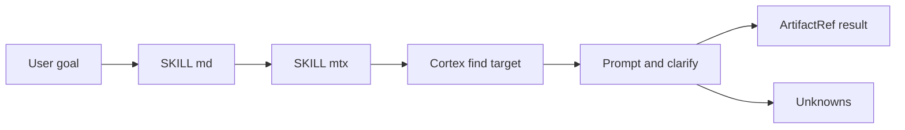
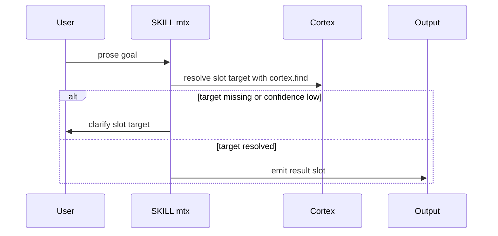

## Overview

This section collects the agent-facing skill packs that teach matrix-core how to reason about accessibility, agent evaluation, API design, architecture, autonomous operation, and adjacent knowledge workflows. The source is split into paired assets: a prose guide in `SKILL.md` and a MatrixScript manifest in `SKILL.mtx`. Together they define what the skill means, when to activate it, what the compiler should resolve, and how the skill should fail or clarify when the target is uncertain.

The most important pattern across this section is that the markdown files describe the human-readable policy and workflow, while the `.mtx` files provide the compiler-facing contract. That contract is intentionally narrow: a required `slot.target`, optional `slot.constraints`, a typed result, and explicit handling for unknown or ambiguous targets. The result is a small but consistent family of agent packs that can be composed for engineering, API, architecture, testing, and audit work.

## Shared Skill Pack Format

All of the visible skill manifests follow the same shape:

- `§SKILL` declares identity and routing fields such as `id`, `version`, `display`, `description`, `mcl.verbs`, `determinism`, and `seed_policy`.
- `§INPUTS` defines the target artifact and optional constraints.
- `§CORTEX` declares the memory categories the skill may read.
- `§TOOLS` and `§SUB_SKILLS` are set to `none` in the visible packs.
- `§PROCEDURE` resolves `slot.target` with `cortex.find`, then clarifies if confidence is too low or the target cannot be identified.
- `§OUTPUTS` always includes a required `slot result: ArtifactRef` and optional `slot unknowns: Unknown[]`.
- `§FAILURE_MODES` consistently uses `target_not_found`, `ambiguous_after_clarify`, `policy_violation`, and `budget_exceeded`.

Across the manifests, the compiler-facing behavior is reproducible: the packs are `seedable`, use `per_intent` seeding, and are organized around a single target artifact rather than open-ended conversation.

### Common Execution Flow

## Accessibility Skill Pack

`skills/accessibility/SKILL.md` frames accessibility as WCAG 2.2 Level AA work grounded in POUR: Perceivable, Operable, Understandable, Robust. It focuses on semantic mapping, accessibility-tree behavior, focus management, and labeling or hints for screen readers, switch controls, keyboard navigation, and native accessibility traits. The visible example shows a search form with a visually hidden label, a search input, and a submit button with `aria-label` set to `Submit Search`.

`skills/accessibility/SKILL.mtx` turns that guidance into a two-verb pack with `find` and `build`. The manifest expects `slot.target: ArtifactRef`, optionally accepts `slot.constraints`, and emits `slot.result: ArtifactRef`. If the target is unclear, it blocks with a clarification prompt instead of proceeding with a weak guess.

| Path | Behavior |
| --- | --- |
| `skills/accessibility/SKILL.md` | Describes WCAG 2.2 AA usage, semantic roles, contrast, target size, focus appearance, redundant entry, and robust ARIA and platform traits. |
| `skills/accessibility/SKILL.mtx` | Resolves a target artifact from Cortex, supports `find` and `build`, and clarifies when confidence drops below the threshold or the target cannot be identified. |

## Agent Evaluation and Regression Assets

`skills/agent-eval/SKILL.md` is a lightweight comparison tool for coding agents such as Claude Code, Aider, and Codex. Its core goal is to make agent comparisons reproducible by defining tasks in YAML, then judging pass rate, cost, time, and consistency across repeated runs. The workflow is explicitly evaluation-first: define tasks, run them, and compare the metrics rather than relying on intuition.

`skills/ai-regression-testing/SKILL.md` complements that with regression protection for AI-assisted development. It starts with mandatory automated checks, specifically `npm run test` and `npm run build`, and then moves into a bug-check review flow that looks for sandbox and production consistency, API response shape mismatches, rollback gaps, and optimistic-update races. The visible helper functions show how test requests are built: `createTestRequest` can add `x-sandbox-user-id` and JSON content type, while `parseResponse` returns the response status and parsed JSON.

| Path | Behavior |
| --- | --- |
| `skills/agent-eval/SKILL.md` | Compares coding agents head-to-head using task definitions and metrics for pass rate, cost, time, and consistency. |
| `skills/agent-eval/SKILL.mtx` | Uses the `monitor` verb, resolves a target artifact, and clarifies when the target is ambiguous. |
| `skills/ai-regression-testing/SKILL.md` | Defines a bug-check workflow with mandatory tests, sandbox-mode request helpers, and regression proposals for each fixed defect. |
| `skills/ai-regression-testing/SKILL.mtx` | Uses `analyze` and `build`, with the same target-resolution and clarification pattern as the other manifests. |

## Agent Engineering Skill Packs

### Harness Construction and Introspection

`skills/agent-harness-construction/SKILL.md` is about improving how an agent plans, calls tools, recovers from errors, and converges on completion. Its guidance is explicit about action-space design, observation formatting, error recovery contracts, context budgeting, and the hybrid ReAct plus function-calling pattern. It also defines the observation fields the tool should return: `status`, `summary`, `next_actions`, and `artifacts`.

`skills/agent-introspection-debugging/SKILL.md` is a self-debugging workflow for repeated failures, runaway retries, or context drift. It divides the process into capture, diagnosis, contained recovery, and report generation. The visible failure patterns include `ECONNREFUSED`, `429`, stale diffs after writes, and tests that still fail after a supposed fix, with each pattern tied to a minimal corrective action.

| Path | Behavior |
| --- | --- |
| `skills/agent-harness-construction/SKILL.md` | Defines action-space design, observation fields, recovery hints, context budgeting, and benchmark metrics such as completion rate, retries, pass@1, and pass@3. |
| `skills/agent-harness-construction/SKILL.mtx` | Supports `modify` and `build`, and follows the shared target-resolution and clarification contract. |
| `skills/agent-introspection-debugging/SKILL.md` | Provides a four-phase self-debug loop with failure capture, diagnosis, recovery, and a structured report. |
| `skills/agent-introspection-debugging/SKILL.mtx` | Uses `analyze` and clarifies the target when the request is underspecified. |

### Agentic Engineering and Payment Controls

`skills/agentic-engineering/SKILL.md` is the higher-level operating model for AI-led implementation work. It emphasizes defining completion criteria before execution, breaking work into agent-sized units, routing model tiers by task complexity, and measuring success with evals and regression checks. It also tracks cost discipline with model, token estimate, retries, wall-clock time, and success or failure.

`skills/agent-payment-x402/SKILL.md` adds autonomous payment execution over x402. It explains budget controls, non-custodial wallets, and spending policy enforcement for agents that need to pay for APIs, services, or other agents. The visible example centers on `set_policy`, `check_spending`, `preToolCheck`, and a fail-closed entrypoint via `main().catch((err) => {})`. The pre-tool logic explicitly handles invalid input, transport failures, tool errors, parse failures, and budget exhaustion before the paid action runs.

| Path | Behavior |
| --- | --- |
| `skills/agentic-engineering/SKILL.md` | Defines eval-first execution, decomposition, model routing, review focus, session strategy, and cost tracking. |
| `skills/agentic-engineering/SKILL.mtx` | Uses `analyze` with the standard target resolution and clarification flow. |
| `skills/agent-payment-x402/SKILL.md` | Describes x402-based payment execution, per-task and per-session budgets, allowlists, rate limits, and fail-closed spending checks. |
| `skills/agent-payment-x402/SKILL.mtx` | Uses `analyze` and follows the same target-resolution pattern as the other skills. |

## API Design and Documentation Skill Packs

### API Design

`skills/api-design/SKILL.md` is a REST design guide for consistent resource naming, status codes, pagination, filtering, sorting, error responses, versioning, and rate limiting. The document includes interface examples for `ApiResponse<T>` and `ApiError`, plus a class example for `UserViewSet`. The examples show how request validation, serializer choice, and response shaping fit together in a controller-style API.

The visible symbol evidence for the embedded examples is summarized below.

#### `ApiResponse`

| Property | Type |
| --- | --- |
| `data` | `T` |
| `meta` | `PaginationMeta` |
| `links` | `PaginationLinks` |

#### `ApiError`

| Property | Type |
| --- | --- |
| `error` | `unknown` |
| `code` | `string` |
| `message` | `string` |
| `details` | `FieldError[]` |

#### `UserViewSet`

| Property | Type |
| --- | --- |
| `action` | `unknown` |

| Method | Description |
| --- | --- |
| `get_serializer_class` | Returns the serializer class used for the current action. |
| `create` | Handles creation with request validation and response shaping. |

`skills/api-design/SKILL.mtx` packages that content as a build-oriented manifest. It uses a single target artifact, resolves it with Cortex, and then asks for clarification if confidence is low. The markdown file’s examples are design patterns, while the manifest turns the pattern into a compile-time skill shape.

### API Documentation

`skills/api-documenter/SKILL.md` is the documentation counterpart. It is focused on OpenAPI 3.1, complete endpoint coverage, request and response examples, error documentation, authentication guides, versioning, and interactive documentation experiences such as try-it-out consoles and environment switching. It also spans documentation forms beyond REST, including GraphQL, WebSocket, gRPC, webhook events, SDK references, CLI docs, and integration guides.

`skills/api-documenter/SKILL.mtx` exposes the same style of compiler contract as the other packs. The visible example payload around the documentation workflow includes progress fields such as `status`, `progress`, `endpoints_documented`, `examples_created`, and `sdk_languages`, which makes the pack suitable for documentation runs that need measurable output.

### API Connector Builder

`skills/api-connector-builder/SKILL.md` is for adding a repo-native connector or provider without inventing a new integration architecture. Its workflow is explicit: inspect at least two existing connectors or providers, map the house style, narrow the target integration, build the connector in the repo’s existing layers, and validate the result against the source pattern. The visible guidance calls out config, auth, retries, pagination, registry hooks, and tests as the pieces that must line up.

`skills/api-connector-builder/SKILL.mtx` is the build manifest for that workflow. It is a target-driven pack with the same Cortex resolution and clarification behavior used by the other manifests.

| Path | Behavior |
| --- | --- |
| `skills/api-design/SKILL.md` | Teaches REST resource naming, envelopes, status codes, pagination, filtering, and controller patterns. |
| `skills/api-design/SKILL.mtx` | Converts the design guidance into a build-oriented manifest with target resolution and clarification. |
| `skills/api-documenter/SKILL.md` | Covers API docs strategy, OpenAPI, examples, error docs, auth guides, versioning, and interactive portals. |
| `skills/api-documenter/SKILL.mtx` | Manifest counterpart for the documentation workflow, including progress-oriented outputs. |
| `skills/api-connector-builder/SKILL.md` | Instructs connector authors to mirror the repository’s existing integration pattern exactly. |
| `skills/api-connector-builder/SKILL.mtx` | Build manifest for a target-specific connector or provider. |

## Architecture and ADR Skill Packs

`skills/architecture/SKILL.md` is the monorepo architecture guide. It focuses on structure, package relationships, import rules, and component organization. The document defines platform-specific file naming, workspace import boundaries, and a strict hierarchy that prevents circular dependencies. It also sets an analysis protocol: assess scope impact, verify patterns, check architecture integrity, and evaluate performance impact before modifying code.

`skills/architecture-decision-records/SKILL.md` captures why decisions were made. It activates when a decision is being chosen or documented, or when someone asks why a past choice was made. The ADR format is lightweight and the lifecycle guidance is explicit: record the original date for past decisions and keep superseded decisions linked to their replacements.

| Path | Behavior |
| --- | --- |
| `skills/architecture/SKILL.md` | Documents monorepo structure, import hierarchy, platform-specific naming, and architecture validation steps. |
| `skills/architecture/SKILL.mtx` | Manifest counterpart with the same target-resolution contract and `analyze` verb. |
| `skills/architecture-decision-records/SKILL.md` | Captures architectural decisions, alternatives, context, consequences, and lifecycle notes in ADR form. |
| `skills/architecture-decision-records/SKILL.mtx` | Manifest that turns ADR capture into a build-oriented skill with target resolution. |

## Autonomous Operation and Audit Packs

`skills/autonomous-agent-harness/SKILL.md` describes how to turn Claude Code into a persistent autonomous agent system using native crons, dispatch, MCP tools, memory, and task queuing. The architecture snippet shows command and hook surfaces feeding an MCP server layer with services such as memory, github, exa, supabase, and browser-use. The prose also shows how task queues are structured with active and completed work, which makes the skill useful for continuous monitoring and scheduled operations.

`skills/automation-audit-ops/SKILL.md` is an evidence-first operator skill for inventorying automations before changing them. It separates configured, authenticated, recently verified, stale or broken, and missing surfaces; it starts read-only; and it refuses to claim a tool is live just because a skill or config references it. Its workflow begins with a real-surface inventory and only then moves to keep, merge, cut, or fix-next recommendations.

| Path | Behavior |
| --- | --- |
| `skills/autonomous-agent-harness/SKILL.md` | Defines persistent autonomous operation, task queues, scheduled execution, and native tool orchestration. |
| `skills/autonomous-agent-harness/SKILL.mtx` | Manifest with `delegate`, `schedule`, and `modify` verbs for the autonomous harness flow. |
| `skills/automation-audit-ops/SKILL.md` | Provides evidence-first automation inventory and overlap analysis before any rewrite or consolidation. |
| `skills/automation-audit-ops/SKILL.mtx` | Manifest counterpart; the visible excerpt includes terminal failure-mode handling such as `policy_violation` and `budget_exceeded`. |

## Analysis Support Assets

`skills/ast-grep-code-analysis/SKILL.md` is a structural analysis skill for complex codebases. It is intended for security vulnerabilities, performance issues, and structural patterns where manual inspection is too shallow. The visible guidance prefers AST-based matching over line-by-line reading and notes a prerequisite around ast-grep installation and configuration.

`skills/ast-grep-code-analysis/SKILL.mtx` packages that analysis workflow as a manifest with the `analyze` verb, target resolution, and clarification when the target is ambiguous. It belongs in the same family as the other agent-oriented skills even though its output is analysis rather than implementation.

| Path | Behavior |
| --- | --- |
| `skills/ast-grep-code-analysis/SKILL.md` | Explains AST-based code analysis for security, performance, and structural review. |
| `skills/ast-grep-code-analysis/SKILL.mtx` | Converts that analysis workflow into a target-driven compiler manifest. |

## Source-Backed Skill Inventory

| File pair | Responsibility |
| --- | --- |
| `skills/accessibility/SKILL.md`, `skills/accessibility/SKILL.mtx` | Accessibility guidance and target-driven accessibility skill execution. |
| `skills/agent-eval/SKILL.md`, `skills/agent-eval/SKILL.mtx` | Agent comparison metrics and evaluation workflow. |
| `skills/agent-harness-construction/SKILL.md`, `skills/agent-harness-construction/SKILL.mtx` | Agent action-space, observation, and recovery design. |
| `skills/agent-introspection-debugging/SKILL.md`, `skills/agent-introspection-debugging/SKILL.mtx` | Self-debugging workflow and manifest contract. |
| `skills/agent-payment-x402/SKILL.md`, `skills/agent-payment-x402/SKILL.mtx` | x402 payment execution and spending control. |
| `skills/agentic-engineering/SKILL.md`, `skills/agentic-engineering/SKILL.mtx` | Eval-first engineering execution and cost discipline. |
| `skills/ai-regression-testing/SKILL.md`, `skills/ai-regression-testing/SKILL.mtx` | Sandbox-oriented regression testing and bug-check automation. |
| `skills/api-connector-builder/SKILL.md`, `skills/api-connector-builder/SKILL.mtx` | Repo-native connector and provider construction. |
| `skills/api-design/SKILL.md`, `skills/api-design/SKILL.mtx` | REST API design patterns and reference examples. |
| `skills/api-documenter/SKILL.md`, `skills/api-documenter/SKILL.mtx` | API documentation workflows and manifest outputs. |
| `skills/architecture/SKILL.md`, `skills/architecture/SKILL.mtx` | Monorepo architecture analysis and import rules. |
| `skills/architecture-decision-records/SKILL.md`, `skills/architecture-decision-records/SKILL.mtx` | ADR capture and decision lifecycle handling. |
| `skills/autonomous-agent-harness/SKILL.md`, `skills/autonomous-agent-harness/SKILL.mtx` | Continuous autonomous operation and task queueing. |
| `skills/automation-audit-ops/SKILL.md`, `skills/automation-audit-ops/SKILL.mtx` | Evidence-first automation inventory and overlap audit. |
| `skills/ast-grep-code-analysis/SKILL.md`, `skills/ast-grep-code-analysis/SKILL.mtx` | AST-driven code analysis for structural issues. |
