## Overview

This section groups the repository’s skill packs and companion knowledge assets that shape how Matrix writes brand content, evolves its own behavior, manages learning from sessions, formats commit messages, and enforces code-pattern guidance. The files here are mostly manifest-driven documentation, shell and Python orchestration, and reference guides rather than application runtime code.

The packs split into a few clear roles: `skills/brand` handles brand voice and asset approval, `skills/self-improve` and `skills/continuous-learning-v2` define recursive learning loops and observer agents, `skills/writing-git-commits` standardizes semantic commit writing, `skills/coding-patterns` captures code-convention rules, and `skills/miniproject/scripts/validate.ts` validates memory-file hygiene.

## Pack Map

```mermaid
flowchart TB
    subgraph brandpack[Brand Pack]
        brandmd[skills brand SKILL md]
        brandmtx[skills brand SKILL mtx]
        brandrefs[Brand reference docs]
        brandtool[validate asset script]
        brandmd --> brandmtx
        brandmd --> brandrefs
        brandrefs --> brandtool
    end

    subgraph selfimprovepack[Self Improve Pack]
        selfreadme[skills self improve README md]
        selfmtx[skills self improve SKILL mtx]
        selfmap[self map manifest]
        selfdiag[self diagnose manifest]
        selfopt[self optimize manifest]
        selfreadme --> selfmtx
        selfmtx --> selfmap
        selfmtx --> selfdiag
        selfmtx --> selfopt
    end

    subgraph learningpack[Continuous Learning Pack]
        learnmd[skills continuous learning v2 SKILL md]
        learnmtx[skills continuous learning v2 SKILL mtx]
        observer[observer agent docs]
        loop[observer loop]
        guard[session guardian]
        launcher[start observer]
        project[detect project]
        instincts[instinct cli]
        tests[test parse instinct]
        learnmd --> learnmtx
        learnmtx --> observer
        learnmtx --> loop
        loop --> guard
        launcher --> loop
        project --> launcher
        instincts --> tests
    end

    subgraph commitpack[Writing Git Commits Pack]
        commitmd[skills writing git commits SKILL md]
        commitmtx[skills writing git commits SKILL mtx]
        faq[FAQ]
        examples[Examples]
        spec[Specification]
        commitmd --> commitmtx
        commitmd --> faq
        commitmd --> examples
        commitmd --> spec
    end

    subgraph codingpack[Coding Patterns Pack]
        codingmd[skills coding patterns SKILL md]
        codingmtx[skills coding patterns SKILL mtx]
        promise[promise handling rules]
        react[react components rules]
        restricted[restricted patterns]
        codingmd --> codingmtx
        codingmd --> promise
        codingmd --> react
        codingmd --> restricted
    end

    subgraph memorycheck[Memory Validation Script]
        validate[skills miniproject scripts validate ts]
    end
```

## Brand Skill Pack

The brand pack defines how the system writes and reviews branded output: voice, visual identity, messaging, asset organization, and approval controls. The manifest and reference files work together; the manifest routes by subcommand, while the references contain the review and formatting rules.

### Brand Skill Manifest

*`skills/brand/SKILL.md`*

This manifest declares the `brand` skill with frontmatter keys `name`, `description`, `argument-hint`, and `metadata`, and it identifies `claudekit` as the author with version `1.0.0`. Its purpose is to activate on brand voice, visual identity, messaging frameworks, asset management, consistency reviews, color palette management, and typography specs.

The routing section is concrete: it parses the first word from `$ARGUMENTS`, loads `references/{subcommand}.md`, and executes the matching reference with the remaining arguments. That makes the reference files the real knowledge assets behind the skill.

### Brand Skill Manifest MatrixScript

*`skills/brand/SKILL.mtx`*

The MatrixScript manifest gives the compiler-facing contract for the same skill. It sets `id=brand`, `display="Brand"`, `mcl.verbs=analyze`, `determinism=seedable`, and `seed_policy=per_intent`, then defines a required `target: ArtifactRef` slot and an optional `constraints: Constraint[]` slot.

Its procedure resolves `slot.target` from Cortex facts near the input text and fails closed if the target cannot be found. The manifest also clarifies on low confidence and on unknown target resolution, which keeps the skill typed and explicit instead of returning an underspecified frame.

### Asset Approval Checklist

*`skills/brand/references/approval-checklist.md`*

This checklist is the approval gate for marketing assets. It covers visual elements, accessibility, content quality, technical requirements, and legal/compliance, then ends with reviewer sign-off and final approval fields.

It also includes an automation note tied to the asset validator script. The checklist explicitly says the validator can check color palette compliance, minimum dimensions, file format and size, naming convention, and basic metadata, and it provides an archival sequence that updates the manifest, records approver data, archives older versions, updates campaign tracking, and notifies teams.

### Asset Organization Guide

*`skills/brand/references/asset-organization.md`*

This guide defines how marketing assets are organized and named. The visible structure centers on a kebab-case naming scheme and metadata fields that include `createdAt` and `createdBy`, so the assets can be searched and tracked consistently.

The source excerpt also shows the asset naming dimensions used in the guide: campaign, description, timestamp, and variant, with example values such as `claude-launch`, `hero-image`, `20251209`, and `dark-mode`. That makes the file a lightweight asset taxonomy rather than a prose-only guideline.

### Brand Guideline Template

*`skills/brand/references/brand-guideline-template.md`*

This template is the starting point for a complete brand guideline document. It covers document structure, typography tables, logo variants, clear space, minimum size, voice and tone, photography style, illustrations, and icons.

The visible examples show how the template expects a team to define brand personality, tone by context, prohibited terms, and imagery standards. It is a fill-in scaffold, not a finished brand manual.

### Asset Validation Script

*`skills/brand/scripts/validate-asset.cjs`*

This Node script validates marketing assets against the brand rules. It uses `fs` and `path`, defines a `RULES` object for naming, dimensions, file size, and supported formats, and runs from `main()`.

| Function | Purpose |
| --- | --- |
| `parseFilename` | Splits an asset filename into type, campaign, description, timestamp, variant, and extension. |
| `validateFilename` | Checks the filename against the naming regex and timestamp/kebab-case rules. |
| `validateFileSize` | Compares the file size with format-specific limits and emits issues or warnings. |
| `validateFormat` | Verifies the extension against image, vector, video, and document format lists. |
| `checkManifest` | Looks for the asset in `.assets/manifest.json` and returns registration status. |
| `suggestFilename` | Builds a corrected filename using today’s date and the parsed pieces. |
| `formatBytes` | Renders raw byte counts into human-readable sizes. |
| `validateAsset` | Runs the full validation pipeline and assembles the result object. |
| `formatOutput` | Produces console output for pass, fail, warning, and suggestion cases. |
| `main` | Reads CLI arguments, resolves the path, prints JSON or text output, and exits with the validation result. |

## Self Improve Pack

> **Note:** The usage comment advertises `--fix`, but `main()` only branches on `--json` and the asset path. The implemented runtime behavior is validation plus formatted reporting, not a fix mode.

This pack defines the recursive self-optimization loop. The prose README explains the loop in human terms, while the MatrixScript manifests specify the exact tool surfaces and sub-skill choreography for the compiler.

### Recursive Self Improvement Guide

*`skills/self-improve/README.md`*

The README describes a recursive loop that maps a subsystem, diagnoses ranked surfaces, gates the architect, optimizes one surface, and verifies the result. It frames the loop as memory-producing: each pass writes typed memories that the next pass reads back through Cortex.

It also explains why the pack exists: earlier skill translations could emit reason-only plans because they declared no tools, so these manifests restore tool calls, explicit gating, and persistence. The install section shows the intended operational loop around `mclc validate` and a driver call that targets `self-improve`.

### Self Improve Manifest

*`skills/self-improve/SKILL.mtx`*

The top-level manifest is the orchestrator. It declares `id=self-improve`, `mcl.verbs=build delegate`, and sub-skills that point to `matrix://skill/self-map@0.1.0`, `matrix://skill/self-diagnose@0.1.0`, `matrix://skill/self-optimize@0.1.0`, and `matrix://skill/self-verify@0.1.0`.

Its `build` procedure requires a sequential plan with a gate before any optimization write lands. Its `delegate` procedure stops after analysis and gate presentation, which lets the architect review ranked surfaces without triggering edits.

### Self Map Manifest

*`skills/self-improve/mnt/user-data/outputs/skills/self-map/SKILL.mtx`*

`self-map` is the observation pass. It reads a subsystem under `/root/matrix`, emits a plan with `fs.directory_tree`, fans out `fs.read_text_file` across discovered files, and persists one Fact memory per file so the topology can be reread later.

The manifest is explicit about not claiming a file was read unless a tool call actually read it. That is the core guardrail of the pack: the map is durable only if the file content was genuinely traversed and recorded.

### Self Diagnose Manifest

*`skills/self-improve/mnt/user-data/outputs/skills/self-diagnose/SKILL.mtx`*

`self-diagnose` consumes the map and ranks optimization surfaces. Its tool surface includes `fs.read_text_file`, `fs.list_directory`, `git.git_diff`, and `forge-bridge.shell_exec`, and its output is a ranked Pattern memory.

The plan requires concrete file paths and falsifiable success criteria for each surfaced opportunity. It is not enough to identify a vague area; the skill must write a ranked list that can be acted on by the next pass.

### Self Optimize Manifest

*`skills/self-improve/mnt/user-data/outputs/skills/self-optimize/SKILL.mtx`*

`self-optimize` is the action pass. It reads the target file, generates the full edited file content, writes it back with `fs.write_file`, records the diff with `git.git_diff`, and persists an Event memory describing the change.

The manifest treats writing before reading as a hard policy violation. That makes the edit loop deterministic and auditable: read, change, write, diff, record.

## Continuous Learning V2 Pack

This pack is the session-observation system. It monitors tool activity, detects repeatable instincts, scopes them by project, and promotes them into reusable knowledge when confidence and repetition are high enough.

### Continuous Learning Skill Manifest

*`skills/continuous-learning-v2/SKILL.md`*

This manifest describes an instinct-based learning system that evolves session patterns into skills, commands, and agents. It highlights the v2.1 project-scoped model, where instincts stay isolated per project unless they are explicitly promoted into global scope.

The README-style content also contrasts v2.1 with earlier versions: observations are now scoped by project hash or repo path, cross-project contamination is reduced, and global instincts remain available as shared knowledge. That makes the pack as much about memory hygiene as about learning.

### Continuous Learning Skill Manifest MatrixScript

*`skills/continuous-learning-v2/SKILL.mtx`*

The MatrixScript surface declares `id=continuous-learning-v2` with `mcl.verbs=monitor build`. It accepts a required `target: ArtifactRef` and optional `constraints: Constraint[]`, then clarifies on low confidence or unknown targets.

Its procedures resolve `slot.target` through Cortex facts and keep the skill typed across both monitor and build intents. The manifest is intentionally minimal at the tool level, because the agent and script layer carry most of the operational behavior.

### Observer Agent Guide

*`skills/continuous-learning-v2/agents/observer.md`*

This file defines the observer background agent. It runs as `haiku`, reads project-scoped observations with a global fallback, and converts repeated behavior into instincts.

The source describes four pattern classes: user corrections, error resolutions, repeated workflows, and tool preferences. It also states that the output lands in project-scoped instincts by default, with global scope reserved for universal patterns.

### Observer Loop

*`skills/continuous-learning-v2/agents/observer-loop.sh`*

This shell loop is the active analyzer. It uses cooldown controls, idle-time exits, session-lease detection, and a signal-driven `USR1` path to decide when to analyze observations.

| Function | Purpose |
| --- | --- |
| `cleanup` | Stops the background sleep process and removes the PID file when the observer exits. |
| `file_mtime_epoch` | Returns a file modification time as an epoch number across GNU and BSD `stat` variants. |
| `has_active_session_leases` | Checks whether the session-lease directory contains active JSON lease files. |
| `latest_activity_epoch` | Chooses the newest timestamp between the observations file and the activity file. |
| `exit_if_idle_without_sessions` | Stops the loop when there are no active leases and the session has been idle too long. |
| `analyze_observations` | Samples the recent observations, builds the analysis prompt, launches `claude`, archives processed observations, and logs failures. |
| `on_usr1` | Guards re-entrancy, enforces cooldown, and triggers `analyze_observations` on demand. |

The script also writes the loop PID, prunes expired instincts through the Python CLI, and continuously rechecks idle and analysis conditions. It is the operational heart of the pack.

### Session Guardian

*`skills/continuous-learning-v2/agents/session-guardian.sh`*

This guard runs before the observer loop spawns a Claude session. It applies three gates in order: active-hours window, project cooldown, and idle detection.

| Function | Purpose |
| --- | --- |
| `get_idle_seconds` | Measures idle time on Darwin, Linux, and Windows-compatible shells, then fails open when idle time cannot be determined. |

The guard is controlled by the environment variables `INTERVAL`, `LOG_PATH`, `ACTIVE_START`, `ACTIVE_END`, and `MAX_IDLE`. It blocks cycles outside active hours, serializes cooldown logging with a lock directory, and skips work when the user has been idle too long.

### Observer Launcher

*`skills/continuous-learning-v2/agents/start-observer.sh`*

This launcher resolves project context, reads observer settings from `config.json` or `CLV2_CONFIG`, and spawns the observer loop in the background. It supports `start`, `stop`, `status`, and `--reset`.

| Function | Purpose |
| --- | --- |
| `write_guard_sentinel` | Writes the pause message that tells the user to review `observer.log` before restarting. |
| `stop_observer_if_running` | Stops a running observer process or cleans up a stale PID file. |

The launcher also checks the observer output for the confirmation and permission prompt pattern from `CLV2_OBSERVER_PROMPT_PATTERN`. If that pattern appears, it fails closed, stops the observer, and writes the sentinel file.

### Project Detection Helper

> **Note:** The status path counts `*.yaml` files in `INSTINCTS_DIR`, while `observer-loop.sh` instructs the observer to write instinct files as `.md`. The running observer can therefore create instinct files that the status counter does not see.

*`skills/continuous-learning-v2/scripts/detect-project.sh`*

This shell helper turns the current working context into project metadata. It prefers `CLAUDE_PROJECT_DIR`, then a git repo root, and falls back to `global` when no project context is available.

| Function | Purpose |
| --- | --- |
| `_clv2_resolve_python_cmd` | Chooses a Python interpreter from `CLV2_PYTHON_CMD`, `python3`, or `python`. |
| `_clv2_detect_project` | Resolves project name, ID, root, storage directory, and project-scoped subdirectories. |
| `_clv2_update_project_registry` | Writes `projects.json` and `project.json` through atomic JSON updates. |
| `atomic_write_json` | The Python-side helper that safely replaces the target JSON file. |

The script also exports `PROJECT_ID`, `PROJECT_NAME`, `PROJECT_ROOT`, `PROJECT_DIR`, and `CLV2_OBSERVER_SENTINEL_FILE`. It is the project-scoping spine for the whole observer pack.

### Instinct CLI

*`skills/continuous-learning-v2/scripts/instinct-cli.py`*

This Python CLI manages instinct lifecycle operations. It handles project detection, path validation, parsing, loading, import, export, status reporting, clustering, and promotion-related analysis.

| Function | Purpose |
| --- | --- |
| `_ensure_global_dirs` | Creates the global instincts and evolved output directories. |
| `_validate_file_path` | Resolves file paths safely and blocks paths that escape into system directories. |
| `_validate_instinct_id` | Rejects instinct IDs that contain traversal, leading dots, or invalid characters. |
| `_yaml_quote` | Quotes strings safely for YAML frontmatter serialization. |
| `detect_project` | Builds the project-scoped directory map and updates the registry. |
| `_update_registry` | Writes the project registry with optional locking on platforms that support it. |
| `load_registry` | Loads `projects.json` or returns an empty registry when it is missing or malformed. |
| `parse_instinct_file` | Parses the YAML-like instinct frontmatter and preserves the body content. |
| `_load_instincts_from_dir` | Reads instinct files from a single directory and annotates their source metadata. |
| `load_all_instincts` | Merges project and global instincts, preferring project-scoped entries on ID conflicts. |
| `load_project_only_instincts` | Loads only the active project’s instincts, or global instincts in fallback mode. |
| `cmd_status` | Prints project, global, and pending instinct counts with scope grouping. |
| `_print_instincts_by_domain` | Groups instincts by domain and prints confidence, trigger, and extracted action text. |
| `cmd_import` | Imports instincts from a file or URL, deduplicates them, and writes them to the target scope. |
| `cmd_export` | Exports selected instincts to stdout or a file, with scope and confidence filtering. |
| `cmd_evolve` | Clusters instincts into candidate skills, commands, and agents, and can generate evolved output. |
| `_find_cross_project_instincts` | Finds instinct IDs that appear in multiple projects. |
| `_show_promotion_candidates` | Prints instincts that are strong candidates for global promotion. |
| `cmd_promote` | Routes promotion requests to specific or auto-detected promotion paths. |
| `_promote_specific` | Promotes one project instinct into global scope after validation and confirmation. |

The import path keeps stale files scoped correctly and writes the new file first, so failed imports do not delete the existing source of truth. The CLI is the main operator tool for moving instincts between project, global, and evolved states.

### Instinct Parser Test Suite

*`skills/continuous-learning-v2/scripts/test_parse_instinct.py`*

This pytest module imports `instinct-cli.py` with `importlib.util` and patches the module globals to a temporary homunculus tree. It verifies parsing, path validation, project detection, loading, status output, project listing, promotion logic, cross-project detection, registry loading, instinct ID validation, and atomic registry replacement.

The test data shows the expected instinct frontmatter shape: `id`, `trigger`, `confidence`, `domain`, and `scope`. It also asserts that the project tree contains the `evolved/skills` directory, which confirms that the CLI’s project scaffolding is part of the expected behavior.

## Writing Git Commits Pack

This pack teaches semantic commit writing using Conventional Commits. It is a knowledge pack rather than a runtime tool: the prose files explain the standard, and the manifest packages that guidance into a skill surface.

### Writing Git Commits Manifest

*`skills/writing-git-commits/SKILL.md`*

The manifest introduces Conventional Commits as a machine-readable commit style that supports automation, semantic versioning, and readable history. Its child-skill section points readers toward the examples, specification, and FAQ material that refine the main rule set.

The core commit types visible in the prose are `feat`, `fix`, `docs`, `style`, `refactor`, `perf`, `test`, `chore`, and `ci`, plus breaking-change forms. The emphasis is on clear intent, atomic changes, and commit messages that are easy for both humans and tools to parse.

### Writing Git Commits Manifest MatrixScript

*`skills/writing-git-commits/SKILL.mtx`*

This MatrixScript manifest packages the commit-writing guidance as a typed `analyze` skill. It uses a required `target: ArtifactRef` slot, an optional `constraints: Constraint[]` slot, and no tools.

The procedure resolves the target from Cortex and clarifies when the target is not identifiable. The result is a skill interface for commit-message guidance rather than a build or runtime workflow.

### FAQ

*`skills/writing-git-commits/faq/SKILL.md`*

The FAQ answers practical questions about adoption, mood, scope, breaking changes, and workflow enforcement. It explains why Conventional Commits help with changelogs, SemVer, and build or publish automation.

It also gives the decision rule for ambiguous commits: split them when possible, rather than stuffing multiple changes into a single message. The examples reinforce lowercase, imperative descriptions and consistent usage across a team.

### Examples

*`skills/writing-git-commits/examples/SKILL.md`*

The examples file is the pattern library. It shows feature, fix, docs, refactor, test, chore, ci, style, and perf commits, along with scoped forms and breaking-change variants.

It also includes longer examples with bodies and footers, which demonstrates how the commit body carries context while the header stays concise. The file’s role is practical calibration: it shows what “good” looks like in real commit messages.

### Specification

*`skills/writing-git-commits/specification/SKILL.md`*

This document is the formal spec. It defines the required type prefix, optional scope, optional breaking marker, required description, optional body, and optional footers, then maps `feat` to `MINOR`, `fix` to `PATCH`, and breaking changes to `MAJOR`.

It also includes a grammar block and a SemVer relationship table, which makes it the authoritative rule source for tooling. In the pack structure, this file is the closest thing to a contract.

## Coding Patterns Pack

This pack captures code-shaping rules for React components, promises, and restricted patterns. It is a knowledge pack, but unlike the commit pack it is tightly oriented around code shape and compiler-safe habits.

### Coding Patterns Manifest

*`skills/coding-patterns/SKILL.md`*

The manifest is a quick-reference skill with `allowed-tools: Read, Grep, Glob, Write, Edit`. Its frontmatter says it should be used for React components, promises, async handling, error handling, and convention enforcement.

The visible reference table points at three rule files: promise handling, React components, and restricted patterns. That makes the manifest a dispatcher into concrete rule pages rather than a standalone policy document.

### Coding Patterns Manifest MatrixScript

*`skills/coding-patterns/SKILL.mtx`*

This MatrixScript surface packages the coding-patterns guidance as `id=coding-patterns` with `mcl.verbs=build`. It accepts the standard required `target: ArtifactRef` and optional `constraints: Constraint[]` slots, then resolves the target and clarifies when it is not identifiable.

The manifest is intentionally tool-free. It exists to produce a typed frame for code-convention guidance, not to execute file operations.

### Promise Handling Rules

*`skills/coding-patterns/references/rules/promise-handling.md`*

This rule file is strict about async work. It says Promises must always be awaited unless they are intentionally fire-and-forget with `void`, and it treats floating promises as a hard error condition.

The examples show the difference between a bare async call, a `void` call, and an `async` handler with `await`. It also explicitly tells readers to consider error scenarios before async operations and to add proper try/catch blocks.

### React Components Rules

*`skills/coding-patterns/references/rules/react-components.md`*

This rule file is about component shape and hooks discipline. It prefers named imports, functional components, top-level hook calls, and dependency arrays that include every referenced value.

It also demonstrates `usePromiseResult` and `useAsyncCall`, plus a standard render order that keeps state, memoized derivations, callbacks, effects, and render output in predictable sections.

#### Documented Component Surface

| Symbol | Properties or Method |
| --- | --- |
| `components` | `rules` |
| `IMyComponentProps` | `title: string`, `isDisabled: boolean` |

The examples in the file also show a `MyComponent` form that accepts `title`, `onPress`, and `isDisabled` in the function signature, but the symbol evidence for `IMyComponentProps` only exposes `title` and `isDisabled` as the documented interface snapshot here.

### Restricted Patterns

*`skills/coding-patterns/references/rules/restricted-patterns.md`*

This rule page lists patterns the codebase forbids or strongly discourages. The visible examples cover `any`, `@ts-ignore`, direct heavy-package usage, and a legacy API call pattern.

The file’s purpose is negative guidance: it shows what not to write so the rest of the pack can stay compatible with the project’s coding rules and platform constraints.

## Memory Validation Script

The memory validation script keeps `.memory/` files compliant with frontmatter and naming conventions. It is a standalone runtime asset, not a skill manifest, but it complements the knowledge packs by keeping their local memory store tidy.

### Validation Script

*`skills/miniproject/scripts/validate.ts`*

The script is a Deno program that walks `.memory/`, reads Markdown files, parses frontmatter, and validates filenames. It defines `MEMORY_DIR`, `ARCHIVE_DIR`, `SPECIAL_FILES`, `FLEXIBLE_PREFIX_FILES`, and a `FILE_TYPES` map for `task`, `phase`, `epic`, `story`, `research`, and `learning`.

| Symbol | Role |
| --- | --- |
| `ValidationResult` | Result shape for file validation, with `file`, `errors`, and `warnings`. |
| `extractFrontmatter` | Pulls YAML frontmatter from a Markdown file body. |
| `validateFilename` | Checks the filename pattern and title quality. |
| `validateFrontmatter` | Verifies required fields and status values for typed memory files. |
| `validateFile` | Reads one file and combines filename and frontmatter validation. |
| `validateMemory` | Traverses `.memory/`, reports results, and sets the process exit code. |

The visible behavior is simple and strict: special files are allowed, `knowledge-` prefixes are flexible, and all standard memory files must follow the `<type>-<8_char_hashid>-<title>.md` convention. Files under `/assets/` are skipped, which keeps the validator focused on memory content rather than asset storage.

## Key Files Reference

| File | Responsibility |
| --- | --- |
| `skills/brand/SKILL.md` | Brand skill prose, use cases, and subcommand routing. |
| `skills/brand/SKILL.mtx` | Brand compiler manifest with analyze intent and target resolution. |
| `skills/brand/references/approval-checklist.md` | Asset approval checklist and archival workflow. |
| `skills/brand/references/asset-organization.md` | Naming and metadata guidance for brand assets. |
| `skills/brand/references/brand-guideline-template.md` | Brand guideline template for voice, typography, logo, and imagery. |
| `skills/brand/scripts/validate-asset.cjs` | Asset validator CLI for naming, size, format, and manifest checks. |
| `skills/self-improve/README.md` | Recursive self-improvement loop and operational guidance. |
| `skills/self-improve/SKILL.mtx` | Self-improve orchestrator manifest. |
| `skills/self-improve/mnt/user-data/outputs/skills/self-map/SKILL.mtx` | Topology mapping manifest that writes one Fact per file. |
| `skills/self-improve/mnt/user-data/outputs/skills/self-diagnose/SKILL.mtx` | Surface-ranking manifest that writes a ranked Pattern. |
| `skills/self-improve/mnt/user-data/outputs/skills/self-optimize/SKILL.mtx` | Edit-and-record manifest for applying one change. |
| `skills/continuous-learning-v2/SKILL.md` | Continuous learning prose guide and project-scoped instinct model. |
| `skills/continuous-learning-v2/SKILL.mtx` | Continuous learning compiler manifest. |
| `skills/continuous-learning-v2/agents/observer.md` | Observer agent guide and pattern categories. |
| `skills/continuous-learning-v2/agents/observer-loop.sh` | Background observation loop and analysis runner. |
| `skills/continuous-learning-v2/agents/session-guardian.sh` | Observer gate for active hours, cooldown, and idle checks. |
| `skills/continuous-learning-v2/agents/start-observer.sh` | Launcher for start, stop, status, and guarded restarts. |
| `skills/continuous-learning-v2/scripts/detect-project.sh` | Project detection and registry updater. |
| `skills/continuous-learning-v2/scripts/instinct-cli.py` | Instinct management CLI for status, import, export, evolve, and promotion. |
| `skills/continuous-learning-v2/scripts/test_parse_instinct.py` | Verification suite for parsing, loading, detection, and promotion behavior. |
| `skills/writing-git-commits/SKILL.md` | Conventional Commits guidance and child-skill entry point. |
| `skills/writing-git-commits/SKILL.mtx` | Commit-writing compiler manifest. |
| `skills/writing-git-commits/faq/SKILL.md` | Practical FAQ for using Conventional Commits. |
| `skills/writing-git-commits/examples/SKILL.md` | Commit-message examples across types and scopes. |
| `skills/writing-git-commits/specification/SKILL.md` | Formal Conventional Commits specification and grammar. |
| `skills/coding-patterns/SKILL.md` | Coding-patterns quick reference and rule index. |
| `skills/coding-patterns/SKILL.mtx` | Coding-patterns compiler manifest. |
| `skills/coding-patterns/references/rules/promise-handling.md` | Promise and async handling rules. |
| `skills/coding-patterns/references/rules/react-components.md` | React component and hooks rules. |
| `skills/coding-patterns/references/rules/restricted-patterns.md` | Forbidden and discouraged code patterns. |
| `skills/miniproject/scripts/validate.ts` | Deno validator for `.memory/` file naming and frontmatter hygiene. |
