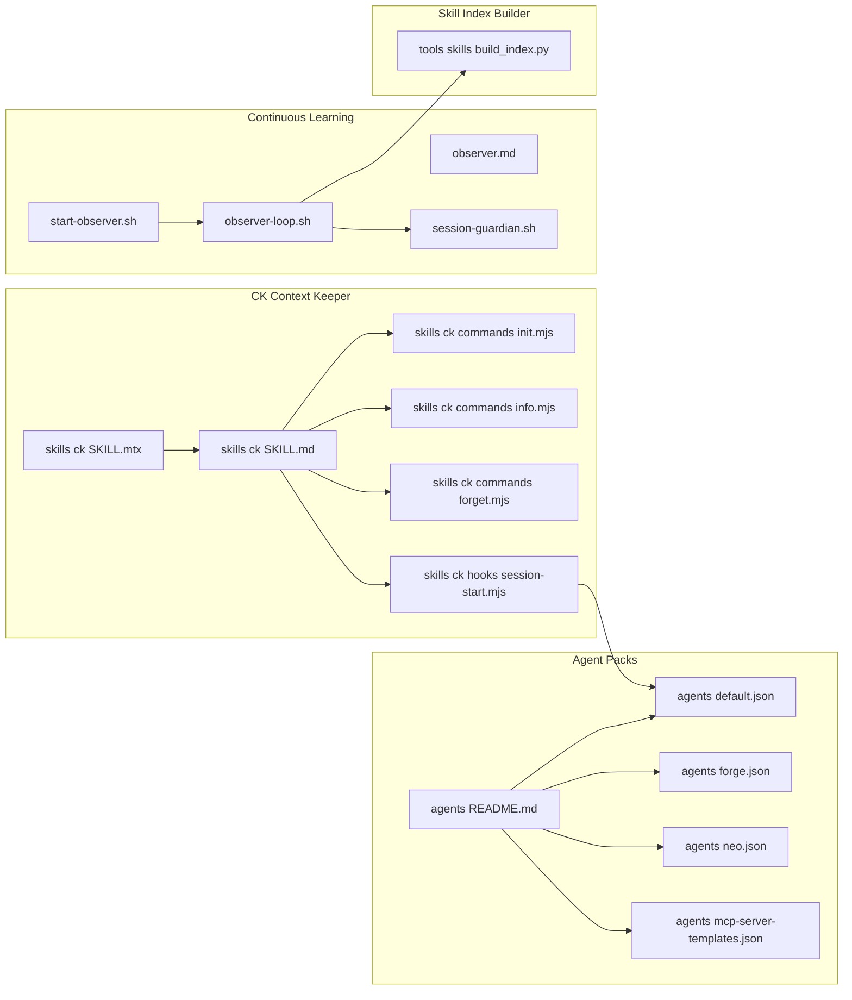
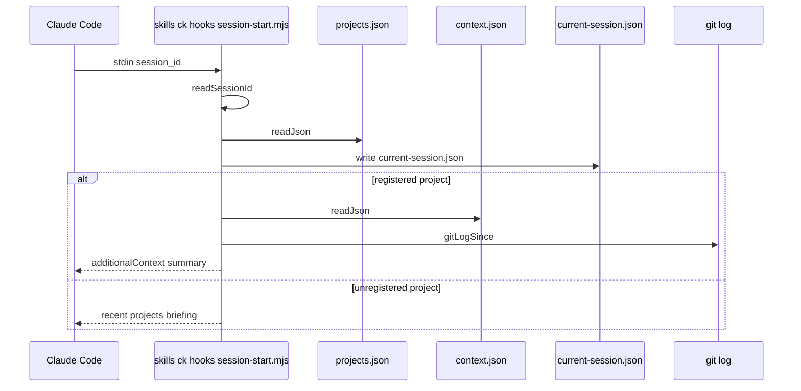
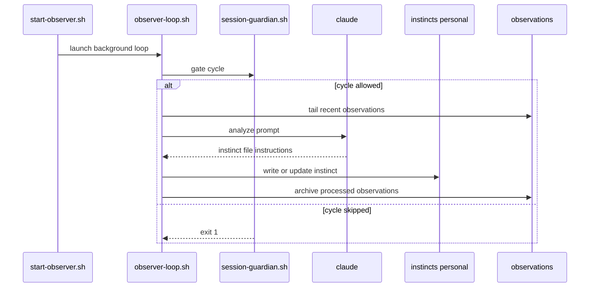

## Overview

This section covers the reusable assets that shape Matrix agent behavior and project memory: the `ck` Context Keeper skill, the agent manifest packs, the continuous-learning observer scripts, and the index builder for the skills corpus. Together, these files define how Claude Code sessions load project context, how agents are packaged with tool access, how observation-driven instincts are produced, and how skill metadata is turned into searchable indexes.

The material here is intentionally operational rather than product-facing. The files document command helpers, manifest policies, runtime guards, and generation scripts that support project bootstrapping, session recall, and agent orchestration.

## CK Context Keeper Skill and Command Helpers

### Covered files

| File | Role |
| --- | --- |
| `skills/ck/SKILL.md` | User-facing command guide for the Context Keeper workflow, including registration, resume, snapshot, forget, and migration flows. |
| `skills/ck/SKILL.mtx` | Compiler-facing skill manifest for the `ck` skill. |
| `skills/ck/commands/init.mjs` | Auto-detects project metadata and prints JSON for confirmation. |
| `skills/ck/commands/info.mjs` | Emits a compact read-only project snapshot. |
| `skills/ck/commands/forget.mjs` | Deletes a project context directory and removes its registry entry. |
| `skills/ck/hooks/session-start.mjs` | Session-start hook that injects compact project context and updates session state. |

### `skills/ck/SKILL.md`

*`skills/ck/SKILL.md`*

The `ck` skill is defined as persistent per-project memory for Claude Code. It instructs the assistant to run deterministic Node.js scripts when the user invokes `/ck:*` commands, and it defines the storage layout under `~/.claude/ck/`.

| Command | Behavior |
| --- | --- |
| `/ck:init` | Runs the init script, shows the detected project draft, waits for approval, then saves confirmed JSON through the save flow. |
| `/ck:save` | Requires LLM analysis of the current conversation, drafts a session summary, asks for confirmation, and then saves the JSON payload. |
| `/ck:resume [name | number]` | Runs the resume script and prints the full briefing verbatim. |
| `/ck:info [name | number]` | Runs the info script and prints the compact snapshot verbatim. |
| `/ck:list` | Runs the list script and prints the portfolio view verbatim. |
| `/ck:forget [name | number]` | Confirms deletion, then runs the forget script. |
| `/ck:migrate` | Runs the migration script, with an optional dry run mode. |

The skill also defines the data layout for stored context:

- `~/.claude/ck/projects.json` maps project path to `{name, contextDir, lastUpdated}`.
- `~/.claude/ck/contexts/<name>/context.json` is the source of truth for structured context.
- `~/.claude/ck/contexts/<name>/CONTEXT.md` is a generated view and is not hand-edited.

Behavioral rules from the skill file are explicit:

- `~` must be expanded to `$HOME` in shell calls.
- Command names are case-insensitive.
- Script output is shown verbatim.
- Exit code `1` is treated as an error message surfaced to the user.
- `context.json` and `CONTEXT.md` are edited only through the scripts.

### `skills/ck/SKILL.mtx`

*`skills/ck/SKILL.mtx`*

This file is the MatrixScript manifest for the same skill. It is generated from `skills/ck/SKILL.md` frontmatter and keeps the prose body in the markdown file.

| Field | Value |
| --- | --- |
| `id` | `ck` |
| `version` | `0.1.0` |
| `display` | `Ck` |
| `author` | `did:pax:0xPLACEHOLDER` |
| `description` | Persistent per-project memory for Claude Code with session-start loading and deterministic Node.js commands. |
| `mcl.verbs` | `monitor`, `build` |
| `determinism` | `seedable` |
| `seed_policy` | `per_intent` |

The manifest defines two verbs:

- `monitor` and `build` both prompt for a fully typed `intent_frame@1` JSON frame.
- Both verbs resolve `slot.target` by searching Cortex memories near the requested target.
- If the target cannot be identified, the skill fails with a blocking unknown-target path.
- If confidence is below `0.75`, the manifest asks for clarification before proceeding.

It declares no tools. Its role is to make the skill available to the Matrix compiler rather than to end-user command execution.

### `skills/ck/commands/init.mjs`

*`skills/ck/commands/init.mjs`*

This script auto-detects project metadata from the current working directory and prints a JSON object for confirmation.

| Output field | Purpose |
| --- | --- |
| `path` | Current working directory. |
| `name` | Project name inferred from manifests or directory name. |
| `description` | Short project description. |
| `stack` | Detected stack labels. |
| `goal` | Current goal inferred from project docs. |
| `constraints` | Do-not-do bullets inferred from project docs. |
| `repo` | Repository URL from `.git/config`. |
| `alreadyRegistered` | Boolean flag derived from the project registry. |

Detection order is visible in the script:

1. `package.json` for `name`, `description`, and stack hints.
2. `go.mod` for Go projects and module-name fallback.
3. `Cargo.toml` for Rust projects and crate name fallback.
4. `pyproject.toml` for Python projects and project name fallback.
5. `.git/config` for the remote URL.
6. `CLAUDE.md` for goal, constraints, stack, and description fallback.
7. `README.md` for a final description fallback.
8. Directory basename as the final name fallback.

The script uses `readFile()` and `extractSection()` helpers, then prints the final object with `JSON.stringify(output, null, 2)`.

### `skills/ck/commands/info.mjs`

*`skills/ck/commands/info.mjs`*

This script is the read-only snapshot helper.

- It resolves the target project from the argument and the current working directory.
- If the project is not found, it prints a hint that tells the user to run `/ck:init`.
- If the project is found, it prints a blank line and then renders `renderInfoBlock(resolved.context)`.

This command does not mutate any project files. It only formats the existing context for display.

### `skills/ck/commands/forget.mjs`

*`skills/ck/commands/forget.mjs`*

This script removes a project’s stored context.

- It resolves the project from the argument and current working directory.
- If no project matches, it prints a hint and exits with status `1`.
- It deletes the resolved context directory with `rmSync({ recursive: true, force: true })`.
- It removes the corresponding entry from `projects.json`.
- On success, it prints `✓ Context for '<name>' removed.`

The script’s behavior is intentionally destructive and does not prompt for confirmation. The confirmation step is handled by the skill instructions before the script is called.

### `skills/ck/hooks/session-start.mjs`

*`skills/ck/hooks/session-start.mjs`*

This hook injects compact project context at session start and persists a session marker before the rest of the session proceeds.

| Input or file | Role |
| --- | --- |
| stdin `session_id` | Identifies the current Claude session. |
| `SKILL_FILE` | Loads `skills/ck/SKILL.md` and injects it every session. |
| `PROJECTS_FILE` | Reads the project registry. |
| `CURRENT_SESSION` | Stores `current-session.json` with the current session metadata. |

It builds output as an `additionalContext` JSON payload. The hook has two distinct paths:

- **Registered project path**- Reads the project’s `context.json`.
- Builds a short summary from the latest session, goal, left-off state, and next steps.
- Detects an unsaved previous session.
- Adds a Git activity summary if commits occurred since the last saved session.
- Compares the goal in `context.json` against the goal in `CLAUDE.md` and warns on mismatch.
- Emits the summary as the first message block.

- **Unregistered project path**- Sorts the recent projects by latest session date.
- Builds a compact portfolio view with project name, staleness marker, last-seen time, and a trimmed summary.
- Prompts the user to register the current folder with `/ck:init`.

- `sessionId`
- `projectPath`
- `projectName`
- `startedAt`

#### Session start flow

## Agent Packs and Manifest Catalogs

### Covered files

| File | Role |
| --- | --- |
| `agents/README.md` | Human-readable manifest guide and policy notes for agent tool access. |
| `agents/default.json` | Baseline agent pack for the default runtime. |
| `agents/forge.json` | Self-maintenance agent pack for the Forge runtime. |
| `agents/neo.json` | Reversible-only agent pack for Neo. |
| `agents/mcp-server-templates.json` | Template catalog for MCP server definitions. |

### `agents/README.md`

*`agents/README.md`*

This document explains that agent manifests are JSON-on-disk descriptions of the tools an agent can access. It states that the executor loads them at boot and resolves `matrix://tool/...` URIs against the manifest data.

The file also records the locked decisions that govern manifest behavior:

| Decision | Meaning |
| --- | --- |
| `Q4` | Off-chain tools dispatch through Anthropic MCP, replacing custom fs, shell, and http tools. |
| `Q15` | Supported transports are `stdio` and `http`, with streamable HTTP included. |
| `Q17` | Tool URIs use `matrix://tool/mcp/<server-alias>/<tool-name>@<version>`. |
| `Q18` | Credentials are supplied through `$env:NAME` references in `env` or `headers`. |
| `Q19` | `native_tools` is reserved as a placeholder for chain tools. |
| `Q21` | `tools` must exhaustively enumerate what the server advertises. |
| `Q22` | `package_digest` must be the sha256 of the published server package. |

The production checklist in the README is also explicit:

- placeholder digests in `default.json` are bootstrap-only;
- the package must be installed locally at the pinned version;
- the actual sha256 digest must replace the zero-filled placeholder;
- the manifest update must be committed so the digest change stays auditable.

The credential section documents that secrets are never written literally into the manifest file. Server credentials are referenced with `$env:` tokens that the executor resolves at spawn time.

### `agents/default.json`

*`agents/default.json`*

This is the baseline per-user self/cloud agent pack. It allows `read`, `write`, `network`, and `shell` side effects, and it wires a broad set of MCP servers.

The manifest combines these tool families:

- filesystem access through `fs`
- HTTP retrieval through `fetch`
- web search through `web-search`
- browser automation through `browser`
- Solidity and Forge workflows through `tachyon`
- service discovery and invocation through `deus`
- time-based alarms through `chronos`
- git operations through `git`
- shell and service supervision through `exec`
- media generation and transcription through `media`
- blockchain data and write operations through `paxeer-net`
- calendar and Gmail access through `uwac`

The most important runtime distinction is in `paxeer-net`:

- read-only tools cover chain state, RPC reads, prices, balances, discovery data, and analytics;
- write tools cover transfers, approvals, streams, scheduled jobs, delegation, and generic contract writes;
- the description states that chain writes are signed through the Paxeer embedded wallet and are plan-gated by `PaxeerSpendPolicy` before side effects happen;
- wallet access can be headless through `PAXEER_WALLET_TOKEN` or `PAXEER_WALLET_EMAIL` plus `PAXEER_WALLET_PASSWORD` and `PAXEER_SUPABASE_ANON_KEY`.

The manifest description also marks placeholder package digests, which aligns with the README rule that digests must be replaced before production or chain-anchoring use.

### `agents/forge.json`

*`agents/forge.json`*

This pack is the self-maintenance runtime for the Forge instance. Its description says it is rooted at `/root/matrix`, and it explicitly keeps the Cortex store, knowledge, and journal directories out of scope for self-modification.

The notable pieces are:

- `fs` is limited by allow and deny rules that protect the disallowed directories.
- `git` is the primary review surface for local changes.
- `forge-bridge` exposes `shell_exec` and `opencode_run`.

The manifest’s `forge-bridge` entry is the unique execution lane for arbitrary shell work and sub-agent prompts:

- `shell_exec` runs `/bin/bash -lc` inside `/root/matrix`, with output capped to avoid runaway logs.
- `opencode_run` launches an OpenCode sub-agent for free-form work such as code review or drafting.

The manifest also states that commits are created on feature branches and that merges to main are human-gated.

### `agents/neo.json`

*`agents/neo.json`*

This pack is the reversible-only front-agent manifest for Neo. Its description says Neo never holds a signing key and does not carry the signing or spending surfaces that are present in the default pack.

The runtime shape is:

- `paxeer` is read-only and is configured with `PAXEER_READS_ONLY=1`.
- `fs`, `fetch`, `web-search`, `browser`, `git`, `exec`, `media`, and `chronos` are present as supporting tools.
- The `exec` server’s state is isolated to `/data/neo/services` through `MATRIX_EXEC_STATE_DIR`.

Neo’s Paxeer layer includes only read operations:

- RPC reads
- `eth_call`
- contract reads
- ABI encoding
- chain info
- balances
- PaxScan-style reads
- prices and analytics reads
- delegation and stream status reads

The manifest explicitly excludes the write tools that the default agent exposes.

### `agents/mcp-server-templates.json`

*`agents/mcp-server-templates.json`*

This file is a template catalog for MCP servers. It is not a runtime agent pack; it is a reusable configuration library for common server definitions.

It includes:

- command-based entries using `npx`, `uvx`, `node`, and `python3`
- HTTP-based entries using `type: http` and a `url`
- examples with `env` variables
- examples with `headers`

The catalog spans issue tracking, GitHub operations, web scraping, persistence, reasoning, browser automation, deployment, analytics, documentation lookup, and evaluation tooling. It also contains operational comments that tell users to copy only the servers they need, replace placeholder env vars, and keep the enabled MCP count small.

## Continuous Learning Observer Tooling

### Covered files

| File | Role |
| --- | --- |
| `skills/continuous-learning-v2/agents/observer.md` | Human-readable background agent definition and behavior guide. |
| `skills/continuous-learning-v2/agents/start-observer.sh` | Launcher for the observer process. |
| `skills/continuous-learning-v2/agents/observer-loop.sh` | Continuous background analysis loop. |
| `skills/continuous-learning-v2/agents/session-guardian.sh` | Execution gate that decides whether the observer should run. |

### `skills/continuous-learning-v2/agents/observer.md`

*`skills/continuous-learning-v2/agents/observer.md`*

This document defines the background `observer` agent. It says the agent analyzes Claude Code session observations to detect repeated patterns and create instincts, and it specifies `haiku` as the model.

The document describes three important runtime inputs:

- a project-scoped observations file
- a global fallback observations file
- session event records that capture tool start and completion events

It also defines the pattern categories the observer looks for:

- user corrections
- error resolutions
- repeated workflows
- tool preferences

The output section says instincts are created in project-scoped or global directories, and the document gives the exact instinct frontmatter shape used by the observer. It also defines:

- scope rules that favor `project` unless the pattern is clearly universal
- confidence ranges based on observation frequency
- promotion criteria for project instincts moving into global scope

### `skills/continuous-learning-v2/agents/start-observer.sh`

*`skills/continuous-learning-v2/agents/start-observer.sh`*

This script is the entrypoint for launching the observer process.

Its behavior is split into three commands:

- `start` launches the observer if enabled in configuration.
- `stop` kills the running observer and clears the PID file.
- `status` reports the observer state, the log path, the observation count, and the number of instincts.

The launcher also:

- detects the current project through the shared project helper;
- reads observer settings from `config.json` or `CLV2_CONFIG`;
- sets project-scoped paths for the PID file, log file, observations file, and instincts directory;
- writes a sentinel file if the observer output contains a confirmation or permission prompt;
- refuses to start if the observer is disabled in config;
- guards against duplicate launches with an existing PID file.

The `status` mode reports instinct count by scanning `INSTINCTS_DIR`, which is relevant to the file naming used by the analysis loop.

### `skills/continuous-learning-v2/agents/observer-loop.sh`

*`skills/continuous-learning-v2/agents/observer-loop.sh`*

This script is the long-running analysis loop. It runs with a re-entrancy guard, a cooldown timer, and idle shutdown behavior.

The runtime path is:

1. Wait for the sleep interval.
2. Check whether the project has active session leases.
3. Exit if the project has been idle too long without active sessions.
4. Count observations and skip analysis if there are too few.
5. Run `session-guardian.sh` before analysis.
6. Tail the most recent observations into a temporary analysis file.
7. Spawn `claude` in print mode with `Read` and `Write` allowed.
8. Let the model produce instinct file instructions.
9. Archive processed observations.

The prompt that the loop sends to the model is strict:

- it requires direct file writing when a qualifying pattern exists;
- it gives a mandatory instinct file format;
- it requires YAML frontmatter fields for `id`, `trigger`, `confidence`, `domain`, `source`, `scope`, `project_id`, and `project_name`;
- it tells the model to use a narrow trigger and to be conservative;
- it instructs the model to update an existing instinct rather than create a duplicate if one already exists.

#### Observer cycle

### `skills/continuous-learning-v2/agents/session-guardian.sh`

start-observer.sh reports the instinct count with find "$INSTINCTS_DIR" -name "*.yaml", while observer-loop.sh instructs the analyzer to write instinct files as &lt;id>.md documents with the required frontmatter format. That status counter can miss the Markdown instincts the loop is creating.

*`skills/continuous-learning-v2/agents/session-guardian.sh`*

This script decides whether the observer should proceed. It is a three-gate filter with cheap checks first.

The gates are:

| Gate | What it checks |
| --- | --- |
| Time window | Whether the current local time is inside the active hours range. |
| Project cooldown | Whether the same project was observed too recently. |
| Idle detection | Whether the machine has been idle longer than the configured threshold. |

The guard uses these configuration variables:

- `OBSERVER_INTERVAL_SECONDS`
- `OBSERVER_LAST_RUN_LOG`
- `OBSERVER_ACTIVE_HOURS_START`
- `OBSERVER_ACTIVE_HOURS_END`
- `OBSERVER_MAX_IDLE_SECONDS`

The idle detection logic is platform-aware:

- macOS uses `IOHIDSystem`
- Linux uses `xprintidle` when available
- Windows paths use `GetLastInputInfo`
- unknown platforms fail open with an idle value of zero

The script exits with `1` when it wants to skip the observer cycle and with `0` when the cycle may continue.

## Skill Index Builder

### `tools/skills/build_index.py`

*`tools/skills/build_index.py`*

This script builds the skills index from skill frontmatter. It reads the skills tree rooted at `/root/matrix/skills`, loads the port manifest, parses frontmatter from each skill’s `SKILL.md`, and writes two generated outputs:

- `INDEX.json`
- `INDEX.md`

The script’s processing steps are explicit:

1. load `PORT_MANIFEST.json`
2. derive `keep` and `adapt` sets
3. walk each skill directory
4. parse frontmatter from `SKILL.md`
5. collapse whitespace in descriptions
6. truncate long descriptions
7. assign `status` as `keep`, `adapt`, or `unknown`
8. write the JSON and markdown indexes
9. print a summary of how many entries were written

The emitted index entries use these fields:

| Field | Meaning |
| --- | --- |
| `slug` | Skill directory name. |
| `status` | `keep`, `adapt`, or `unknown`. |
| `name` | Skill name from frontmatter or fallback to slug. |
| `description` | Parsed and normalized description. |
| `origin` | Frontmatter origin field. |

The entrypoint is `main()`, and the script terminates with `sys.exit(main())`.

## Key Files Reference

| File | Responsibility |
| --- | --- |
| `skills/ck/SKILL.md` | Defines the Context Keeper command surface, storage layout, and session rules. |
| `skills/ck/SKILL.mtx` | Supplies the MatrixScript manifest for `ck` with monitor and build verbs. |
| `skills/ck/commands/init.mjs` | Detects project metadata and prints confirmation JSON. |
| `skills/ck/commands/info.mjs` | Prints a compact project snapshot. |
| `skills/ck/commands/forget.mjs` | Deletes a project context and registry entry. |
| `skills/ck/hooks/session-start.mjs` | Injects session context and writes `current-session.json`. |
| `agents/README.md` | Documents agent manifest policies, URI resolution, and digest rules. |
| `agents/default.json` | Baseline agent pack with read, write, network, and shell tools. |
| `agents/forge.json` | Forge self-maintenance agent pack with guarded local modification tools. |
| `agents/neo.json` | Neo read-focused agent pack with signing and spending surfaces removed. |
| `agents/mcp-server-templates.json` | Template catalog for reusable MCP server definitions. |
| `skills/continuous-learning-v2/agents/observer.md` | Defines the observer agent’s pattern detection and instinct creation rules. |
| `skills/continuous-learning-v2/agents/start-observer.sh` | Launches, stops, and reports observer status. |
| `skills/continuous-learning-v2/agents/observer-loop.sh` | Runs the continuous analysis loop and writes instincts. |
| `skills/continuous-learning-v2/agents/session-guardian.sh` | Applies time, cooldown, and idle gating before observer cycles. |
| `tools/skills/build_index.py` | Generates the skill index outputs from skill frontmatter. |
