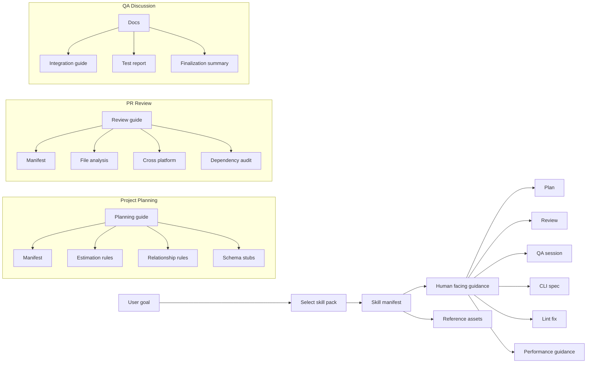
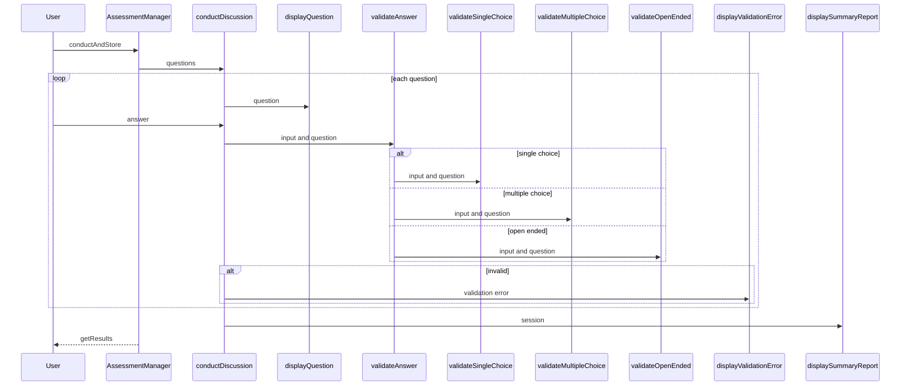

## Overview

This section documents the skill packs and reference assets that shape planning, review, QA discussion, code quality, CLI design, and performance guidance in `paxlabs-inc/matrix-core`. The repository uses a split model: human-facing `SKILL.md` and reference docs describe the practice, while `.mtx` manifests encode the compiler-facing intent, slots, and clarification behavior.

The section is intentionally about delivery-oriented knowledge assets, not runtime services. It covers how each pack guides an agent or contributor from a user goal to a concrete artifact such as a plan, review, QA session, CLI spec, lint fix, or performance rule application.

## Knowledge Asset Map

| Pack | Path | Role |
| --- | --- | --- |
| Project planning | `skills/project-planning/SKILL.md` | Human-facing planning guide with artifact taxonomy, phases, estimation, relationships, and schema pointers. |
| Project planning | `skills/project-planning/SKILL.mtx` | MatrixScript manifest for `analyze`; resolves the target, clarifies uncertainty, and emits result and unknown slots. |
| Project planning | `skills/project-planning/references/estimations.md` | Effort hierarchy for Epic, Story, and Task, including the rule that PRD and Spec are not estimated directly. |
| Project planning | `skills/project-planning/references/relationships.md` | Artifact relationship taxonomy and the mandatory parent Story and parent Epic links for Tasks. |
| Project planning | `skills/project-planning/references/schema/01-artifact-prd.md` | PRD content-structure reference stub. |
| Project planning | `skills/project-planning/references/schema/02-artifact-epic.md` | Epic content-structure reference stub. |
| Project planning | `skills/project-planning/references/schema/03-artifact-spec.md` | Spec content-structure reference stub. |
| Project planning | `skills/project-planning/references/schema/04-artifact-research.md` | Research content-structure reference stub. |
| Project planning | `skills/project-planning/references/schema/05-artifact-decision.md` | Decision content-structure reference stub. |
| Project planning | `skills/project-planning/references/schema/06-artifact-story.md` | Story content-structure reference stub. |
| Project planning | `skills/project-planning/references/schema/07-artifact-task.md` | Task content-structure reference stub. |
| Project planning | `skills/project-planning/references/schema/08-artifact-retrospective.md` | Retrospective content-structure reference stub. |
| PR review | `skills/pr-review/SKILL.md` | Security-first PR review checklist with diff scoping, dependency audit, cross-platform checks, performance review, and finding categories. |
| PR review | `skills/pr-review/SKILL.mtx` | MatrixScript manifest for `analyze` and `modify`; resolves the review target and clarifies when confidence is low. |
| PR review | `skills/pr-review/reference/file-analysis.md` | Changed-file inventory and import-dependency tracing guide. |
| PR review | `skills/pr-review/reference/cross-platform.md` | Platform risk checklist for Extension, Mobile RN, Desktop Electron, and Web. |
| PR review | `skills/pr-review/reference/dependency-audit.md` | Package diff, package metadata, `node_modules` inspection, and grep patterns for high-risk behavior. |
| QA discussion | `skills/qa-discussion/README.md` | Full feature guide and API reference for structured Q&A discussions. |
| QA discussion | `skills/qa-discussion/QUICK-START.md` | Quick setup, example questions, session fields, and validation helper usage. |
| QA discussion | `skills/qa-discussion/INTEGRATION.md` | Integration guide with question interfaces, `AssessmentManager`, and wrapper patterns. |
| QA discussion | `skills/qa-discussion/TEST-REPORT.md` | Test report with commands, coverage, and validation categories. |
| QA discussion | `skills/qa-discussion/FINALIZATION-SUMMARY.md` | Completion summary with metrics, readiness checks, and maintenance notes. |
| Code quality | `skills/code-quality/SKILL.md` | Lint and code-quality guide with English comment rules, unused variable patterns, and direct-code examples. |
| Code quality | `skills/code-quality/SKILL.mtx` | MatrixScript manifest for `modify`; resolves the target and handles unknown requests. |
| Code quality | `skills/code-quality/references/rules/code-quality.md` | Rulebook and examples for comments, promises, direct code, and helper usage. |
| Code quality | `skills/code-quality/references/rules/fix-lint.md` | Practical lint-fix playbook for unused imports, parameters, destructuring, non-null assertions, and extracted components. |
| Create CLI | `skills/create-cli/SKILL.md` | Human-first CLI design guide with command surface, output contract, safety, configuration precedence, and examples. |
| Create CLI | `skills/create-cli/SKILL.mtx` | MatrixScript manifest for `find`, `modify`, and `build`; resolves the target and clarifies ambiguity. |
| Create CLI | `skills/create-cli/references/cli-guidelines.md` | Condensed CLI rubric on help, output, errors, flags, interactivity, config, signals, naming, distribution, and analytics. |
| Create CLI | `skills/create-cli/references/styles-bash.md` | Bash CLI pattern with help, argument validation, command dispatch, and a direct execution guard. |
| Performance | `skills/performance/references/rules/performance.md` | Cross-platform performance rulebook for batching, render deferral, memoization, virtualization, and cancellation. |

## Skill Pack Architecture

## Project Planning Skill Pack

The project planning pack turns delivery intent into a traceable artifact chain. It defines the planning vocabulary, the phase model, estimation hierarchy, and the relationship types used to connect work items across planning and execution.

`skills/project-planning/SKILL.md` frames the pack around planning artifacts such as `PRD`, `Epic`, `Spec`, `Research`, `Decision`, `Story`, `Task`, and `Retrospective`. It also separates work into Planning, Execution, Closing, and Retrospective phases, and it explicitly escalates scope changes, timeline shifts, technical refactoring, and resource constraints.

`skills/project-planning/SKILL.mtx` is the compiler-facing surface. It uses `analyze`, resolves `slot.target` from resolved memories, and can force clarification when the target is ambiguous or confidence is low. The manifest also defines `slot.result` and `slot.unknowns` and uses failure modes such as `target_not_found`, `ambiguous_after_clarify`, `policy_violation`, and `budget_exceeded`.

### Estimation model

`skills/project-planning/references/estimations.md` keeps estimation hierarchical:

- `PRD` and `Spec` are not estimated directly.
- `Epic` is estimated in weeks or months.
- `Story` is estimated in story points, typically 3–13.
- `Task` is estimated in story points, typically 1–8.

That file also ties estimation to use:

- Epic scale supports timeline planning and resource allocation.
- Story scale supports release planning and sprint capacity.
- Task scale supports execution, blockers, and day-to-day planning.

### Relationship model

`skills/project-planning/references/relationships.md` defines how planning artifacts connect:

| Relationship group | Link types |
| --- | --- |
| Parent-child | `implements` |
| Cross-cutting | `influenced_by_research`, `influenced_by_decision`, `influences`, `dependent_on_research`, `dependent_on` |
| Task-specific | `blocks`, `dependent_on`, `related_to`, `duplicate_of` |
| Project closure | `documents_closure`, `related_to`, `informed_by` |

The file also states that every `Task` must link to both a parent `Story` and a parent `Epic`. That rule is the core traceability constraint for the pack.

### Schema reference stubs

The schema files are lightweight content-structure references for the artifact types they name. They anchor the shape of planning documents without adding extra runtime behavior.

| Path | What the stub covers |
| --- | --- |
| `skills/project-planning/references/schema/01-artifact-prd.md` | PRD content structure. |
| `skills/project-planning/references/schema/02-artifact-epic.md` | Epic content structure. |
| `skills/project-planning/references/schema/03-artifact-spec.md` | Spec content structure. |
| `skills/project-planning/references/schema/04-artifact-research.md` | Research content structure. |
| `skills/project-planning/references/schema/05-artifact-decision.md` | Decision content structure. |
| `skills/project-planning/references/schema/06-artifact-story.md` | Story content structure. |
| `skills/project-planning/references/schema/07-artifact-task.md` | Task content structure. |
| `skills/project-planning/references/schema/08-artifact-retrospective.md` | Retrospective content structure. |

## PR Review Skill Pack

The PR review pack is security-first and change-centric. It starts from the diff against `main`, inventories changed files, and then checks dependency risk, platform risk, and performance risk before it produces findings.

`skills/pr-review/SKILL.md` treats the current branch as the PR under review and explicitly scopes the comparison to `origin/main...HEAD`. It organizes output into `Blockers`, `High risk`, `Suggestions`, and `Questions`, and it keeps the review focused on security, correctness, architecture, and performance rather than style nitpicks.

`skills/pr-review/SKILL.mtx` supports `analyze` and `modify`, resolves `slot.target`, and asks for clarification when the target is not clear. Like the other manifests, it is the compiler-facing part of the pack and keeps the prose in `SKILL.md`.

### Review workflow

The review workflow is consistent across the pack:

1. Scope the change set against `main`.
2. Inventory changed files and modules.
3. Audit package changes and lockfile changes.
4. Inspect `node_modules` when supply-chain risk is non-trivial.
5. Check cross-platform boundaries.
6. Review performance hotspots in React and React Native code.
7. Report findings by severity.

### Dependency and platform checks

`skills/pr-review/reference/dependency-audit.md` is the risk-check playbook. It recommends:

- `git diff -- package.json`
- `git diff -- yarn.lock pnpm-lock.yaml package-lock.json`
- `npm view <pkg> version time maintainers repository dist.tarball`
- `cat node_modules/<pkg>/package.json`

It also gives grep patterns for outbound requests, dynamic execution, and install hooks. The goal is to catch telemetry, unexpected network access, shell execution, or install-time downloads before approval.

`skills/pr-review/reference/cross-platform.md` organizes checks by platform boundary:

- Extension: MV3 lifecycle, CSP, host permissions.
- Mobile RN: backgrounding, secure storage, WebView bridge validation.
- Desktop Electron: IPC validation, `nodeIntegration`, `contextIsolation`.
- Web: XSS, CSP, CORS, storage leakage, runtime differences.

The source also flags `react-native.config.js` as an asset reference that belongs in review scope when platform permissions or native hooks change.

`skills/pr-review/reference/file-analysis.md` helps reviewers map the changed surface. It supports changed-file inventory and import tracing, and it highlights source areas such as components and screens when building an impact map.

## QA Discussion Skill Pack

The QA discussion pack is the most API-like of the skill packs. It documents a typed Q&A session flow with validation helpers, progress reporting, and a session summary.

`skills/qa-discussion/README.md` presents the feature as a production-ready structured discussion engine. It describes the main entry point `conductDiscussion`, the display helpers, the validation helpers, the session summary fields, the supported question types, the security model, and the performance profile.

`skills/qa-discussion/QUICK-START.md` is the shortest on-ramp. It shows a 30-second setup, the three question types, the session result fields, feedback-only mode, knowledge assessment mode, custom validation, and the expected validation error handling pattern.

`skills/qa-discussion/INTEGRATION.md` shows how to wrap the discussion flow inside application logic. It introduces the `Question` union, the `AssessmentManager` wrapper, and a practical integration pattern for storing sessions and reacting when a discussion finishes.

`skills/qa-discussion/TEST-REPORT.md` and `skills/qa-discussion/FINALIZATION-SUMMARY.md` document the verification story. Together they prove the pack is shipped as a validated, production-ready asset rather than a rough example.

### Flow of a discussion session

### Documented functions

| Function | Purpose |
| --- | --- |
| `conductDiscussion` | Main entry point for the full Q&A discussion. |
| `displayQuestion` | Shows one question at a time. |
| `displayValidationError` | Displays validation feedback. |
| `displaySummaryReport` | Prints the final summary. |
| `displaySuccess` | Confirms a successful response. |
| `validateAnswer` | Routes validation by question type. |
| `validateSingleChoice` | Validates single-choice input. |
| `validateMultipleChoice` | Validates multiple-choice input. |
| `validateOpenEnded` | Validates open-ended input. |

### Session fields surfaced in the docs

The documentation exposes these session fields after `conductDiscussion` completes:

- `session.sessionId`
- `session.totalQuestions`
- `session.completedQuestions`
- `session.responses`
- `session.summary`
- `session.summary.successRate`
- `session.summary.validResponses`
- `session.summary.totalAttempts`
- `session.summary.averageAttempts`
- `session.summary.completionTime`

The response records also expose:

- `questionId`
- `answer`
- `isValid`
- `attempts`
- `validationError`

The validation helpers return result objects shaped around `valid`, `error?`, and `answer?`.

### Question interfaces

`skills/qa-discussion/INTEGRATION.md` defines the base and specialized question types that the session engine uses.

#### `BaseQuestion`

| Property | Type | Description |
| --- | --- | --- |
| `id` | `string` | Question identifier. |
| `text` | `string` | Question text. |
| `type` | `'single' \ | 'multiple' \ | 'open'` | Question kind. |
| `hint` | `string` | Hint text. |

#### `SingleChoiceQuestion`

This interface extends `BaseQuestion`.

| Property | Type | Description |
| --- | --- | --- |
| `type` | `'single'` | Single-choice question marker. |
| `options` | `string[]` | Available choices. |
| `correctAnswer` | `string` | Expected answer. |

#### `MultiChoiceQuestion`

This interface extends `BaseQuestion`.

| Property | Type | Description |
| --- | --- | --- |
| `type` | `'multiple'` | Multiple-choice question marker. |
| `options` | `string[]` | Available choices. |
| `correctAnswers` | `string[]` | Expected answers. |
| `minSelections` | `number` | Minimum allowed selections. |
| `maxSelections` | `number` | Maximum allowed selections. |

#### `OpenEndedQuestion`

This interface extends `BaseQuestion`.

| Property | Type | Description |
| --- | --- | --- |
| `type` | `'open'` | Open-ended question marker. |
| `minLength` | `number` | Minimum answer length. |
| `maxLength` | `number` | Maximum answer length. |

### `AssessmentManager`

`skills/qa-discussion/INTEGRATION.md` also shows an application wrapper that stores completed sessions in memory.

#### Properties

| Property | Type | Description |
| --- | --- | --- |
| `sessions` | `Map<string, DiscussionSession>` | Private session store keyed by `assessmentId`. |

#### Methods

| Method | Description |
| --- | --- |
| `conductAndStore` | Runs `conductDiscussion`, stores the session under `assessmentId`, and returns the session. |
| `getResults` | Retrieves a stored session by `assessmentId`. |

The wrapper uses a private `onAssessmentComplete` hook for custom post-processing after storage.

### Validation and quality evidence

`skills/qa-discussion/TEST-REPORT.md` says the suite runs with `node --test index.test.ts` and `node --test index.test.ts --reporter=spec`. The report records 71 passing tests, 0 failures, and about 120 ms total duration.

`skills/qa-discussion/FINALIZATION-SUMMARY.md` gives the production-readiness summary:

- 2,681 lines of code and documentation.
- 23 exported items.
- 5 real-world examples.
- 100+ question scale testing.
- Zero TypeScript errors.
- Production-ready status.

The same summary also confirms the pack’s maintenance posture: extend question types, customize display, add persistence, and keep the examples and docs current.

## Code Quality Skill Pack

The code-quality pack is a lint and readability rulebook. It is explicit about what good code looks like in the repository and how to repair the common lint failures that appear in day-to-day work.

`skills/code-quality/SKILL.md` defines the skill as a guide for linting, documentation, and general code quality. The frontmatter states that comments must be in English and that the pack is triggered by linting, type-checking, unused variable, comment, documentation, spellcheck, and pre-commit work. Its allowed tools are `Read`, `Grep`, and `Glob`.

`skills/code-quality/SKILL.mtx` is the manifest surface for `modify` requests. It resolves the target artifact and can stop early if the target is ambiguous.

`skills/code-quality/references/rules/code-quality.md` and `skills/code-quality/references/rules/fix-lint.md` are the actual rulebooks. They teach the style, then show the repair patterns.

### Rule themes

The code-quality rules focus on a few recurring patterns:

- Prefer comments that explain business logic, such as why a gas limit or fee exists, rather than restating the code.
- Prefer simple, direct calls such as `const user = await fetchUser(userId);`.
- Use `_unused` for unused destructured variables or parameters.
- Use `void` or `await` for floating promises.
- Extract nested components instead of defining them inline.
- Prefer a guard or assertion over a non-null assertion when linting rejects `!`.

The examples use identifiers like `foo`, `gasLimit`, `fee`, `value`, and `createUserFetcher` to show the contrast between discouraged and approved style.

### Lint fix playbook

- Removing unused imports.
- Prefixing unused parameters with `_`.
- Prefixing unused destructured bindings with `_`.
- Handling assigned-but-unused values.
- Replacing non-null assertions with a type assertion or guard.
- Extracting nested components.
- Keeping intentional stubs readable, including the `openInMobileApp` example with `_request` and `_params` and the `NotImplemented` throw.

## Create CLI Skill Pack

The create-cli pack is a design-time guide for command-line interfaces. It is not an implementation template; it is a spec-writing rubric for arguments, flags, help text, output modes, exit codes, prompts, config precedence, and safe behavior.

`skills/create-cli/SKILL.md` asks the user to clarify the command name, primary user, input sources, output contract, interactivity, config model, and platform constraints before the spec is finalized. The deliverables are a command tree, args and flags table, subcommand semantics, I/O rules, exit code map, safety rules, config/env precedence, shell completion story, and examples.

`skills/create-cli/SKILL.mtx` supports the `find`, `modify`, and `build` verbs. It resolves `slot.target`, clarifies when confidence is low, and uses the same MatrixScript pattern as the other skill manifests.

`skills/create-cli/references/cli-guidelines.md` is the condensed CLI rubric. It emphasizes human-first design, `stdout` for primary output, `stderr` for diagnostics, standard flags like `--help`, `--version`, `--json`, `--dry-run`, `--no-input`, and careful handling of signals and control characters.

`skills/create-cli/references/styles-bash.md` shows one concrete Bash structure for CLI tools. It includes `print_help`, `requires_arg`, `helper_function`, `init_command`, `start_command`, `stop_command`, `status_command`, and `main`, with `case`-based dispatch and a direct-execution guard at the bottom.

### CLI design expectations encoded in the pack

skills/create-cli/SKILL.md points readers to agent-scripts/skills/create-cli/references/cli-guidelines.md, while the repository copy documented here is skills/create-cli/references/cli-guidelines.md. The guidance content is the same; the path text differs.

- `-h` and `--help` always show help.
- `--version` prints version to stdout.
- Primary data belongs on stdout.
- `--json` and `--plain` are supported as machine-friendly output modes.
- Prompts only occur when stdin is a TTY.
- Destructive operations should require confirmation or an explicit force path.
- `NO_COLOR`, `TERM=dumb`, and `--no-color` all influence color output.
- Ctrl-C should stop quickly and clean up safely.

### `parameters` checklist symbol

The create-cli source also exposes a `parameters` checklist-like symbol with four sections.

| Method | Meaning |
| --- | --- |
| `area` | Surface. |
| `map` | Top failure modes. |
| `story` | Completion. |
| `invocations` | Common flows, including piped and stdin examples. |

That symbol is a design scaffold, not a runtime type.

## Performance Rules Reference

`skills/performance/references/rules/performance.md` is a practical rulebook for React, React Native, and cross-platform work. Its examples show how to reduce request fan-out, keep the UI responsive, and avoid heavy work in render.

The file names two important helpers: `InteractionManager` from `react-native` and `memo` from `react`. It also shows a batched request helper, `executeBatched`, with a default concurrency of 3, and it uses `Promise.allSettled` in batch slices to avoid saturating the UI thread with too many concurrent operations.

### Optimization clusters in the rulebook

| Cluster | What the file teaches |
| --- | --- |
| Concurrent requests | Limit fan-out, batch tasks, and avoid `Promise.all` on large request sets. |
| Load shaping | Paginate or lazy load large payloads. |
| Input handling | Debounce noisy user input before tracking or network calls. |
| Render deferral | Use `setTimeout` or `InteractionManager.runAfterInteractions` for heavy work. |
| Loop chunking | Break expensive loops into chunks and yield to the event loop. |
| Memoization | Use `useMemo`, `memo`, and `useCallback` when the cost justifies it. |
| List tuning | Use stable keys, lower `windowSize`, and long-list visibility optimizations. |
| State updates | Batch related updates and derive state instead of duplicating it. |
| Cancellation | Abort stale network requests when input changes. |
| Measurement | Time expensive flows with `PerformanceMonitor.start('list-load')`. |

### Concrete patterns called out in the file

- `executeBatched(tasks, 3)` for controlled concurrency.
- `InteractionManager.runAfterInteractions` to defer heavy work.
- `useMemo` for expensive derived lists.
- `memo` for components that benefit from stable props.
- Stable callback references with `useCallback`.
- `windowSize={5}` in the optimized `ListView` path.
- `windowSize={3-5}` for `FlatList` or custom list components when memory pressure matters.
- `contentVisibility: 'hidden'` for closed force-mounted dialogs and `content-visibility: auto` for long lists.
- `AbortController` to cancel stale searches.
- A batched token-list update pattern based on `accountAddressList`, `this.updateNetworkTokenList(account)`, and `this.executeBatched(tasks, 3)`.

The rulebook is explicitly practical: it ties each optimization to a concrete UI or data-loading scenario instead of describing performance in abstract terms.
