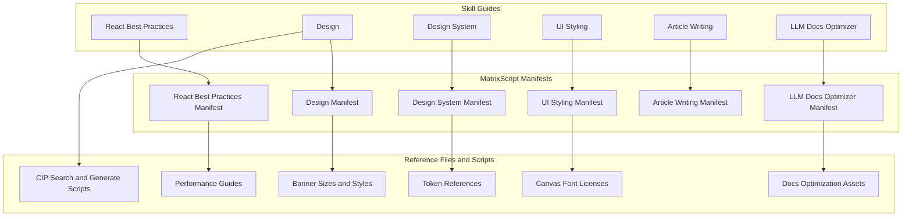

## Overview

This section documents the skill packs that shape React performance guidance, visual design workflows, token-driven UI systems, accessible styling, long-form writing, and documentation optimization in `matrix-core`. The material is split between human-facing `SKILL.md` guides, compiler-facing `SKILL.mtx` manifests, reference files, and a small set of runtime scripts that turn structured knowledge into search, prompts, mockups, and analysis reports.

The packs are intentionally specialized. React best practices focuses on performance rules for React and Next.js, design combines brand and corporate identity generation with banner and presentation workflows, design-system formalizes token layers and component specs, ui-styling concentrates on shadcn/ui and Tailwind usage, article-writing enforces a distinctive long-form voice, and llm-docs-optimizer improves documentation quality for AI-assisted workflows.

## Shared Manifest Model

The `SKILL.md` files define what each skill is for, while the `SKILL.mtx` files make the same capability executable by the Matrix compiler. Across the packs, the manifests follow the same structure: `§SKILL`, `§INPUTS`, `§CORTEX`, `§PROCEDURE`, `§OUTPUTS`, and `§FAILURE_MODES`, with `slot.target` resolved through `cortex.find` and clarification prompts triggered when the target stays ambiguous.

| Manifest element | Shared behavior |
| --- | --- |
| `§SKILL` | Declares the skill id, version, display name, author, and description. |
| `§INPUTS` | Requires `slot.target: ArtifactRef` and accepts optional `slot.constraints: Constraint[]`. |
| `§CORTEX` | Reads `Fact`, `Goal`, `Pattern`, `Event`, `Constraint`, and `Preference`. |
| `§PROCEDURE` | Builds a typed frame from the user goal, resolved cortex context, current slots, and unknowns. |
| `§OUTPUTS` | Returns `slot.result` and optional `slot.unknowns`. |
| `§FAILURE_MODES` | Uses `target_not_found`, `ambiguous_after_clarify`, `policy_violation`, and `budget_exceeded`. |

## React Best Practices

*Files: `skills/react-best-practices/SKILL.md`, `skills/react-best-practices/SKILL.mtx`, `skills/react-best-practices/references/react-performance-guidelines.md`, `skills/react-best-practices/references/rules/advanced-event-handler-refs.md`, `skills/react-best-practices/references/rules/advanced-use-latest.md`*

This pack is a performance-first React and Next.js guide. The prose guide frames the skill around practical refactoring and review work, while the reference set expands it into rule-driven guidance on waterfalls, bundle size, server-side performance, client-side data fetching, rendering, JavaScript performance, and advanced patterns.

| Path | Responsibility |
| --- | --- |
| `skills/react-best-practices/SKILL.md` | Human-facing guide for when to apply the skill, with priority-ordered patterns and references to the detailed rule set. |
| `skills/react-best-practices/SKILL.mtx` | Manifest with `acquire`, `analyze`, and `modify` verbs, target resolution, clarification prompts, and a no-tools execution model. |
| `skills/react-best-practices/references/react-performance-guidelines.md` | Full performance guide with the rule taxonomy and worked examples. |
| `skills/react-best-practices/references/rules/advanced-event-handler-refs.md` | Rule for storing event handlers in refs to keep subscriptions stable. |
| `skills/react-best-practices/references/rules/advanced-use-latest.md` | Rule for `useLatest`-style callback refs that avoid stale closures without broad dependency lists. |

The manifest is intentionally narrow: it does not invoke tools or sub-skills, and it resolves the target artifact before proceeding. The documentation itself is centered on practical performance habits rather than abstract theory, with explicit attention to `React` and `Next.js` behavior.

## Design Skill Pack

*Files: `skills/design/SKILL.md`, `skills/design/SKILL.mtx`, `skills/design/references/banner-sizes-and-styles.md`, `skills/design/scripts/cip/core.py`, `skills/design/scripts/cip/search.py`, `skills/design/scripts/cip/generate.py`, `skills/design/scripts/cip/render-html.py`*

The design pack is the broadest of the group. It combines brand identity work, tokenized design systems, UI styling, logo generation, corporate identity program outputs, presentations, banners, social photo assets, and icon generation into one routing layer. The guide explicitly routes tasks into brand, design-system, ui-styling, logo, CIP, slides, banner, social photos, and icon workflows.

| Path | Responsibility |
| --- | --- |
| `skills/design/SKILL.md` | Top-level design guide covering brand, tokens, UI styling, logo generation, CIP mockups, presentations, banners, social photos, and icons. |
| `skills/design/SKILL.mtx` | Manifest for `deliver` and `build` execution with the same target-resolution flow used by the other packs. |
| `skills/design/references/banner-sizes-and-styles.md` | Banner size reference and art direction guide with social, web, display, website, and print formats plus style guidance. |
| `skills/design/scripts/cip/core.py` | BM25-backed search core for CIP guidance. |
| `skills/design/scripts/cip/search.py` | CLI for searching CIP guidance and building briefs. |
| `skills/design/scripts/cip/generate.py` | CLI for prompt generation and Gemini-backed CIP mockup generation. |
| `skills/design/scripts/cip/render-html.py` | CLI for turning generated mockup images into an HTML presentation. |

### CIP Search Core

`skills/design/scripts/cip/core.py` turns CSV-backed corporate identity data into ranked search results. It keeps a domain map for `deliverable`, `style`, `industry`, and `mockup`, then searches the appropriate CSV using BM25 scoring.

#### `BM25`

| Property | Type | Description |
| --- | --- | --- |
| `k1` | unknown | Term-frequency saturation parameter configured in `__init__`. |
| `b` | unknown | Length-normalization parameter configured in `__init__`. |
| `corpus` | unknown | Tokenized documents stored by `fit`. |
| `doc_lengths` | unknown | Per-document token counts. |
| `avgdl` | unknown | Average document length. |
| `idf` | unknown | Inverse document frequency values per token. |
| `N` | unknown | Total number of indexed documents. |

| Method | Description |
| --- | --- |
| `__init__` | Sets up the BM25 parameters and empty index state. |
| `tokenize` | [REDACTED] |
| `fit` | Builds the BM25 index from the supplied documents. |
| `score` | Scores all indexed documents against a query and returns ranked results. |

The class tokenizes documents, counts document frequencies, computes `idf`, and then scores query tokens against each document. That makes the CIP search utility useful for finding the most relevant deliverable, style, industry, or mockup guidance without hardcoded keyword matching.

#### CIP domain mapping

| Domain | Search focus | Notes |
| --- | --- | --- |
| `deliverable` | Deliverable, Category, Keywords, Description, Mockup Context | Returns row-shaped deliverable guidance with design notes and constraints. |
| `style` | Style Name, Category, Keywords, Description, Mood | Returns style guidance for art direction and presentation tone. |
| `industry` | Industry, Keywords, CIP Style, Mood | Returns industry-specific brand guidance. |
| `mockup` | Context Name, Category, Keywords, Scene Description | Returns scene and camera framing guidance for mockup generation. |

### CIP CLI Tools

#### `skills/design/scripts/cip/search.py`

`search.py` is the read-only front door into the CIP knowledge base. It supports direct search, all-domain search, and brief generation, with JSON output available for automation.

| Function | Description |
| --- | --- |
| `format_results` | Formats search rows for terminal output. |
| `format_brief` | Formats a CIP brief with industry, style, color system, typography, and recommended deliverables. |
| `main` | Parses `query`, `--domain`, `--max`, `--all`, `--cip-brief`, `--brand`, `--style`, and `--json`, then dispatches the appropriate search mode. |

The CLI can produce a direct result set, aggregate results across all domains, or assemble a full brief using `get_cip_brief`.

#### `skills/design/scripts/cip/generate.py`

`generate.py` turns the search data into image-generation prompts and then sends those prompts to Gemini image generation. It supports both pure text-to-image and image-editing mode, where a provided logo image is preserved and inserted into the mockup work.

| Function | Description |
| --- | --- |
| `load_logo_image` | Loads a logo image, converts alpha or palette images to RGB, and prepares it for image editing. |
| `load_env` | Loads environment variables from the local `.env` file locations used by the script. |
| `build_cip_prompt` | Builds a prompt from deliverable, brand, style, industry, and mockup context data. |
| `generate_with_nano_banana` | Sends the prompt to Gemini image generation and saves the resulting image file. |
| `generate_cip_set` | Generates a multi-deliverable CIP package and returns the generated file paths and prompts. |
| `check_logo_required` | Prompts the user when no logo image is supplied and offers continue, generate, or exit choices. |
| `main` | Parses `--brand`, `--logo`, `--deliverable`, `--deliverables`, `--industry`, `--style`, `--mockup`, `--set`, `--output`, `--model`, `--ratio`, `--prompt-only`, `--json`, and `--no-logo-prompt`. |

Notable behavior:

- `load_env` checks the repository `.env`, the user skill `.env`, and the home `.env`.
- The image editing path preserves the provided logo image rather than regenerating it.
- Model selection is split between `flash` and `pro`.
- The generated prompt data includes `prompt`, `deliverable`, `style`, `brand`, `colors`, `mockup_context`, and `logo_placement`.

#### `skills/design/scripts/cip/render-html.py`

`render-html.py` converts generated PNG mockups into a polished HTML presentation. It embeds images as base64 when possible, adds brand and industry metadata, and writes a branded summary page to disk.

| Function | Description |
| --- | --- |
| `get_image_base64` | Reads an image and returns a base64 string for HTML embedding. |
| `get_deliverable_info` | Infers deliverable metadata from the image file name. |
| `generate_html` | Builds the presentation HTML and writes it to the target file. |
| `main` | Parses `--brand`, `--industry`, `--style`, `--images`, and `--output`, then renders the presentation. |

The deliverable dictionary in this file covers business card, letterhead, document template, reception signage, office signage, polo shirt, t-shirt, vehicle, van, car, envelope, and folder. The generated presentation uses a dark, editorial layout with a hero section and per-deliverable sections.

### Design reference content

`skills/design/references/banner-sizes-and-styles.md` combines two kinds of guidance: exact banner sizes and art direction styles. It covers social media, display ads, website banners, and print sizes, then adds visual direction notes such as minimalist, bold typography, photo-based, geometric, glassmorphism, neon, editorial, collage, data-driven, dark mode, flat color, nature, and motion-ready styles.

The same file also defines practical design rules:

- three-zone hierarchy
- safe zones
- one CTA per banner
- typography limits
- text-to-image ratio guidance
- print specs
- Pinterest search queries for reference gathering

## Design System Skill Pack

*Files: `skills/design-system/SKILL.md`, `skills/design-system/SKILL.mtx`, `skills/design-system/references/component-specs.md`, `skills/design-system/references/component-tokens.md`, `skills/design-system/references/primitive-tokens.md`, `skills/design-system/references/semantic-tokens.md`, `skills/design-system/references/states-and-variants.md`*

The design-system pack formalizes token architecture and component specification. It presents the three-layer model of primitive, semantic, and component tokens, then ties those layers to component states, variants, and slide-generation patterns.

| Path | Responsibility |
| --- | --- |
| `skills/design-system/SKILL.md` | Human-facing guide for token architecture, component specifications, and slide generation. |
| `skills/design-system/SKILL.mtx` | Manifest for the build intent with the same target-resolution and clarification behavior as the other packs. |
| `skills/design-system/references/component-specs.md` | Component specifications for buttons, form controls, badges, alerts, and related state patterns. |
| `skills/design-system/references/component-tokens.md` | [REDACTED] |
| `skills/design-system/references/primitive-tokens.md` | [REDACTED] |
| `skills/design-system/references/semantic-tokens.md` | [REDACTED] |
| `skills/design-system/references/states-and-variants.md` | State priority, loading behavior, disabled treatment, and accessibility notes. |

`skills/design-system/SKILL.md` is also the slide-system entry point. It ties the token layer to Chart.js-based presentations and names the slide assets used by the pack. The source explicitly references token CSS, animation CSS, and the Chart.js runtime asset used to render chart examples.

### Token layers

The reference docs split the system into three layers:

- Primitive tokens define the raw values for colors, spacing, typography, line heights, weights, tracking, radii, and durations.
- Semantic tokens remap those values into meaning-based names such as background, foreground, card, popover, muted, secondary, accent, border, and input.
- Component tokens build button, input, and alert-specific values on top of the semantic layer.

### Component and state guidance

`skills/design-system/references/component-specs.md` captures concrete variants, sizes, states, and anatomy for the component catalog. The visible material covers button variants and sizes, input states, badge variants and sizes, and alert variants.

`skills/design-system/references/states-and-variants.md` focuses on interaction rules:

- default, hover, focus, active, disabled, and loading states
- state priority from disabled down to default
- disabled value conventions for opacity, pointer events, cursor, background, and color
- loading placement guidance for button, input, card, and page
- accessibility notes for `aria-disabled`, `disabled`, and contrast

## UI Styling Skill Pack

*Files: `skills/ui-styling/SKILL.md`, `skills/ui-styling/SKILL.mtx`, `skills/ui-styling/LICENSE.txt`, `skills/ui-styling/canvas-fonts/ArsenalSC-OFL.txt`, `skills/ui-styling/canvas-fonts/BigShoulders-OFL.txt`, `skills/ui-styling/canvas-fonts/Boldonse-OFL.txt`, `skills/ui-styling/canvas-fonts/BricolageGrotesque-OFL.txt`, `skills/ui-styling/canvas-fonts/CrimsonPro-OFL.txt`, `skills/ui-styling/canvas-fonts/DMMono-OFL.txt`, `skills/ui-styling/canvas-fonts/EricaOne-OFL.txt`, `skills/ui-styling/canvas-fonts/GeistMono-OFL.txt`, `skills/ui-styling/canvas-fonts/Gloock-OFL.txt`, `skills/ui-styling/canvas-fonts/IBMPlexMono-OFL.txt`, `skills/ui-styling/canvas-fonts/InstrumentSans-OFL.txt`*

The ui-styling pack is the implementation-facing styling guide. It centers on shadcn/ui, Tailwind CSS, responsive utilities, theme customization, and canvas-based visual design. The prose guide combines practical setup steps with reference navigation for component libraries, theming, accessibility, utilities, responsive design, and visual design systems.

| Path | Responsibility |
| --- | --- |
| `skills/ui-styling/SKILL.md` | Human-facing styling guide for shadcn/ui, Tailwind, accessibility, responsive design, theming, and canvas-based visual composition. |
| `skills/ui-styling/SKILL.mtx` | Manifest for the build intent with the same target and clarification flow as the other skill packs. |
| `skills/ui-styling/LICENSE.txt` | Apache 2.0 license text for the styling skill package. |

### Canvas font license files

The canvas font directory contains license notices for the font families used by the visual design assets. Each file is a license text rather than runtime logic, so the right way to read them is as asset provenance for canvas composition work.

| Path | Role |
| --- | --- |
| `skills/ui-styling/canvas-fonts/ArsenalSC-OFL.txt` | SIL Open Font License notice for Arsenal SC. |
| `skills/ui-styling/canvas-fonts/BigShoulders-OFL.txt` | SIL Open Font License notice for Big Shoulders. |
| `skills/ui-styling/canvas-fonts/Boldonse-OFL.txt` | SIL Open Font License notice for Boldonse. |
| `skills/ui-styling/canvas-fonts/BricolageGrotesque-OFL.txt` | SIL Open Font License notice for Bricolage Grotesque. |
| `skills/ui-styling/canvas-fonts/CrimsonPro-OFL.txt` | SIL Open Font License notice for Crimson Pro. |
| `skills/ui-styling/canvas-fonts/DMMono-OFL.txt` | SIL Open Font License notice for DM Mono. |
| `skills/ui-styling/canvas-fonts/EricaOne-OFL.txt` | SIL Open Font License notice for Erica One. |
| `skills/ui-styling/canvas-fonts/GeistMono-OFL.txt` | SIL Open Font License notice for Geist Mono. |
| `skills/ui-styling/canvas-fonts/Gloock-OFL.txt` | SIL Open Font License notice for Gloock. |
| `skills/ui-styling/canvas-fonts/IBMPlexMono-OFL.txt` | SIL Open Font License notice for IBM Plex Mono. |
| `skills/ui-styling/canvas-fonts/InstrumentSans-OFL.txt` | SIL Open Font License notice for Instrument Sans. |

The guide itself presents a quick start that installs shadcn/ui, adds components, and uses utility classes in React components. It also documents the Tailwind-only path, including Vite configuration and the `@import "tailwindcss";` entry point.

## Article Writing Skill Pack

*Files: `skills/article-writing/SKILL.md`, `skills/article-writing/SKILL.mtx`*

The article-writing pack is the long-form writing counterpart to the visual and technical skills. It is designed for guides, tutorials, essays, newsletter issues, and other content that should sound like an actual person with a point of view.

| Path | Responsibility |
| --- | --- |
| `skills/article-writing/SKILL.md` | Prose guide for long-form article writing, voice handling, structure, banned patterns, and quality gates. |
| `skills/article-writing/SKILL.mtx` | Manifest for the build intent with target resolution and clarification prompts. |

The guide is opinionated in a useful way:

- lead with concrete artifacts and examples
- explain after the example
- keep sentences tight unless the source voice is intentionally expansive
- use proof instead of adjectives
- avoid generic AI phrasing and engagement padding

It also defines voice handling. If voice references exist, the guide says to run `brand-voice` first and reuse its `VOICE PROFILE`; otherwise it defaults to a sharp operator voice. The banned-pattern list is explicit and removes the usual filler that lowers clarity.

## LLM Docs Optimizer Skill Pack

*Files: `skills/llm-docs-optimizer/SKILL.md`, `skills/llm-docs-optimizer/SKILL.mtx`, `skills/llm-docs-optimizer/examples/sample_llmstxt.md`, `skills/llm-docs-optimizer/examples/sample_readme.md`, `skills/llm-docs-optimizer/references/c7score_metrics.md`, `skills/llm-docs-optimizer/references/llmstxt_format.md`, `skills/llm-docs-optimizer/references/optimization_patterns.md`, `skills/llm-docs-optimizer/scripts/analyze_docs.py`*

This pack improves documentation for AI assistants and LLMs. It combines c7score-oriented restructuring, llms.txt generation, question-driven content mapping, and a scoring model that explains why the optimization matters.

| Path | Responsibility |
| --- | --- |
| `skills/llm-docs-optimizer/SKILL.md` | Main guide for c7score optimization and llms.txt generation, including workflow, scoring, and output expectations. |
| `skills/llm-docs-optimizer/SKILL.mtx` | Manifest for the modify intent with the same target resolution and clarification behavior as the other skills. |
| `skills/llm-docs-optimizer/examples/sample_llmstxt.md` | Worked examples of llms.txt generation for multiple project types. |
| `skills/llm-docs-optimizer/examples/sample_readme.md` | Before-and-after README optimization example. |
| `skills/llm-docs-optimizer/references/c7score_metrics.md` | Detailed explanation of the five c7score metrics and their scoring rubrics. |
| `skills/llm-docs-optimizer/references/llmstxt_format.md` | llms.txt format specification, file structure, and link rules. |
| `skills/llm-docs-optimizer/references/optimization_patterns.md` | Transformation patterns for converting weak documentation into question-answering documentation. |
| `skills/llm-docs-optimizer/scripts/analyze_docs.py` | Python analyzer that scans markdown for snippet quality and documentation issues. |

### Optimizer workflow

The skill starts by asking whether the user also wants `llms.txt` when the request is about c7score optimization. From there it:

1. analyzes current documentation
2. generates common developer questions
3. maps questions to snippets
4. optimizes the documentation
5. validates formatting and snippet quality
6. evaluates the score impact

The skill treats `llms.txt` generation as a first-class output, not a side effect. The example files show how the pack expects that output to look, and the references formalize both the file format and the optimization heuristics.

### Documentation analyzer

`skills/llm-docs-optimizer/scripts/analyze_docs.py` is the runtime checker behind the documentation workflow. It extracts markdown code fences, detects short or setup-only snippets, flags metadata-heavy content, finds duplicates, suggests common questions, and prints a report with recommendations.

#### `CodeSnippet`

| Property | Type | Description |
| --- | --- | --- |
| `language` | unknown | Fenced code block language tag. |
| `context` | unknown | Nearby markdown text used as surrounding context. |
| `line_num` | unknown | Starting line number of the snippet. |
| `issues` | unknown | Collected analysis findings for the snippet. |

| Method | Description |
| --- | --- |
| `__init__` | Stores the language, code, context, and line number. |
| `__repr__` | Returns a compact debug representation for the snippet. |

#### Module functions

| Function | Description |
| --- | --- |
| `extract_code_snippets` | Pulls fenced code blocks out of markdown and captures nearby context. |
| `analyze_snippet` | Flags import-only snippets, installation-only snippets, short or long snippets, bad language tags, list-like blocks, directory trees, and license or citation markers. |
| `find_duplicates` | Finds exact or near-duplicate snippets. |
| `generate_question_suggestions` | Produces common developer questions that documentation should answer. |
| `analyze_documentation` | Returns a report with snippet counts, issue counts, duplicate pairs, language distribution, and question suggestions. |
| `print_report` | Prints the analysis summary, issue breakdown, duplicates, suggestions, and recommendations. |

The report structure is source-backed as well: it counts total snippets, snippets with issues, duplicate snippets, issue rates, language distribution, detailed issues, duplicate pairs, and recommendations. That output is designed to support c7score-style doc cleanup rather than generic linting.

### Scoring and format references

`skills/llm-docs-optimizer/references/c7score_metrics.md` defines five metrics:

- Question-Snippet Comparison
- LLM Evaluation
- Formatting
- Project Metadata
- Initialization

It also provides rubrics for good and poor scores, plus the weighting model that puts question coverage at the center of the score.

`skills/llm-docs-optimizer/references/llmstxt_format.md` defines the llms.txt structure:

- H1 title
- optional blockquote summary
- optional descriptive content
- H2 sections with links
- full URLs
- an optional section for lower-priority material

`skills/llm-docs-optimizer/references/optimization_patterns.md` shows the transformation patterns used by the optimizer. The central pattern is simple: turn fragments, imports, and API references into runnable, question-answering examples with enough context to stand alone.

### Sample outputs

`skills/llm-docs-optimizer/examples/sample_readme.md` demonstrates a full README transformation from metadata-heavy and fragmentary content into question-driven documentation. `skills/llm-docs-optimizer/examples/sample_llmstxt.md` shows what good llms.txt files look like for a Python library, a CLI tool, a web framework, and a Claude skill.

## Skill Pack Summary

| Pack | Main purpose |
| --- | --- |
| React Best Practices | React and Next.js performance guidance with rule-based references. |
| Design | Brand, CIP, banner, presentation, social, icon, and token-driven design workflows. |
| Design System | Primitive, semantic, and component token architecture with state and variant definitions. |
| UI Styling | shadcn/ui, Tailwind, accessibility, responsive layout, and canvas visual design. |
| Article Writing | Long-form writing with a distinct voice and strict structural discipline. |
| LLM Docs Optimizer | Documentation restructuring, c7score optimization, llms.txt generation, and analysis. |

If you want, I can also turn this into a narrower pack-by-pack reference page or split it into one documentation page per skill family.
