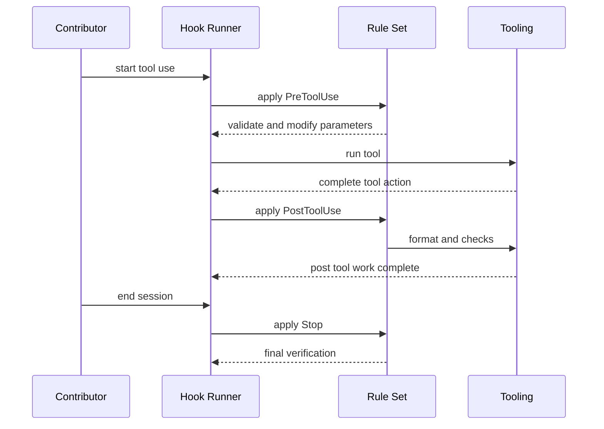

## Overview

This section documents the hook rules that shape contributor workflow across the repository’s language-specific rule sets. The shared baseline defines when hooks run, how much automation is acceptable, and how `TodoWrite` is used to keep multi-step work visible and steerable.

The language-specific files then narrow that baseline into concrete post-edit and stop-time conventions: formatters, analyzers, build checks, and warnings that protect against risky edits such as debug prints, secret-bearing config changes, or oversized web edits. The result is a consistent contributor policy that still leaves room for each language’s normal tooling.

## Shared Hook Lifecycle

The common rule set establishes the lifecycle that every other hook file extends:

- `PreToolUse`: runs before tool execution for validation and parameter modification.
- `PostToolUse`: runs after tool execution for auto-formatting and checks.
- `Stop`: runs when the session ends for final verification.

It also defines the permission model for automation:

- Enable auto-accept only for trusted, well-defined plans.
- Disable it for exploratory work.
- Never use the `dangerously-skip-permissions` flag.
- Configure `allowedTools` in `~/.claude.json` instead.

`TodoWrite` is treated as a contributor control surface rather than a convenience feature. The common guidance uses it to track progress on multi-step tasks, verify instruction understanding, enable real-time steering, and expose mismatched task granularity, missing steps, unnecessary steps, or misread requirements.

## Language-Specific Hook Rules

| File | Visible scope | Source-backed hook behavior |
| --- | --- | --- |
| `rules/common/hooks.md` | Shared baseline for all hook rule sets | Defines `PreToolUse`, `PostToolUse`, and `Stop`; sets the auto-accept caution policy; recommends `TodoWrite` for multi-step work and requirement steering. |
| `rules/web/hooks.md` | Web-specific hook recommendations | Prefers project-local tooling over remote one-off package execution; uses the project’s existing formatter entrypoint after edits; blocks writes that exceed 800 lines. |
| `rules/golang/hooks.md` | `**/*.go`, `**/go.mod`, `**/go.sum` | Extends the shared baseline with `PostToolUse` actions for `gofmt/goimports`, `go vet`, and `staticcheck`. |
| `rules/typescript/hooks.md` | `**/*.ts`, `**/*.tsx`, `**/*.js`, `**/*.jsx` | Extends the shared baseline with `PostToolUse` actions for Prettier and `tsc`, plus a `console.log` warning; adds a `Stop`-time `console.log` audit. |
| `rules/python/hooks.md` | `**/*.py`, `**/*.pyi` | Extends the shared baseline with `PostToolUse` actions for `black/ruff` and `mypy/pyright`; warns about `print()` statements in edited files. |
| `rules/java/hooks.md` | `**/*.java`, `**/pom.xml`, `**/build.gradle`, `**/build.gradle.kts` | Extends the shared baseline with `PostToolUse` actions for `google-java-format`, `checkstyle`, and compilation via `./mvnw compile` or `./gradlew compileJava`. |
| `rules/kotlin/hooks.md` | `**/*.kt`, `**/*.kts`, `**/build.gradle.kts` | Extends the shared baseline with `PostToolUse` actions for `ktfmt/ktlint`, `detekt`, and `./gradlew build`. |
| `rules/rust/hooks.md` | `**/*.rs`, `**/Cargo.toml` | Extends the shared baseline with `PostToolUse` actions for `cargo fmt`, `cargo clippy`, and `cargo check`. |
| `rules/swift/hooks.md` | `**/*.swift`, `**/Package.swift` | Extends the shared baseline with `PostToolUse` actions for `SwiftFormat`, `SwiftLint`, and `swift build`; warns on `print()` and steers contributors toward `os.Logger` or structured logging. |
| `rules/php/hooks.md` | `**/*.php`, `**/composer.json`, `**/phpstan.neon`, `**/phpstan.neon.dist`, `**/psalm.xml` | Extends the shared baseline with `PostToolUse` actions for Pint or PHP-CS-Fixer, PHPStan or Psalm, and PHPUnit or Pest; warns on `var_dump`, `dd`, `dump`, `die()`, raw SQL, and disabled CSRF or session protections. |
| `rules/perl/hooks.md` | `**/*.pl`, `**/*.pm`, `**/*.t`, `**/*.psgi`, `**/*.cgi` | Extends the shared baseline with `PostToolUse` actions for `perltidy` and `perlcritic`; warns about `print` in non-script `.pm` files and steers toward `say` or a logging module such as `Log::Any`. |
| `rules/csharp/hooks.md` | `**/*.cs`, `**/*.csx`, `**/*.csproj`, `**/*.sln`, `**/Directory.Build.props`, `**/Directory.Build.targets` | Extends the shared baseline with `PostToolUse` actions for `dotnet format`, `dotnet build`, and `dotnet test --no-build`; adds a `Stop`-time final `dotnet build` and warns on modified `appsettings*.json` files so secrets are not committed. |
| `rules/cpp/hooks.md` | `**/*.cpp`, `**/*.hpp`, `**/*.cc`, `**/*.hh`, `**/*.cxx`, `**/*.h`, `**/CMakeLists.txt` | Extends the shared baseline and introduces a `Build Hooks` section for C++ changes. |
| `rules/dart/hooks.md` | `**/*.dart`, `**/pubspec.yaml`, `**/analysis_options.yaml` | Extends the shared baseline with `PostToolUse` actions for `dart format`, `dart analyze`, and optional `flutter test` after significant changes. |
| `rules/zh/hooks.md` | Chinese-language hook guidance | Restates the shared hook types, the auto-accept caution policy, and the `TodoWrite` guidance in Chinese. |

## Contributor Policy by Lifecycle Stage

### Before Tool Use

The shared baseline treats permissive automation as a controlled exception, not a default. The approved path is allowedTools, not dangerously-skip-permissions.

The hook system treats pre-tool behavior as a place for validation and parameter adjustment rather than output formatting. That keeps edits and automation bounded before any tool runs.

The only explicit trust boundary in the shared rules is the auto-accept policy. It is allowed only when the work is narrowly defined and trusted, and it is explicitly discouraged for exploratory changes.

### After Tool Use

The post-tool stage is where the language-specific files do most of their work. Most rule sets use this point for formatting, linting, static analysis, and targeted compile checks, so the contributor sees issues immediately after a change rather than after a later manual review.

The web rules are stricter about local execution. They prefer the repository’s own formatter entrypoint after edits and reject oversized writes over 800 lines, which keeps hook-triggered changes inside a reviewable module size.

### At Session Stop

The shared baseline reserves `Stop` for final verification. TypeScript adds a `console.log` audit here, and C# adds a final `dotnet build`. The C# rules also instruct the hook system to warn about edits to `appsettings*.json`, which ties the stop phase to secret hygiene.

## Security and Review Guardrails

The hook files encode several concrete safety checks that contributors are expected to respect:

- `rules/common/hooks.md` forbids `dangerously-skip-permissions` and routes approved automation through `allowedTools`.
- `rules/csharp/hooks.md` warns on `appsettings*.json` edits to reduce secret leakage risk.
- `rules/php/hooks.md` warns on debug output helpers and on raw SQL or disabled CSRF and session protections.
- `rules/python/hooks.md` warns about `print()` in edited files and steers output to `logging`.
- `rules/perl/hooks.md` warns about `print` in non-script `.pm` files and prefers `say` or logging.
- `rules/swift/hooks.md` warns about `print()` and prefers `os.Logger` or structured logging.
- `rules/typescript/hooks.md` warns about `console.log` and audits it again at session stop.
- `rules/web/hooks.md` blocks writes that exceed 800 lines, which keeps file-level changes from becoming unreviewable.

These rules do not replace the language toolchains; they bind contributor behavior to specific checks so the edit loop stays fast, local, and auditable.

## Hook File Reference

| File | Why it matters in this policy set |
| --- | --- |
| `rules/common/hooks.md` | Defines the shared lifecycle and the permissions policy used by all other hook files. |
| `rules/web/hooks.md` | Adds a web-specific local-tooling preference and an edit-size guard for large files. |
| `rules/golang/hooks.md` | Standardizes Go formatting and static analysis after edits. |
| `rules/typescript/hooks.md` | Enforces formatting, type checking, and `console.log` audits. |
| `rules/python/hooks.md` | Enforces formatting, type checking, and `print()` warnings. |
| `rules/java/hooks.md` | Connects edits to formatter, style checks, and compilation. |
| `rules/kotlin/hooks.md` | Connects edits to formatter, static analysis, and Gradle build verification. |
| `rules/rust/hooks.md` | Connects edits to formatting, linting, and compile checks. |
| `rules/swift/hooks.md` | Connects edits to formatting, linting, build checks, and logging guidance. |
| `rules/php/hooks.md` | Connects edits to formatting, static analysis, testing, and debug or security warnings. |
| `rules/perl/hooks.md` | Connects edits to formatting, linting, and output discipline. |
| `rules/csharp/hooks.md` | Connects edits to formatting, build, test, and secrets-awareness at stop time. |
| `rules/cpp/hooks.md` | Marks the C++ hook surface and its build-hook focus. |
| `rules/dart/hooks.md` | Connects edits to formatting, analysis, and optional Flutter tests. |
| `rules/zh/hooks.md` | Provides the Chinese-language version of the shared hook guidance. |
