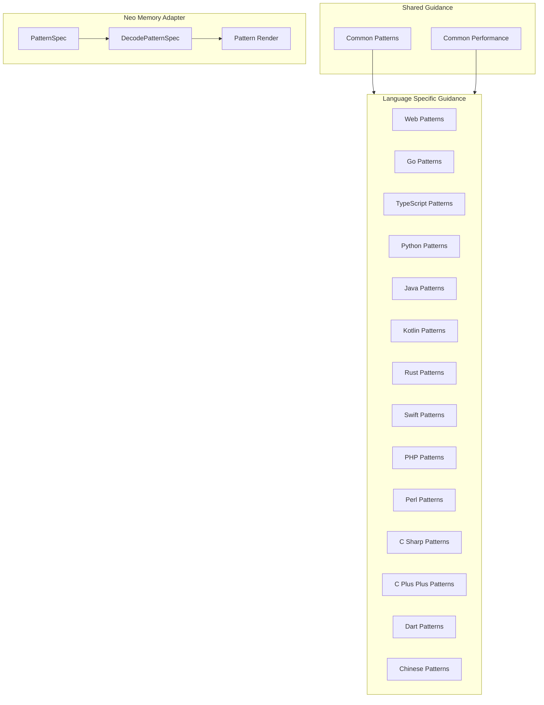
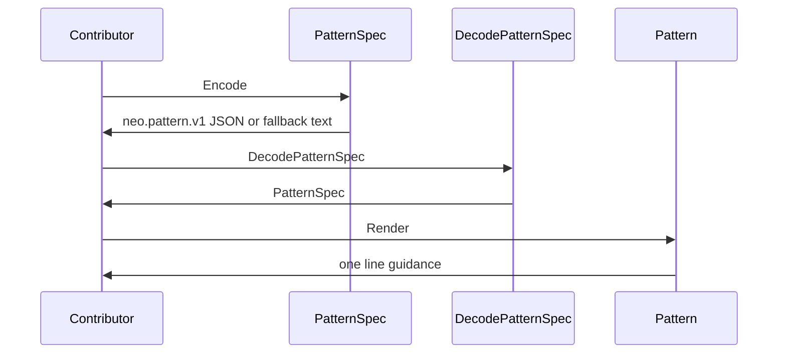

## Overview

This slice of the repository is policy material, not runtime product logic. The documents in `rules/` define reusable implementation heuristics for choosing proven starting points, structuring boundaries, and shaping shared response formats across languages, while the performance files define how contributors should think about model choice, context management, and web delivery budgets.

Security appears here as part of the contributor workflow in `rules/common/patterns.md`: skeleton project selection explicitly includes a security assessment alongside extensibility, relevance, and implementation planning. The only executable source in this section, `neo/internal/memory/pattern.go`, turns a procedural recipe into a stable memory representation and renders it back into a concise, human-readable instruction string.

## Guidance Flow

## Reusable Pattern Guidance

### Policy files

| Path | Scope | Concrete guidance |
| --- | --- | --- |
| `rules/common/patterns.md` | Shared pattern baseline | Select battle-tested skeleton projects, evaluate them with security, extensibility, relevance, and implementation planning, then iterate inside the proven structure. It also standardizes repository boundaries and a common API response envelope. |
| `rules/web/patterns.md` | Web UI composition | Use compound components when related UI shares state and interaction semantics. |
| `rules/golang/patterns.md` | Go sources and module manifests | Extends the shared pattern guidance for `**/*.go`, `**/go.mod`, and `**/go.sum`. |
| `rules/typescript/patterns.md` | TypeScript, JavaScript, and JSX | Defines `ApiResponse<T>`, a debounce hook, and a repository interface for async CRUD-style data access. |
| `rules/python/patterns.md` | Python modules and type stubs | Uses a `Repository` protocol with `find_by_id` and `save`, plus a simple `CreateUserRequest` shape with `name`, `email`, and optional `age`. |
| `rules/java/patterns.md` | Java application layering | Favors repository interfaces, constructor injection, builder-based criteria objects, sealed result types, and record-based response objects. |
| `rules/kotlin/patterns.md` | Kotlin and Android or KMP code | Uses constructor injection, `MutableStateFlow` state in ViewModels, repository interfaces, and small use cases with `invoke`. |
| `rules/rust/patterns.md` | Rust application boundaries | Shows trait-based repositories, constructor-based service wiring, newtypes for IDs, state enums, and a builder for configuration. |
| `rules/swift/patterns.md` | Swift and KMP-style design | Uses protocol-oriented design, a load-state enum, and a service that accepts a repository dependency with a default implementation. |
| `rules/php/patterns.md` | PHP services and transport boundaries | Keeps controllers thin, prefers DTOs and value objects, injects dependencies through constructors, and isolates ORM and SDK concerns behind narrow contracts. |
| `rules/perl/patterns.md` | Perl application boundaries | Places DBI or DBIx::Class behind an interface rather than exposing storage details directly. |
| `rules/csharp/patterns.md` | C# application layering | Defines `ApiResponse<T>`, `IRepository<T>`, and `PaymentsOptions` for response shape, persistence contracts, and payment configuration. |
| `rules/cpp/patterns.md` | C++ resource lifetime management | Uses RAII with `FileHandle`, which owns `std::FILE* file_` and closes it in the destructor. |
| `rules/dart/patterns.md` | Dart and Flutter state/data patterns | Shows remote-plus-local repository composition, Cubit state mutation, event-driven BLoC handling, a notifier-based state holder, and a consumer widget. |
| `rules/zh/patterns.md` | Chinese-language mirror of the shared patterns | Repeats the skeleton-project, repository, and API response guidance in Chinese for the same contributor workflow. |

### Common guidance themes

- The shared repository pattern in `rules/common/patterns.md` and the language-specific repository examples in `rules/typescript/patterns.md`, `rules/python/patterns.md`, `rules/java/patterns.md`, `rules/kotlin/patterns.md`, `rules/rust/patterns.md`, and `rules/csharp/patterns.md` all separate business logic from storage or transport details.
- Constructor injection is the dominant dependency shape in `rules/java/patterns.md`, `rules/kotlin/patterns.md`, `rules/rust/patterns.md`, and `rules/swift/patterns.md`.
- `rules/common/patterns.md`, `rules/typescript/patterns.md`, and `rules/csharp/patterns.md` converge on a consistent response envelope with success, data, error, and metadata fields.
- `rules/web/patterns.md` is the only file in this set that explicitly steers UI composition rather than data or service boundaries, and it does so with compound components.
- `rules/dart/patterns.md` is the most stateful example set: it shows local caching in the repository implementation, simple counter state in a Cubit, event-to-state mapping in a BLoC, and widget consumption through a provider.

### `rules/common/patterns.md`

This file establishes the repository pattern as the primary boundary between business logic and storage. It also gives a consistent API response envelope with a success indicator, payload, error message, and pagination metadata, which keeps response shapes predictable across implementations.

It additionally documents a contributor workflow for new work: search for battle-tested skeleton projects, evaluate them with parallel agents, then clone the best match and iterate inside that structure. The evaluation criteria include security assessment, so security is treated as part of architecture selection rather than a separate afterthought.

### `rules/web/patterns.md`

This file narrows the shared patterns to UI composition. Its visible guidance is specific: use compound components when multiple UI pieces share state and interaction semantics.

That makes it the web-specific counterpart to the repository and response-envelope rules in the shared file. It is a composition rule, not a data or transport rule.

### `rules/typescript/patterns.md`

This file standardizes three reusable TypeScript building blocks: `ApiResponse<T>`, `useDebounce`, and a generic `Repository<T>`. The response interface includes `success`, `data`, `error`, and `meta`, with `meta` carrying `total`, `page`, and `limit`.

`useDebounce` is implemented as a React hook that delays state updates with `setTimeout` and clears the timeout on cleanup. The repository interface covers the usual async data operations: `findAll`, `findById`, `create`, `update`, and `delete`.

### `rules/python/patterns.md`

This file uses `Protocol` to define a duck-typed `Repository` contract with `find_by_id` and `save`. It keeps the contract intentionally small so different backends can satisfy it without inheritance-heavy coupling.

The file also defines `CreateUserRequest` with `name`, `email`, and optional `age`. That request shape is a simple, typed input object rather than an unstructured mapping.

### `rules/java/patterns.md`

This file pushes constructor injection and explicit service boundaries. `OrderService` depends on `OrderRepository` and `PaymentGateway`, then turns a `CreateOrderRequest` into an `Order`, charges payment, saves the order, and returns an `OrderSummary`.

It also shows a deliberate contrast between constructor injection and field injection in `NotificationService`, and it gives several other reusable patterns: `OrderResponse` as a record, `SearchCriteria` as a builder, and a sealed `PaymentResult` hierarchy for exhaustive handling. The file is strongly oriented toward explicit state and explicit dependency wiring.

### `rules/kotlin/patterns.md`

This file centers on ViewModel-driven state and use-case boundaries. `ScreenViewModel` owns a `MutableStateFlow`, exposes it as `state`, and dispatches `ScreenEvent.Load` and `ScreenEvent.Delete` through `onEvent`.

The repository and use-case examples keep the same shape: `ItemRepository` exposes `getById` and `getAll`, `GetItemUseCase` wraps `getById`, and `GetItemsUseCase` wraps `getAll`. The result is a layered, constructor-injected Kotlin style that keeps ViewModels thin.

### `rules/rust/patterns.md`

This file uses traits and newtypes to make boundaries explicit. The repository pattern is implemented with trait objects, and `OrderService::new` accepts a boxed repository and payment gateway, mirroring the Java example but in Rust style.

The file also includes `UserId` and `OrderId` newtypes to prevent ID mix-ups, a `ConnectionState` enum that captures connection lifecycle, and a `ServerConfigBuilder` with defaults for host, port, and max connections. The builder and state enum reinforce explicit configuration and explicit transitions.

### `rules/swift/patterns.md`

This file emphasizes protocol-oriented design. `UserService` stores `repository: any UserRepository` and defaults to `DefaultUserRepository()`, which keeps the service injectable without making construction verbose.

`LoadState<T>` captures the standard idle, loading, loaded, and failed states. The file is concise, but it clearly prefers small protocols and shared defaults over rigid inheritance hierarchies.

### `rules/php/patterns.md`

This file is a transport-and-boundary checklist. It keeps controllers thin, moves business rules into application or domain services, and replaces shape-heavy associative arrays with DTOs and value objects.

It also states that dependencies should be injected through constructors and that ORM models and third-party SDKs should be isolated behind narrow adapters. The file points readers to `api-design` and `laravel-patterns` for adjacent guidance, but its own visible emphasis is boundary hygiene.

### `rules/perl/patterns.md`

This file is intentionally small and specific: it recommends keeping DBI or DBIx::Class behind an interface. That mirrors the repository pattern used elsewhere in the repo and keeps data-access concerns from leaking upward.

### `rules/csharp/patterns.md`

This file defines three reusable pieces: `ApiResponse<T>`, `IRepository<T>`, and `PaymentsOptions`. `ApiResponse<T>` carries `Success`, `Data`, `Error`, and `Meta`; `IRepository<T>` exposes the standard async CRUD surface; `PaymentsOptions` groups `SectionName`, `BaseUrl`, and `ApiKeySecretName`.

The effect is the same as in the TypeScript and Java guidance: response shape, persistence abstraction, and configuration are each made explicit.

### `rules/cpp/patterns.md`

This file presents `FileHandle` as an RAII example. The class owns `std::FILE* file_`, opens the file in the constructor, closes it in the destructor, and deletes copy construction and copy assignment.

The pattern is simple but important: resource lifetime is tied to object lifetime, which keeps cleanup deterministic.

### `rules/dart/patterns.md`

This file is the richest state-pattern example set in the repo. `UserRepositoryImpl` composes a remote source and a local source, `CounterCubit` mutates integer state, `CartEvent` is a sealed event family, `CartState` uses `copyWith`, `CartBloc` maps events to state transitions, and `CartPage` reads the state through a provider.

The repository example explicitly caches remote data into local storage after fetches. The widget example then consumes the state from the provider and turns it into a list of tiles, which keeps the UI decoupled from the repository implementation.

### `rules/zh/patterns.md`

This file mirrors the shared pattern guidance in Chinese. It repeats the same three policy anchors: skeleton-project selection, repository boundaries, and a standardized API response envelope.

That makes the guidance accessible to Chinese readers without changing the underlying architecture heuristics.

## Performance Guidance

### Performance files

| Path | Focus | Concrete guidance |
| --- | --- | --- |
| `rules/common/performance.md` | Model and workflow efficiency | Chooses among Haiku 4.5, Sonnet 4.6, and Opus 4.5 by task complexity; recommends staying out of the last 20 percent of the context window for large refactors; keeps extended thinking enabled by default; and uses `build-error-resolver` for build failures. |
| `rules/web/performance.md` | Web delivery performance | Defines Core Web Vitals targets, bundle budgets by page type, critical CSS and asset loading strategy, and dynamic import examples for `gsapModule` and `ScrollTrigger`. |
| `rules/zh/performance.md` | Chinese-language mirror of performance guidance | Repeats the same model-selection, context-window, extended-thinking, and build-troubleshooting guidance in Chinese. |

### `rules/common/performance.md`

This file is a contributor-efficiency playbook. It assigns Haiku 4.5 to lightweight or frequently invoked work, Sonnet 4.6 to main development and complex coding tasks, and Opus 4.5 to deep architectural decisions and research.

It also defines how to work with the context window: avoid the last 20 percent for large refactors and multi-file changes, keep extended thinking enabled by default, and use plan mode and multiple critique rounds for complex tasks. Build failures are handled by the `build-error-resolver` agent and incremental verification.

### `rules/web/performance.md`

This file turns the common performance ideas into web delivery targets. It sets concrete budgets for LCP, INP, CLS, FCP, and TBT, and it caps gzipped JavaScript and CSS by page type.

The loading strategy is similarly explicit: inline only justified critical CSS, preload only the hero image and primary font, defer non-critical assets, and dynamically import heavy libraries. The visible examples use `gsapModule` and a direct `ScrollTrigger` import as the dynamic-loading pattern.

### `rules/zh/performance.md`

This file mirrors the same performance policy in Chinese. The visible material repeats the model selection, context-window management, extended thinking, and build troubleshooting structure from the common performance document.

## Neo Memory Pattern Encoding

### `neo/internal/memory/pattern.go`

*`neo/internal/memory/pattern.go`*

This file defines the structured procedural-memory schema and the string codec that maps it onto the flat `PatternData.Statement` storage field. The encoder prefixes JSON with `neo.pattern.v1:` and falls back to a trimmed name plus joined steps if JSON marshaling fails.

The file also defines the internal identity rule used for deduplication: `dedupKey` prefers `Name`, then `Trigger`, then the joined `Steps`. `DecodePatternSpec` treats legacy plain statements as a single freeform step, so older or hand-written entries still render cleanly.

#### Properties

| Symbol | Property | Type | Meaning |
| --- | --- | --- | --- |
| `PatternSpec` | `Name` | `string` | Recipe name. |
| `PatternSpec` | `Trigger` | `string` | Condition that causes the recipe to apply. |
| `PatternSpec` | `Preconditions` | `[]string` | Checks to perform before applying the pattern. |
| `PatternSpec` | `Steps` | `[]string` | Ordered procedure steps. |
| `PatternSpec` | `Gotchas` | `[]string` | Learned failure modes to avoid. |
| `PatternSpec` | `SuccessCriteria` | `[]string` | Conditions that must be true after execution. |
| `Pattern` | `Spec` | `PatternSpec` | Structured recipe payload. |
| `Pattern` | `Confidence` | `float32` | Confidence score. |
| `Pattern` | `Coverage` | `int` | How many times the pattern was proven. |
| `Pattern` | `URI` | `string` | Source URI for the retrieved pattern. |

#### Public methods

| Method | Description |
| --- | --- |
| `Encode` | Marshals the spec to canonical JSON and prefixes it with `neo.pattern.v1:`; if marshaling fails, it falls back to a trimmed `Name` plus joined `Steps`. |
| `DecodePatternSpec` | Removes the version prefix when present, unmarshals JSON into a `PatternSpec`, and falls back to a single-step legacy spec for plain statements. |
| `IsEmpty` | Reports whether the spec has no usable content after `dedupKey` normalization. |
| `Render` | Produces a one-line guidance string with the name, trigger, preconditions, steps, gotchas, success criteria, and coverage count. |

#### Behavior details

- `PatternSpec.Encode` stores the structured schema as JSON instead of flattening the fields into separate storage columns.
- `DecodePatternSpec` preserves compatibility with older plain-text values by mapping them to `Steps: []string{statement}`.
- `Pattern.Render` formats `Steps` with ` → `, which makes the sequence readable as a single guidance line.
- The coverage suffix appears only when `Coverage > 0`, so uncited patterns remain visually clean.
- `patternEncPrefix` is the version tag that makes encoded and legacy statements distinguishable.

### `neo/internal/memory/pattern_test.go`

*`neo/internal/memory/pattern_test.go`*

This test file acts as the executable specification for the codec and render behavior. It verifies the round-trip shape, legacy compatibility, deduplication precedence, and rendered output content.

| Test | Verified behavior |
| --- | --- |
| `TestPatternSpecEncodeDecodeRoundTrip` | Confirms that `PatternSpec.Encode` prefixes the serialized payload and that `DecodePatternSpec` recreates the full original spec. |
| `TestDecodeLegacyPlainStatement` | Confirms that a plain statement decodes into a one-step recipe and that an empty statement produces an empty spec. |
| `TestDedupKeyPrecedence` | Confirms that `Name` wins over `Trigger`, `Trigger` wins over `Steps`, and an empty spec is empty. |
| `TestPatternRender` | Confirms that the rendered string includes the name, trigger, steps, gotchas, success criteria, and coverage count. |

## Source File Coverage Summary

| Path | Role in this section |
| --- | --- |
| `rules/common/patterns.md` | Shared pattern baseline for skeleton selection, repository boundaries, and response envelopes. |
| `rules/web/patterns.md` | Web composition rule centered on compound components. |
| `rules/golang/patterns.md` | Go-scoped extension point that inherits the shared guidance. |
| `rules/typescript/patterns.md` | TypeScript and JavaScript pattern set for responses, hooks, and repositories. |
| `rules/python/patterns.md` | Python protocol-based repository and request object guidance. |
| `rules/java/patterns.md` | Java layering, injection, builders, and sealed result guidance. |
| `rules/kotlin/patterns.md` | Kotlin ViewModel and use-case pattern guidance. |
| `rules/rust/patterns.md` | Rust trait, newtype, state, and builder guidance. |
| `rules/swift/patterns.md` | Swift protocol-oriented design and load-state guidance. |
| `rules/php/patterns.md` | PHP service boundary and DTO guidance. |
| `rules/perl/patterns.md` | Perl interface boundary guidance for DBI or DBIx::Class. |
| `rules/csharp/patterns.md` | C# response, repository, and payment configuration patterns. |
| `rules/cpp/patterns.md` | C++ RAII example with `FileHandle`. |
| `rules/dart/patterns.md` | Dart repository, Cubit, BLoC, notifier, and widget state patterns. |
| `rules/zh/patterns.md` | Chinese-language mirror of the shared pattern guidance. |
| `rules/common/performance.md` | Shared model-selection and context-management performance policy. |
| `rules/web/performance.md` | Web delivery budgets and loading strategy. |
| `rules/zh/performance.md` | Chinese-language mirror of the shared performance policy. |
| `neo/internal/memory/pattern.go` | Procedural-memory schema, codec, deduplication, and rendering implementation. |
| `neo/internal/memory/pattern_test.go` | Round-trip, legacy compatibility, precedence, and render tests. |
