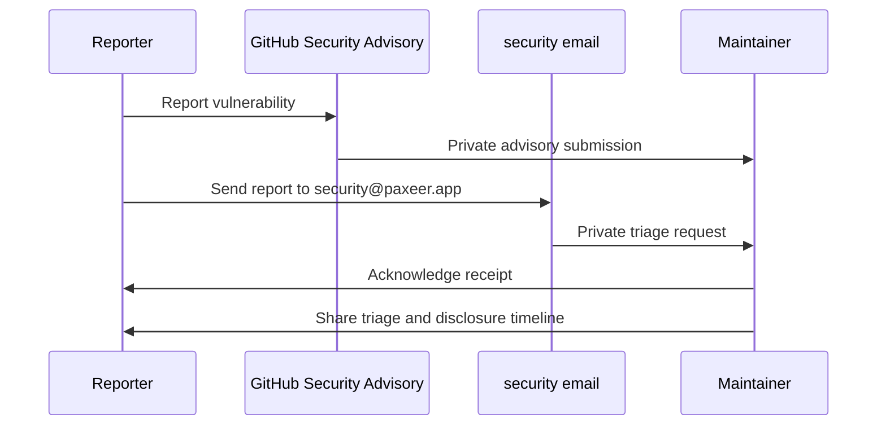

## Overview

This section documents the project’s security disclosure surface and the source-backed security rule sets that apply across languages. The repository splits policy into a central security policy, a public marketplace disclosure endpoint, a marketplace policy page, and language-specific markdown rules that reinforce secure coding and secret handling.

The material is intentionally operational: it tells reporters where to send vulnerabilities, shows what is in scope, and captures the concrete guardrails contributors are expected to follow before committing code. It also includes localized security guidance in Chinese and a web-specific CSP rule set for browser-delivered content.

## Security Disclosure and Policy Surface

### `SECURITY.md`

*`SECURITY.md`*

`SECURITY.md` is the project’s main vulnerability disclosure policy. It defines supported versions, in-scope and out-of-scope areas, the preferred report channels, the expected response timeline, and a set of operator hardening notes that describe security invariants enforced in code.

| Area | Source-backed policy |
| --- | --- |
| Supported versions | `main` is active; pre-1.0 fixes are provided against the current `main` branch; tagged releases receive best-effort backports at maintainer discretion. |
| In scope | `cortex/`, `MCL/`, `bridge/`, `executor/`, `deploy/`, and crypto primitives used by the project. |
| Out of scope | Denial of service via legitimate workload, issues that require existing signing keys or credentials, third-party MCP servers and dependencies, and legacy code in `runs/`, `research/`, and `knowledge/`. |
| Report channels | GitHub Security Advisory, email to `security@paxeer.app`, or a private channel initiated through a GitHub Discussions thread mentioning security. |
| Target handling | Acknowledgement within 72 hours, triage and severity within 7 calendar days, fix planning within 14 days, and coordinated disclosure by mutual agreement, typically 30–90 days. |
| Reporter expectations | Provide module and file line context, reproduction steps or proof of concept, severity, and any verified mitigation. |
| Operator hardening notes | Replay invariant checks, atomic batch journaling, URI version pinning, closed vocabulary enforcement, rate limits, daemon auth, and `$env:NAME`-based credential injection conventions. |

#### Disclosure flow

### `marketplace/public/.well-known/security.txt`

The policy explicitly asks reporters not to use public GitHub issues for security bugs.

*`marketplace/public/.well-known/security.txt`*

This is the public disclosure endpoint for the marketplace. It advertises a security contact address, an expiry, a preferred language, and canonical references back to the marketplace-hosted policy documents.

| Field | Value |
| --- | --- |
| `Contact` | `mailto:security@paxeer.app` |
| `Expires` | `2027-06-30T00:00:00.000Z` |
| `Preferred-Languages` | `en` |
| `Canonical` | `https://market.paxeer.app/.well-known/security.txt` |
| `Policy` | `https://market.paxeer.app/legal/security-policy.html` |

### `marketplace/public/legal/security-policy.html`

*`marketplace/public/legal/security-policy.html`*

This page is the marketplace-facing security policy landing page. It is marked `noindex`, titled `Security Policy · Deus`, and currently presents a placeholder statement telling visitors that the final policy will replace the file at the same URL before public launch.

The visible UI links to `mailto:legal@paxeer.app` for questions and a root-relative link back to the marketplace.

## Common Security Rules

### `rules/common/security.md`

This file explicitly states that it is a placeholder and that the final policy will replace the same URL before public launch.

*`rules/common/security.md`*

This file defines the baseline security checks that apply before any commit. It is the shared rule set that the language-specific documents extend.

| Category | Required behavior |
| --- | --- |
| Secret handling | [REDACTED] |
| Input validation | All user inputs must be validated. |
| Database safety | Use parameterized queries to prevent SQL injection. |
| Browser safety | Sanitize HTML to prevent XSS. |
| Request safety | Enable CSRF protection. |
| Access control | Verify authentication and authorization. |
| Availability controls | Apply rate limiting to all endpoints. |
| Error hygiene | Error messages must not leak sensitive data. |
| Response protocol | Stop immediately on security findings, route the issue through `security-reviewer`, fix critical issues first, rotate exposed secrets, and review the codebase for similar problems. |

## Language-Specific Security Rules

### `rules/web/security.md`

*`rules/web/security.md`*

This rule set extends the shared guidance with web-specific browser security. It requires a production CSP and recommends a per-request nonce for scripts instead of `'unsafe-inline'`.

### `rules/golang/security.md`

*`rules/golang/security.md`*

This rule set applies the shared security policy to Go source and module manifests. Its coverage is tied to `**/*.go`, `**/go.mod`, and `**/go.sum`, and it is explicitly an extension of the common security rules.

### `rules/typescript/security.md`

*`rules/typescript/security.md`*

This rule set applies the shared security policy to TypeScript, JavaScript, and JSX/TSX files. It forbids hardcoded API keys and shows environment-variable-based configuration using `process.env.OPENAI_API_KEY` with a fail-fast `Error` when the key is missing.

### `rules/python/security.md`

*`rules/python/security.md`*

This rule set applies the shared security policy to Python source and type stub files. Its scope is tied to `**/*.py` and `**/*.pyi`, and it extends the common security rules for Python code.

### `rules/java/security.md`

*`rules/java/security.md`*

This rule set applies the shared security policy to Java source. It forbids hardcoded secrets, recommends `System.getenv("API_KEY")`, advises using a secret manager for production, and keeps local configuration out of version control.

It also includes an input-validation example through `createOrder`, where blank customer names and nonpositive amounts raise `IllegalArgumentException`.

### `rules/kotlin/security.md`

*`rules/kotlin/security.md`*

This rule set applies the shared security policy to Kotlin and Android or KMP code. It directs contributors to keep secrets in `local.properties`, use `BuildConfig` for CI-injected release values, and store runtime secrets in `EncryptedSharedPreferences` or Keychain.

It also specifies security handling for authenticated clients and mobile surfaces:

- store tokens in secure storage rather than plain SharedPreferences
- implement token refresh with proper 401 and 403 handling
- clear auth state on logout
- use `BiometricPrompt` for sensitive operations
- keep ProGuard or R8 rules for serialized and reflection-based libraries
- validate URLs and control navigation in WebView usage
- disable JavaScript unless explicitly needed

### `rules/rust/security.md`

*`rules/rust/security.md`*

This rule set applies the shared security policy to Rust source. It forbids hardcoded secrets, uses `std::env::var("API_KEY")`-style loading, fails fast when required secrets are missing, and keeps `.env` files out of version control.

It also includes an `Email::parse` example that validates trimmed input, checks the `@` location, applies length and domain checks, and returns a typed validation error on malformed input. Server-side logging guidance is also explicit: use `tracing` or `log`, keep detailed errors on the server, and return generic messages to clients.

### `rules/swift/security.md`

*`rules/swift/security.md`*

This rule set applies the shared security policy to Swift source and package manifests. It requires Keychain Services for sensitive data, recommends environment variables or `.xcconfig` files for build-time secrets, and forbids hardcoding secrets in source.

### `rules/php/security.md`

*`rules/php/security.md`*

This rule set applies the shared security policy to PHP code and package manifests. It focuses on request validation at the framework boundary, output escaping by default, prepared statements for all dynamic queries, secrets loaded from environment variables or a secret manager, and CSRF protection for state-changing requests.

It also adds operational guidance around dependency review with `composer audit` and warns against abandoned packages. The rule set references `laravel-security` for Laravel-specific guidance.

### `rules/perl/security.md`

*`rules/perl/security.md`*

This rule set applies the shared security policy to Perl code and tests. It requires taint mode for CGI or web-facing scripts, sanitization of `%ENV` before external commands, and allowlist-based regex untainting rather than permissive capture patterns.

### `rules/csharp/security.md`

*`rules/csharp/security.md`*

This rule set applies the shared security policy to C# source, scripts, project files, and application settings files. It forbids hardcoded API keys, tokens, and connection strings, and directs developers to use environment variables, user secrets for local development, and secret managers in production.

It also shows configuration validation that throws `InvalidOperationException` when a required setting is missing, and it demonstrates parameterized SQL through a `QueryAsync<Order>` call with a named parameter.

### `rules/cpp/security.md`

*`rules/cpp/security.md`*

This rule set applies the shared security policy to C++ source and CMake files. It emphasizes memory safety, buffer-overflow prevention, and undefined-behavior avoidance.

| Area | Required behavior |
| --- | --- |
| Memory safety | Avoid raw `new` and `delete`; use smart pointers. Avoid C-style arrays and `malloc` / `free`. |
| Buffer safety | Prefer `std::string`, use `.at()` when bounds matter, and avoid `strcpy`, `strcat`, and `sprintf`. |
| Undefined behavior | Initialize variables, avoid signed overflow, and never dereference null or dangling pointers. |
| Static analysis | Use sanitizers, `clang-tidy`, and `cppcheck`. |

### `rules/dart/security.md`

*`rules/dart/security.md`*

This rule set applies the shared security policy to Dart, Flutter, Android, and iOS mobile code. It forbids hardcoded secrets in Dart source, recommends `--dart-define` or `--dart-define-from-file` for compile-time config, and uses `flutter_dotenv` or equivalent for non-secret configuration.

It also directs runtime secret storage into secure storage such as `flutter_secure_storage`, and it adds mobile hardening guidance:

- review required permissions in `AndroidManifest.xml`
- export Android components only when necessary
- use `android:exported="false"` when possible
- review implicit intent filters
- use `FLAG_SECURE` for sensitive screens
- keep ProGuard or R8 rules in sync with release behavior
- run `flutter analyze` and address warnings before release

### `rules/zh/security.md`

*`rules/zh/security.md`*

This file is the Chinese-language version of the shared security rules. It mirrors the common security checklist, secret management guidance, and response protocol in Chinese so contributors can follow the same security requirements in a localized format.

## Key Files Reference

| File | Responsibility |
| --- | --- |
| `SECURITY.md` | Central disclosure policy, scope definition, reporting channels, response timeline, and operator hardening notes. |
| `marketplace/public/.well-known/security.txt` | Public security contact metadata for the marketplace. |
| `marketplace/public/legal/security-policy.html` | Marketplace security policy landing page and placeholder notice. |
| `rules/common/security.md` | Shared security checks, secret handling rules, and incident response protocol. |
| `rules/web/security.md` | Browser-facing CSP guidance with nonce-based scripts. |
| `rules/golang/security.md` | Go-specific extension of the shared security rules. |
| `rules/typescript/security.md` | TypeScript and JavaScript secret handling guidance. |
| `rules/python/security.md` | Python-specific extension of the shared security rules. |
| `rules/java/security.md` | Java-specific secret handling and input-validation guidance. |
| `rules/kotlin/security.md` | Kotlin and Android or KMP security guidance. |
| `rules/rust/security.md` | Rust-specific secret loading, validation, and logging guidance. |
| `rules/swift/security.md` | Swift-specific secure storage and build-time secret guidance. |
| `rules/php/security.md` | PHP security boundary, database, auth, and dependency guidance. |
| `rules/perl/security.md` | Perl taint-mode and input-untainting guidance. |
| `rules/csharp/security.md` | C# secret management and secure configuration guidance. |
| `rules/cpp/security.md` | C++ memory safety and static-analysis guidance. |
| `rules/dart/security.md` | Dart and Flutter secret handling and mobile hardening guidance. |
| `rules/zh/security.md` | Chinese-language version of the shared security guidance. |
