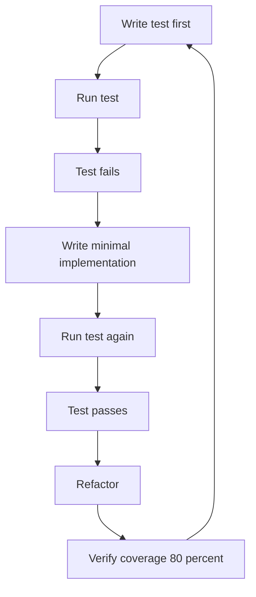

## Overview

This section collects the repository’s formal testing expectations and the project-specific QA guidance that contributors are expected to follow. The baseline policy comes from `rules/common/testing.md`, and the language-specific files refine that baseline for Go, C++, C#, Java, Kotlin, Dart, Rust, Swift, PHP, Perl, Python, TypeScript, web frontends, and localized guidance in Chinese.

The most consistent theme across the files is disciplined verification: write tests before implementation, keep coverage at or above 80%, prefer behavior-focused test names, and use the framework that matches the language and runtime. Several files add more specific expectations for visual regression, golden tests, test isolation, coverage tooling, and integration coverage against real infrastructure.

## Repository-Wide Testing Baseline

*`rules/common/testing.md`*

The shared testing rule set establishes the minimum quality bar for the entire monorepo:

- Minimum test coverage is 80%.
- All three test types are required:- Unit tests for individual functions, utilities, and components
- Integration tests for API endpoints and database operations
- E2E tests for critical user flows
- The required workflow is RED → GREEN → IMPROVE:1. Write the test first
2. Run it and confirm it fails
3. Implement the smallest change that passes
4. Refactor
5. Verify coverage
- Tests should follow Arrange-Act-Assert structure.
- Test names should explain behavior, not implementation details.
- The `tdd-guide` agent is meant to be used proactively for new features and for troubleshooting failures.
- When tests fail, the guidance is to check isolation, verify mocks, and fix implementation issues rather than changing the test unless the test is wrong.



### Common test style and naming

The shared file also standardizes a few small but important conventions:

- Prefer AAA structure in every test.
- Use descriptive test names such as behavior statements.
- Keep tests focused on one outcome at a time.
- Use the same failure-debugging workflow when a test is unstable or unexpectedly passing.

## Web QA Priorities

*`rules/web/testing.md`*

The web-specific rules sit on top of the shared baseline and change the emphasis for browser-facing work:

- Visual regression comes first.- Screenshot key breakpoints at 320, 768, 1024, and 1440.
- Cover hero sections, scroll-driven sections, and meaningful states.
- Use Playwright screenshots for visually important work.
- If both themes exist, test both.
- Accessibility is the second priority.- Run automated accessibility checks.
- Verify keyboard navigation.
- Verify reduced-motion behavior.
- Verify color contrast.
- Performance checks follow.- Run Lighthouse or an equivalent tool on meaningful pages.
- Keep Core Web Vitals targets aligned with the performance guidance.
- Cross-browser coverage must include Chrome, Firefox, and Safari.
- Responsive behavior should be checked at 320, 375, 768, 1024, 1440, and 1920.
- The included Playwright example shows a simple route check that waits for the landing page heading to be visible.
- The rule set explicitly warns against flaky timeout-based assertions and prefers deterministic waits.

## Chinese Localized Testing Guidance

*`rules/zh/testing.md`*

This file restates the common testing policy in Chinese for contributors who work from that language set. It mirrors the same core expectations:

- 80% minimum coverage
- Unit, integration, and E2E tests
- RED → GREEN → IMPROVE TDD flow
- Troubleshooting through `tdd-guide`
- Checking isolation and mocks before changing implementation details

It exists as a localized version of the shared baseline rather than a separate policy.

## Language-Specific Testing Rules

| File | Main testing guidance | Tools, commands, or conventions |
| --- | --- | --- |
| `rules/golang/testing.md` | Go tests should be table-driven and run with race detection. | `go test -race ./...`, `go test -cover ./...` |
| `rules/cpp/testing.md` | C++ tests use GoogleTest with CMake/CTest and include coverage and sanitizer guidance. | `cmake --build build && ctest --test-dir build --output-on-failure`, coverage with `lcov`, sanitizers via `-fsanitize=address,undefined` |
| `rules/csharp/testing.md` | C# tests prefer xUnit, FluentAssertions, mocking libraries, and Testcontainers for real infrastructure. | `dotnet test`, `WebApplicationFactory<TEntryPoint>`, coverage target 80%+ |
| `rules/java/testing.md` | Java tests use JUnit 5, AssertJ, Mockito, and Testcontainers, with behavior-based naming. | `@DisplayName`, `@ParameterizedTest`, JaCoCo coverage |
| `rules/kotlin/testing.md` | Kotlin tests cover multiplatform, coroutines, flows, and local fakes. | `kotlin.test`, `Turbine`, `runTest`, `MockEngine`, Room and SQLDelight strategies |
| `rules/typescript/testing.md` | TypeScript and JavaScript E2E testing uses Playwright for critical flows. | `e2e-runner` agent |
| `rules/python/testing.md` | Python tests use pytest with coverage reporting and mark-based categorization. | `pytest --cov=src --cov-report=term-missing` |
| `rules/rust/testing.md` | Rust tests rely on `#[test]`, rstest, proptest, mockall, and async support. | `cargo test`, `cargo llvm-cov`, `cargo llvm-cov --fail-under-lines 80` |
| `rules/swift/testing.md` | Swift tests use Swift Testing for new coverage and emphasize isolation. | `swift test --enable-code-coverage` |
| `rules/php/testing.md` | PHP tests default to PHPUnit, or Pest when configured, with separate unit and integration coverage. | `vendor/bin/phpunit --coverage-text`, `vendor/bin/pest --coverage` |
| `rules/perl/testing.md` | Perl tests use Test2::V0 with `prove -l` and Devel::Cover. | `prove -l t/`, `cover -test` |
| `rules/zh/testing.md` | Chinese localized copy of the common testing baseline. | Same 80% coverage and TDD flow expectations |


## Go Testing

*`rules/golang/testing.md`*

The Go file is concise and focuses on the execution model:

- Use the standard `go test` tool with table-driven tests.
- Always run tests with `-race`.
- Use `go test -cover ./...` for coverage reporting.
- The file is path-scoped to Go sources and Go module metadata through its `paths` entry.

The guidance is intentionally minimal and operational: it tells contributors how to structure tests and which commands matter in CI and local verification.

## C++ Testing

*`rules/cpp/testing.md`*

The C++ guidance is built around GoogleTest and CMake/CTest:

- Framework: GoogleTest with gtest/gmock.

```bash
  cmake --build build && ctest --test-dir build --output-on-failure
```

```bash
  cmake -DCMAKE_CXX_FLAGS="--coverage" -DCMAKE_EXE_LINKER_FLAGS="--coverage" ..
  cmake --build .
  ctest --output-on-failure
  lcov --capture --directory . --output-file coverage.info
```

- Run sanitizers in CI:

```bash
  cmake -DCMAKE_CXX_FLAGS="-fsanitize=address,undefined" ..
```

This file also points to the `cpp-testing` skill for deeper patterns and helper usage.

## C# Testing

*`rules/csharp/testing.md`*

The C# rule set is centered on xUnit and readable assertions:

- Prefer xUnit for unit and integration tests.
- Use FluentAssertions for expressive assertions.
- Use Moq or NSubstitute for mocks.
- Use Testcontainers when integration tests need real infrastructure.
- Mirror the `src/` structure under `tests/`.
- Separate unit, integration, and end-to-end coverage clearly.
- Name tests by behavior.

The source example uses `OrderServiceTests` and a behavior-named test method, `FindByIdAsync_ReturnsOrder_WhenOrderExists`, to show the naming style. For ASP.NET Core integration coverage, the file requires `WebApplicationFactory<TEntryPoint>` and insists that auth, validation, and serialization be exercised through HTTP rather than bypassing middleware.

## Java Testing

*`rules/java/testing.md`*

The Java file defines a classic JVM testing stack:

- JUnit 5 is the primary framework.
- AssertJ is used for fluent assertions.
- Mockito is used for mocking dependencies.
- Testcontainers is used for database and service-backed integration tests.
- Test structure should mirror `src/main/java` under `src/test/java`.
- Behavior-oriented names and `@DisplayName` are encouraged.
- Coverage target is 80%+ with JaCoCo.

The examples in the file show:

- `OrderServiceTest` using `orderRepository` and `orderService`
- `OrderRepositoryIT` using `repository`
- AssertJ assertions against `result` and `order`
- Integration setup with `PostgreSQLContainer<?>` and `PGSimpleDataSource`

That combination makes the Java guidance explicitly split between service-level unit tests and database-backed integration tests.

## Kotlin Testing

*`rules/kotlin/testing.md`*

The Kotlin guidance is broader because it covers multiplatform and reactive patterns:

- Use `kotlin.test` for multiplatform tests.
- Use JUnit 4 or 5 for Android-specific tests.
- Use Turbine for Flow and StateFlow testing.
- Use `kotlinx-coroutines-test` with `runTest` for coroutine work.
- Prefer hand-written fakes over mocking frameworks when dependencies are complex.
- Test organization spans `commonTest`, `androidUnitTest`, `androidInstrumentedTest`, and `iosTest`.
- Minimum coverage expectation: ViewModel + UseCase for every feature.

The file includes a fake repository example, `FakeItemRepository`, whose methods include `getAll` and `observeAll`. It also shows coroutine testing, Ktor `MockEngine` usage for HTTP tests, and Room/SQLDelight examples for storage-layer verification.

## TypeScript and JavaScript Testing

*`rules/typescript/testing.md`*

This file is focused on E2E coverage for critical user flows:

- Playwright is the required E2E framework.
- The `e2e-runner` agent is the project-specific support tool.
- The file is intentionally short and does not prescribe a unit-test runner here; its unique contribution is the E2E expectation.

## Python Testing

*`rules/python/testing.md`*

The Python testing guidance is straightforward:

- Use pytest as the test framework.
- Use `pytest --cov=src --cov-report=term-missing` for coverage.
- Categorize tests with markers such as unit and integration.

The sample names make the style explicit: `test_calculate_total` and `test_database_connection`.

## Rust Testing

*`rules/rust/testing.md`*

The Rust file covers unit, integration, async, parameterized, and property-based testing:

- `#[test]` with `#[cfg(test)]` modules for unit tests.
- `rstest` for parameterized tests and fixtures.
- `proptest` for property-based testing.
- `mockall` for trait-based mocking.
- `#[tokio::test]` for async tests.
- Use `cargo test` for normal execution.
- Use `cargo llvm-cov` for coverage, with a hard floor of 80%.

The file also documents common commands such as `cargo test --lib`, `cargo test --test api_test`, and `cargo test --doc`.

## Swift Testing

*`rules/swift/testing.md`*

The Swift guidance adopts the modern Swift Testing framework:

- Use `import Testing`.
- Use `@Test` and `#expect` for new tests.
- Each test should get a fresh instance; the file recommends setup in `init` and teardown in `deinit`.
- Parameterized tests are supported with argument lists.
- Coverage is collected with `swift test --enable-code-coverage`.

## PHP Testing

*`rules/php/testing.md`*

The PHP file sets a default and a fallback:

- Use PHPUnit by default.
- If Pest is configured, prefer Pest for new tests and avoid mixing frameworks.
- Keep unit tests separate from framework and database integration tests.
- Use factories or builders for fixtures.
- Keep HTTP and controller tests focused on transport and validation, and push business rules into service tests.
- If Inertia.js is present, prefer `assertInertia` with `AssertableInertia`.
- Coverage commands are:

```bash
  vendor/bin/phpunit --coverage-text
  # or
  vendor/bin/pest --coverage
```

## Perl Testing

*`rules/perl/testing.md`*

Perl testing is anchored around Test2::V0:

- Use Test2::V0 for new projects instead of Test::More.
- Run tests with `prove -l t/`.
- For recursive parallel runs, `prove -lr -j8 t/` is listed.
- Coverage should use Devel::Cover.
- Mocking options are Test::MockModule and Test::MockObject.
- Test files should end with `done_testing`.
- The `-l` flag is required so `lib/` is included in `@INC`.

## Project QA Report

*`skills/qa-discussion/TEST-REPORT.md`*

- 71 passing tests
- 0 failing tests
- 85%+ coverage achieved
- Roughly 120 ms total duration
- Execution via Node.js built-in test runner:

```bash
  node --test index.test.ts
```

- Verbose execution:

```bash
  node --test index.test.ts --reporter=spec
```

The report says the suite is organized into eight describe blocks covering:

- Single choice validation
- Multiple choice validation
- Open-ended validation
- Answer routing
- Session management
- Edge cases and boundary conditions
- Integration tests for discussion flow
- Error scenarios and validation

It also states that validation and session-management functions are fully exercised and that the suite is designed for broad edge-case coverage, including Unicode, whitespace, range errors, and mixed-result flows.

## Tachyon Test Guidance

*`tachyon/test/TESTING.md`*

The Tachyon test note is intentionally brief but still important:

- Unit tests are described as critical to OpenZeppelin Contracts.
- The `/test` directory structure corresponds to the `/contracts` directory.

That file establishes a directory-mirroring convention for contract testing rather than a command list or framework choice.

## Practical QA Expectations Across the Repo

Across these files, the contributor policy is consistent:

- Write tests before implementation when adding new behavior.
- Keep test coverage at or above 80%.
- Use the language-appropriate framework and runner.
- Prefer behavior-focused test names.
- Include integration coverage for endpoints, storage, and infrastructure-heavy paths.
- Use visual regression and accessibility checks for web work.
- Use real-infrastructure tests where the file explicitly asks for them, such as Testcontainers or HTTP-through-middleware validation.
- Treat the repository’s QA utilities and specialized agents as part of the workflow, not optional extras.
